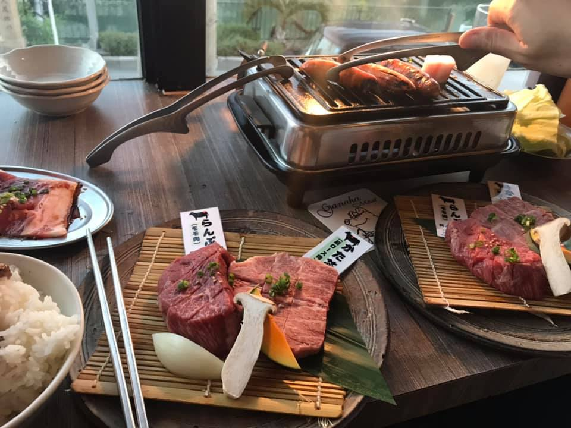

---
featured: true
title:  海外自助單車旅遊 Part 1 - 單車沖繩環島心得
date:   2018-12-23 15:01:35 +0800
thumbnail:  okinawa.webp
category: Travel
tags:   ['海外自助單車旅遊']
description : 海外自助單車旅遊 Part 1 - 單車沖繩環島心得
author : Mark Ku
slug : 2018/12/23/okinawa-bicycle-round-the-island
--- 
## 沖繩環島小故事
出國環島，聽起來很熱血，但是對沒有訓練的人騎起來可能就是有點辛苦的旅程  

此趟行程，我帶了我的同學  

他說他有在運動  
 
說有在跑步  

沒想到騎25km 他就喊痛  

直到70km才到今天租的Airbnb     

我都得一路哄著他  
 
終點快到了，就在前面轉彎就到飯店  
 
結果第一天幫去藥局幫我他藥膏貼屁股  

第二天我同學他說:不騎了，再騎屁股會爛掉，連人帶車就一起塔上計程車

剩下就剩下我一個人繼續騎，後面還真的不好騎，上上下下的，花了三天，一共騎了200多公里，才把沖繩本島騎完  

## 注意事項 
1. 最好事先掌握地形，是否有許多爬坡，平常不擅爬坡的人，騎起來可能就是夢魘。
2. 時速規劃最好能運動均速在18-25km間，一天騎3-5小時就好，因為是去玩不需要騎的太快，也不能騎的太慢會影響checkin 及其他可以去的行程，最好多安排幾個路線。
3. 出發前，至少曾經騎過3小時以上的單車經驗，因為沒經過訓練的屁股，無法應付長時間騎乘，除非已練成鐵屁股，且為了屁股著想，最好一定要穿車褲。
4. 安全配備是否齊全，國外租車，安全帽及配件是另外算的（前後車燈、安全帽、車褲、換胎工具、雨具、WiFi、Gps）
5. 若真的不舒服，可以叫計程車，或詢問租車公司是否有回收服務
6. 租車公司交車時最好試騎，確認煞車、變速、輪胎是不是已經不堪使用或需要調整。
7. 天氣不好掌控，若下大雨，雨天騎車慢危險，最好要有其他的備案。
8. 不要帶太多東西，因為長時間騎乘，是種負擔，最好1～2換洗衣物(快乾型），一件防風外套，因為多數飯店或airbnb都有洗衣機及烘乾機
9. 若真的很酸痛，日本有很多藥妝店有賣痠痛藥膏，貼完隔天會讓你舒服很多，泡澡及拉筋也能讓你舒緩。
10. 日本是左駕左騎，記不住就是記與車同向
淡季機票來回6987+ Airbnb 三夜4140+ 腳踏車1318+WiFi五天 吃到飽590=13035
