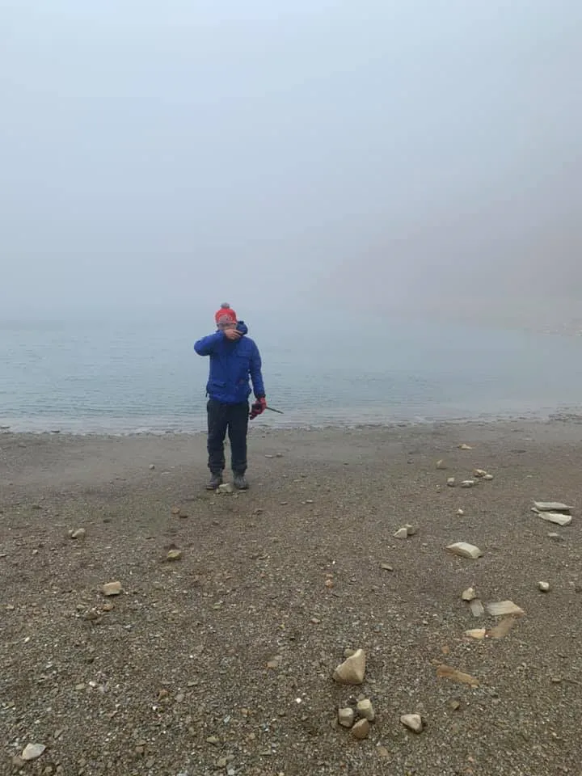
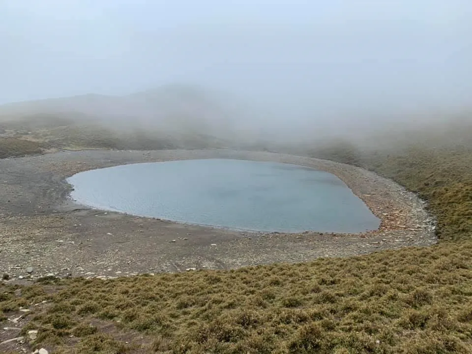
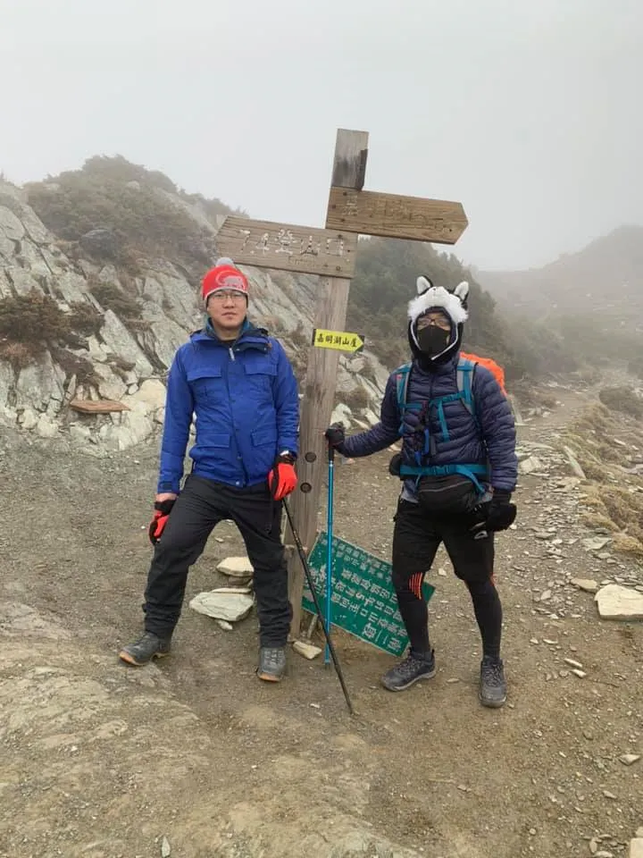
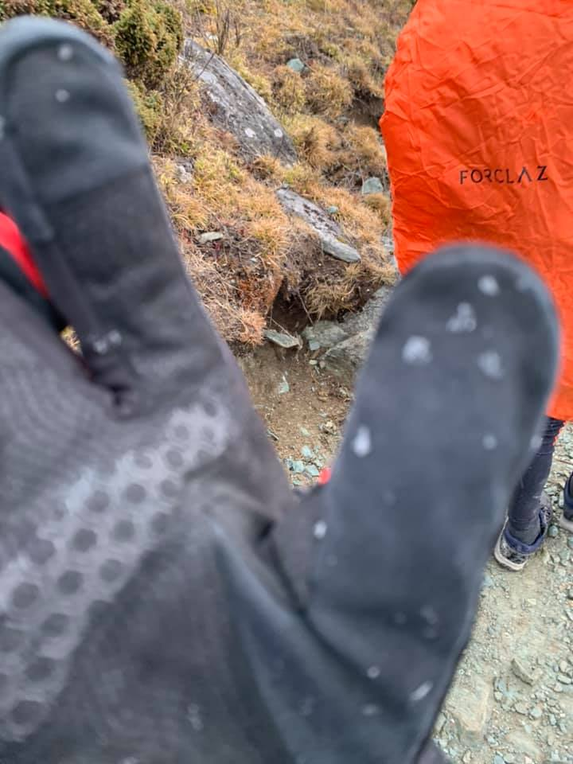
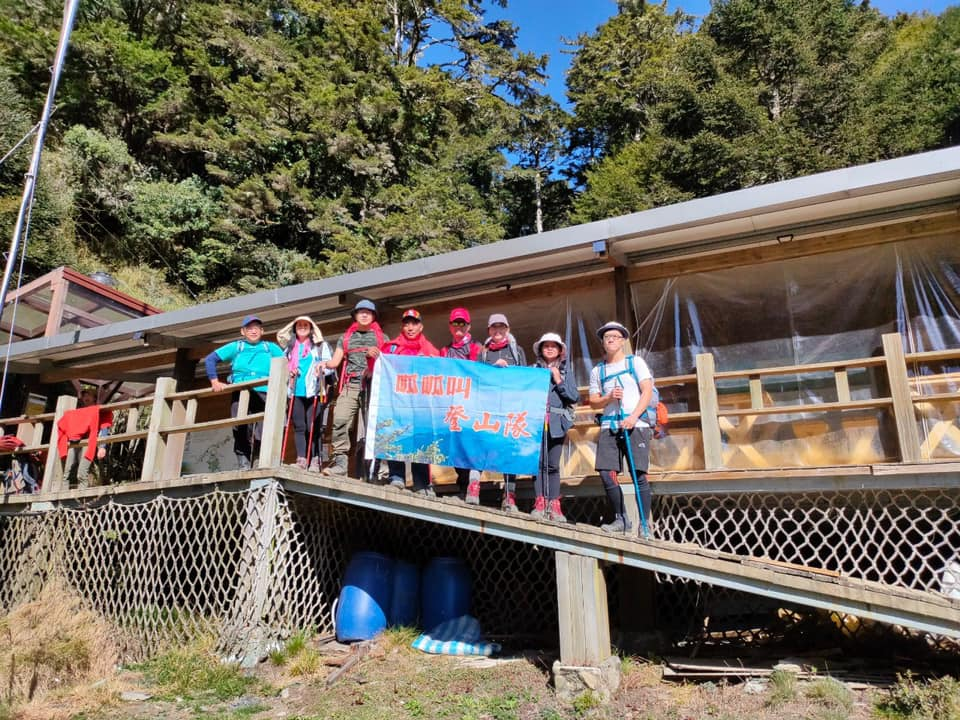
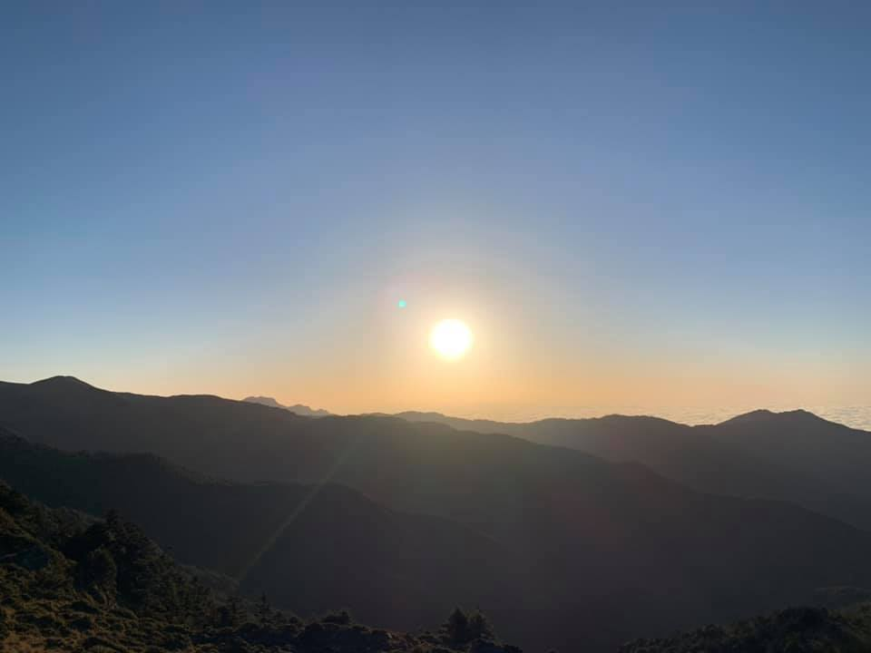

---
featured: true
title:  給想去嘉明湖的一些事項參考事項  - 1
date:   2020-03-29 15:01:35 +0800
thumbnail:  jiaming-lake.webp
category: Travel
tags:   ['嘉明湖']
description : 給想去嘉明湖的一些事項參考事項
author : Mark Ku
slug: 2020/03/29/Jiaming-Lake
--- 

# 給想去嘉明湖的一些事項參考事項

## 前言
全員安全登出-嘉明湖（順便撿了個百岳-三叉山）
同一天遇上日出、暴雪（冰霰）、東西南北吹的狂風、大霧、低溫，終於在寒風中等了半小時，嘉明湖終於矜持的露出30秒。

## 參考事項
1. 到嘉明湖警察小隊辦理入山證前會經過幾個道路管制區（修路），因此一天能開車到辦理入山證警察小隊通行的時間有限，一錯過要等3-5小時才會放行。
2. 山屋的申請
Day1向陽山屋
Day2嘉明湖避難山屋
別申請錯山屋，因為路程變長很多會使自己及團隊陷入危險
3. 路程與體力
三天兩會帶的東西差不多10kg左右，我們吃是訂餐，但身上都要有自備乾糧3-5天，嘉明湖登山的難度屬於中高，路程及坡度陡（哭坡一堆，陡上抖下）相當有挑戰性，完全不適合體力不佳又沒準備的新手。
P.S不背重裝可請花錢請山青，但雨衣和輕糧要放在身上。
Day1警察小隊-》向陽山屋 5.6km 總爬升542海拔（13:00起登）
Day2 向陽山屋-》嘉明湖避難山屋 5.8 km（03:00出發）總爬升675海拔
Day2嘉明湖避難山屋（輕裝）-》三叉山-》嘉明湖 -》避難山屋10.3km 總爬升869海拔
Day3 避難山屋-》警察小隊 11.4km
（04:00出發）
共約33km 
路程加上重裝，對於體力的負擔其實很大
4. 詭譎多變的極端氣候
上一刻是大太陽，可能會因為強風面將雲層吹過來，下起大量的雪（冰霰），吹起狂風及大霧，最好團體行動，且不要落單，在攻嘉明湖途中遇到兩隊成員中有人走不動，在一個點等團隊回來，結果瞬間吹起大霧，回來時發現人已不再，氣候大霧大風，團隊會不知道，找人還是要撤退回避難山屋，當下請千萬不要脫隊，相當危險。（等不到人，或發現氣候變化太大，請跟著其他人潮直接撤退，別傻傻的等）
5. 裝備要帶多少
其實挺看個人的，我帶的9成都有用到，在高山遇到極端氣候，裝備多帶其實是保障自己安全，同時也是對自己的安全負責任。
6. 網路及電話訊號
快到向陽山屋後幾乎都沒網路及電話
7. 水
向陽山屋-飲用水、清洗的水
避難山屋-僅提供飲用水
8. 請自備碗筷，訂餐的餐廳不提供
9. 關山好吃的餐廳（慶功宴）
紅瓦屋風味餐廳（原住民料理）
一桌三千 有特色及蠻好吃的
轉介網友的話
嘉明湖不是澄清湖，
向陽山更不是陽明山，
高山美景是最好的享受，
但有很多風險，
做好準備在上山！

附上我的裝備清單
[連結](https://docs.google.com/spreadsheets/d/12dCvXPsIpmhQUgTzwp8gNfT0kM7ZzM1ePkp0t6JULJQ/htmlview?fbclid=IwAR2wRLYxs105oSDzt5aVc1sWCReR1mSOl8HyoXhIFQ_K56tHlDO6Pfry_6Q)

