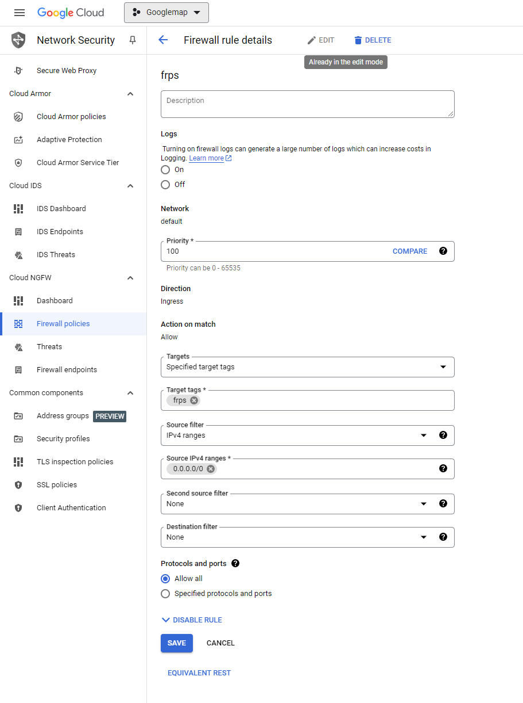

## 解決問題
[先前一篇文章](https://blog.markkulab.net/2021/05/31/frpc/)介紹過如何透過免費的 Frps 反向代理伺服器，將內網網站經過映射出去，但因為免費的真的太不穩定，BLOG 和 DEMO 網站，常常服務會掛掉，後來經網友推薦，Google 有免費體驗90天，並給予 300 美金的體驗費用，這篇就來介紹用 GCP (Google Cloud) 來自己架內網穿透伺服器 ( FRPS )

## 首先，請申請 GCP 帳號及挷定信用卡

## 登入 GCP 的後台 > 虛擬機器 (VM) 執行個體


## 選擇地區為台灣，作業系統 Ubuntu ，因為我只要反向代理，不需要複雜的運算，選擇 f1-micro就好，預估費用一個月只要約 15X 元台幣，算是蠻實惠的。  


## 主機建立好時，在菜單選單中找到 VPC 網路，將主機的IP改成靜態，這樣就IP就不會跑掉了。


## 回到虛擬機器( VM ) 執行個體，對剛建立的主機開啟 SSH


## 接著會開啟瀏覽器版 SSH 中，依序輸入下面的 Linux 指令

更新系統

```
sudo apt-get update
sudo apt-get upgrade
```

FRP使用Go語言，大部分Linux主機都有預裝了，但如果你的沒有，可以先執行以下指令

```
sudo apt-get install bison ed gawk gcc libc6-dev make golang-go vim
```

接著你必須到FRP的Github上查看最新frps ，並下載他

```
wget https://github.com/fatedier/frp/releases/download/v0.61.0/frp_0.61.0_linux_amd64.tar.gz
```

解壓縮檔案並重新命名資料夾為 frp

```
tar -zxvf frp_0.61.0_linux_amd64.tar.gz
sudo mkdir /var/frps
sudo mv frp_0.61.0_linux_amd64/* /var/frps/
cd /var/frps
```

編輯 frps 的設定檔 (sudo vim frps.toml)

```
# frps.toml
bindAddr = "0.0.0.0"
bindPort = 7000
vhostHttpPort = 80
vhostHttpsPort = 443
webServer = { port = 7500, user = "admin", password = "your password", addr="0.0.0.0" }
auth.method = "token"
auth.token = "your token"
```

執行
```
sudo ./frps -c ./frps.toml
```

## 在到 DNS 主機中設定域名


挷定 DNS 將 proxy.markkulab.net 指向 FRPS 主機

11221
挷定 CNAME，這樣訪問者訪問 blog.markkulab.net frps 就會指到指定用戶端映射的網站


## frpc.toml 的設定

```
serverAddr = "35.223.172.254"
serverPort = 7000
auth.token = "your token"
transport.poolCount = 10000

[[proxies]]
name = "test-tcp"
type = "tcp"
localIP = "127.0.0.1"
localPort = 22
remotePort = 6000

[[proxies]]
name = "ShopCarthttps1"
type = "http"
customDomains = ["www.letgo.com.tw"]
localPort = 8896

[[proxies]]
name = "linebot"
type = "https"
customDomains = ["linebot.letgo.com.tw"]
[proxies.plugin]
type = "https2http"
localAddr = "127.0.0.1:48002"
crtPath = "/Public/!.letgo.com.tw/fullchain.crt"
keyPath = "/Public/!.letgo.com.tw/cert.key"
hostHeaderRewrite = "linebot.letgo.com.tw"
requestHeaders.set.x-from-where = "frp"
```
## 如果你需要重開機自動啟動，則需要額外註冊成服務
### 在 /lib/systemd/system/ 增加設定檔
```
sudo vim /lib/systemd/system/frps.service
```
建立自動啟動設定檔
```
[Unit]
Description=FRP Server
After=network.target
Wants=network.target

[Service]
Restart=on-failure
RestartSec=5
ExecStart=/var/frps/frps -c /var/frps/frps.toml

[Install]
WantedBy=multi-user.target
```
### 啟動服務
```
sudo systemctl daemon-reload  // reload service
sudo systemctl stop frps.service //停止 FRP Server 服務
sudo systemctl start frps.service //啟動 FRP Server 服務
sudo systemctl restart frps.service //重啟 FRP Server 服務
sudo systemctl disable frps.service //開機時不要啟動 FRP Server 服務
sudo systemctl enable frps.service //開機時自動啟動 FRP Server 服務
sudo systemctl status frps.service //查看FRP Server 狀態
```
## 測試防火牆有沒有關
windows 測試防火牆有沒有關
```
telnet 35.223.172.254  7000
```
linux 測試防火牆有沒有開
```
nc -zv 127.0.0.1 7000
```
## 記得 GCP 必須關閉防火牆，否則外網連不到，回到 instance 修改裡面的 Network tags 才會生效。


## 接著找一台 Ubuntu 主機來，安裝frpc
### 建立資料夾
```
sudo mkdir -p /etc/frp
```
### 下載 FRP 0.61.0 並解壓到 
```
cd /etc/frp
sudo wget https://github.com/fatedier/frp/releases/download/v0.61.0/frp_0.61.0_linux_amd64.tar.gz
sudo tar -zxvf frp_0.61.0_linux_amd64.tar.gz --strip-components=1
```
### 建立frpc.toml設定檔
```
sudo vim /etc/frp/frpc.toml
```
frpc.toml
```
serverAddr = "your server"
serverPort = 7000
auth.token = "your token"
transport.poolCount = 10000

[[proxies]]
name = "jks"
type = "https"
customDomains = ["jks.letgo.com.tw"]
[proxies.plugin]
type = "https2http"
localAddr = "127.0.0.1:8080"
crtPath = "/var/frpc/letgo/fullchain.crt"
keyPath = "/var/frpc/letgo/cert.key"
hostHeaderRewrite = "jks.letgo.com.tw"
requestHeaders.set.x-from-where = "frp"
```
### 測試
```
/etc/frp/frpc -c /etc/frp/frpc.toml
```
### 建立開機後自動啟動
```
sudo vim /lib/systemd/system/frpc.service
```
### 建立自動啟動的設定檔
```
[Unit]
Description=FRP Client
After=network.target
Wants=network.target

[Service]
Restart=on-failure
RestartSec=5
ExecStart=/etc/frp/frpc -c /etc/frp/frpc.toml

[Install]
WantedBy=multi-user.target
```
## 最後
最後將VM建在台灣節點，聽說Google的機房在嘉義，網速超級快，也很穩定，一個月差不多150元台幣左右，就能擁有反向代理及一個固定IP，其實蠻滑算的


## 補充 - GCP 免費計劃
[免費計劃連結](https://cloud.google.com/free/docs/gcp-free-tier/?hl=zh-CN#compute)

在免費試用期結束後，我們還是可以在限制的用量內免費使用特定產品。例如最常見的 Google Compute Engine 就提供了以下免費條件：  

僅限美國地區「us-central1」、「us-east1」和「us-west1」  
* 每月 1 個 f1-micro 執行個體每月 30 GB 硬碟空間
* 每月 1 GB 網路輸出量 (從北美輸出至中國和澳洲以外的所有地區)

f1 的方案 就算放在台灣一個月也只要  5.6 *27.82 (美金匯率) = 約 155 台幣左右


