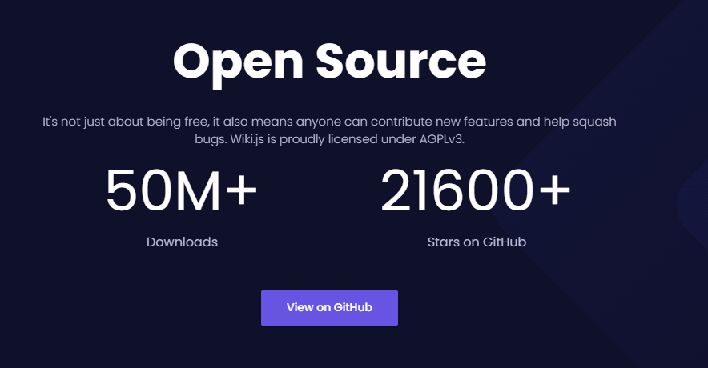
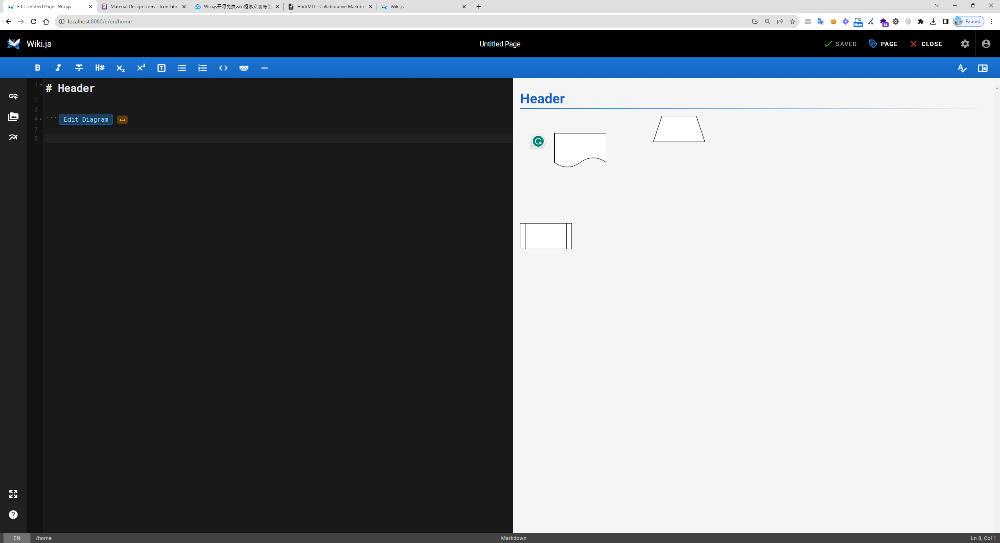
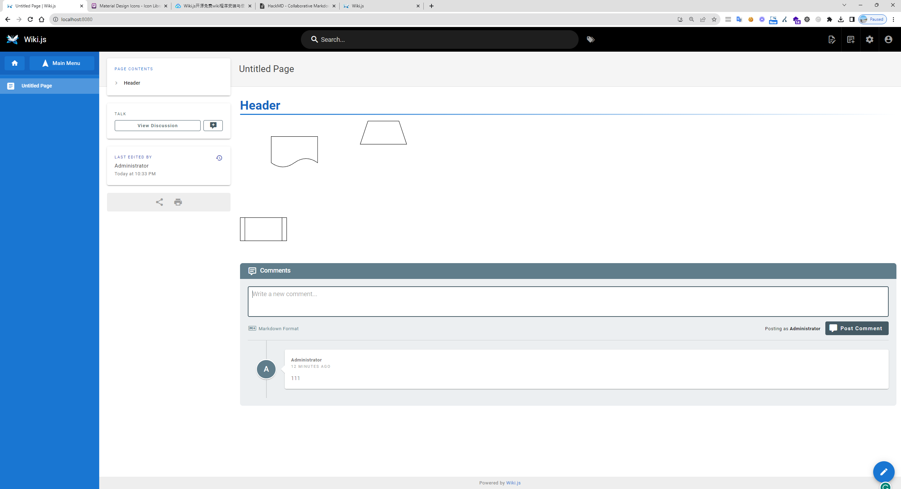
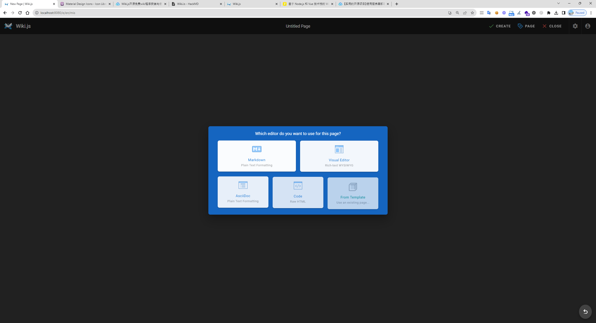
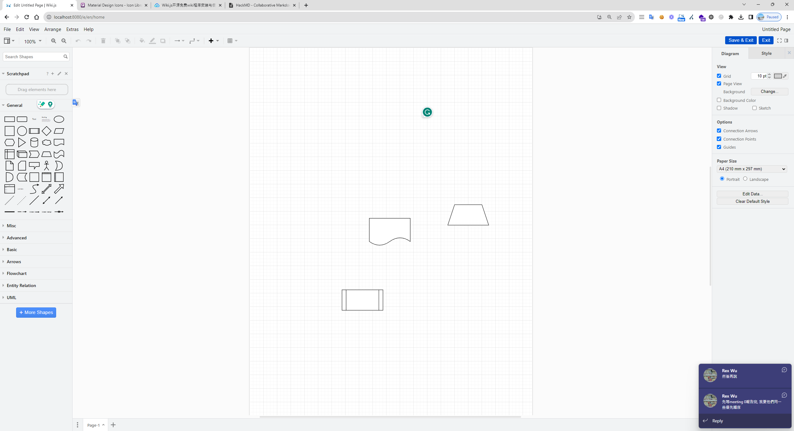
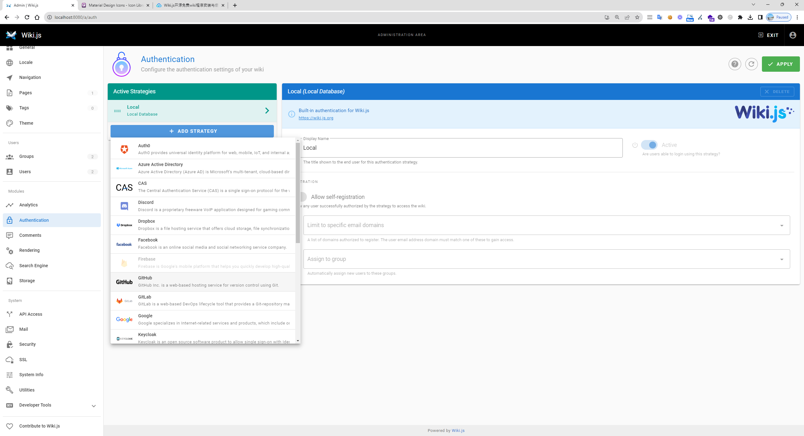
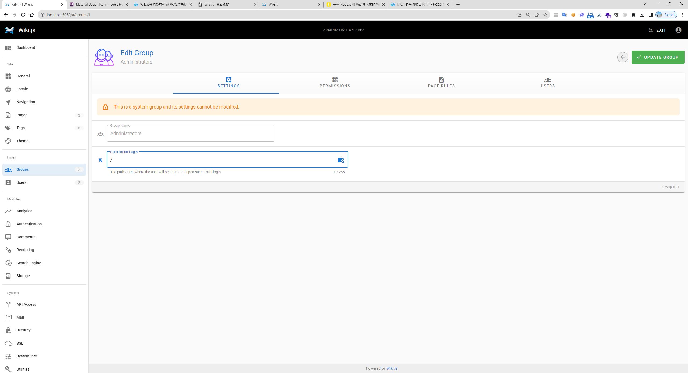
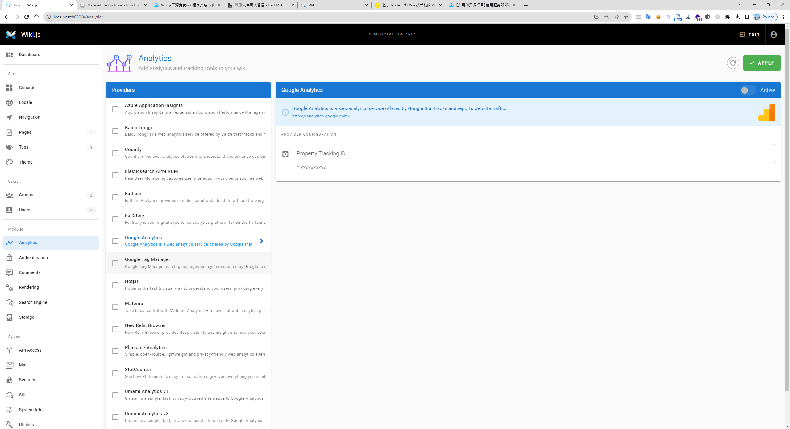
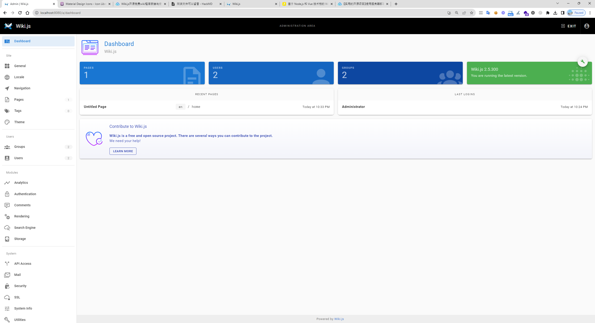
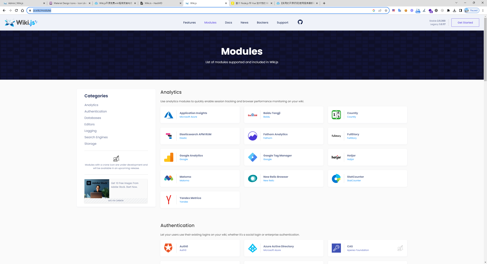

## 時空背景
在追求有效的資料和知識共享時，許多公司和部門面臨挑戰，我們曾使用 OneNote，但遇到了許多工程師的反饋——它不是最理想的工具，在尋找更好的解決方案時，我發現了 Wiki.JS。

## 費用
Wiki.Js 支援多人共同維護，不需額外費用，開源程式碼，並支援 Docker 佈署


## 有那些公司在使用


## 完整的生態


## fanGroupRef功能亮點fanGroupRef

### fanGroupRef流程圖fanGroupRef: 文件中可以直接顯示。


### fanGroupRef留言功能fanGroupRef: 文件下方可進行討論。


### fanGroupRef編輯介面fanGroupRef:界面很像 hackmd ，但支援多種 editor ，甚至可以插入流程圖，點擊兩下可就可以直接編輯，但儲存要在右上角按 save。






### 社群整合: 可整合多種社群登入，甚至支援公司的 teams 帳號。


### 群組權限與登入設定:支援群組權限訪問，並設定登入 url


### 細緻的權限管理:您不僅可以設定基本的訪問權限，還可以對各個群組進行更深入的存取權限設定。


### fanGroupRef流量與熱區分析fanGroupRef:Wiki.JS 兼容並支援多種流量分析工具，例如 hotjar，助您深入了解用戶行為。


### fanGroupRef多語言支援與後台功能fanGroupRef:Wiki.JS 支援多國語言，並提供一系列強大的後台管理功能。


### 客製化與擴充性
Wiki.JS 的前端使用 vue 和 node.js，資料庫使用 MySQL，具有高度的客製化能力，並有眾多的 plugin 供選擇。
[查看更多插件](https://js.wiki/modules)


### Docker + Mysql 指令
```
docker run -d -p 8080:3000 --name wiki --restart unless-stopped -e "DB_TYPE=mariadb " -e "DB_HOST=192.168.0.106" -e "DB_PORT=33066" -e "DB_USER=wiki" -e "DB_PASS=6U3WApD9" -e "DB_NAME=wiki" ghcr.io/requarks/wiki:2
```