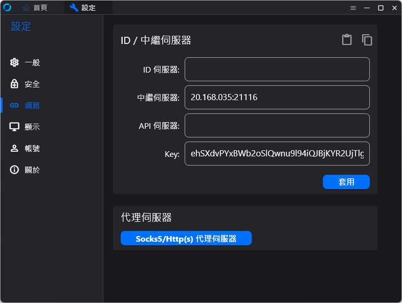
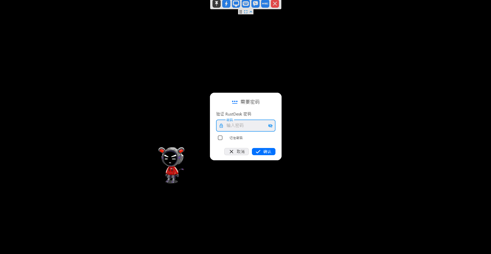

## 前言
各位應該都有聽或使用過知名的 TeamViewer 遠端桌面工具，但當它開始收費，我們開不斷的開始尋找其他的免費選項，像是我曾經過的 AnyDesk 和 AweSun，經常出現不明原因卡頓或斷線，最後我找到了 RustDesk，這一個開源免費，並允許我們自行架設好用的遠端連線工具。

## RestDesk 優點
* 高效與安全：RustDesk 使用 Rust 編寫，這是一個高效且安全的程式語言。
* 多平台支援：不管是 Windows、Linux，或是 MacOS，甚至 iOS 和 Android 都能輕鬆使用。
* 簡單易用：使用感覺像 TeamViewer 一樣直觀，並透過 NAT 穿透技術確保連接穩定。
* 私密與靈活：RustDesk 允許你擁有自己的中繼伺服器，讓你更能掌控隱私。
* 連接穩定：即便網路不穩，RustDesk 也能保持連接的穩定性。
* 開放與免費：你可以完全免費使用 RustDesk，且其開放原始碼讓你隨時查看或修改。
快來體驗屬於你自己的 RustDesk 遠端桌面工具吧！

## 準備事項
* 準備一台 Ubuntu 的伺服器，用於安裝 RustDesk Server 
* 給予你的 Ubuntu 伺服器設定一個獨立的 IP 位址。
* 並在 Ubuntu 上[安裝 Docker](https://docs.docker.com/engine/install/ubuntu/) 

## 首先，安裝 RustDesk Server 

### 在安裝好 Docker 的Ubuntu 伺服器，建立 docker-compose yaml 檔。
```
vim docker-compose.yml
```
### 
```
version: '3'

networks:

  rustdesk-net:

    external: false

services:

  hbbs:

    container_name: hbbs

    ports:

      - 21115:21115

      - 21116:21116

      - 21116:21116/udp

      - 21118:21118

    image: rustdesk/rustdesk-server:latest

    # yourIP 換成你的外部網路 IP 

    command: hbbs -r {yourIP}:21117

    volumes:

      - ./data:/root

    networks:

      - rustdesk-net

    depends_on:

      - hbbr

    restart: unless-stopped


  hbbr:

    container_name: hbbr

    ports:

      - 21117:21117

      - 21119:21119

    image: rustdesk/rustdesk-server:latest

    command: hbbr

    volumes:

      - ./data:/root

    networks:

      - rustdesk-net

    restart: unless-stopped

```
### 啟動服務

```
sudo docker compose up -d

```
### 關閉防火牆
```
ufw allow 21115:21119/tcp
ufw allow 8000/tcp
ufw allow 21116/udp
sudo ufw enable
```
```
## 設定用戶端
### 首先，[下載並安裝 RestDesk](https://github.com/rustdesk/rustdesk/releases/tag/1.2.2) 用戶端

### 接著，我們設定好這個用戶端的固定密碼。 設置 > 解鎖安全設置  > 設定固定密碼

### 再來，將先前設定好的 RustDesk Server。 解鎖網路設置 > {yourIP}:21116


### 觀察下面狀態條，如果顯示就續就代表連線成功


### 連線畫面


### 使用畫面 - 桌機版
 

### 使用畫面 - 手機版
 
