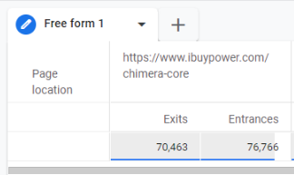
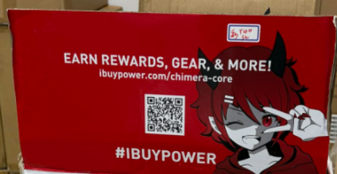
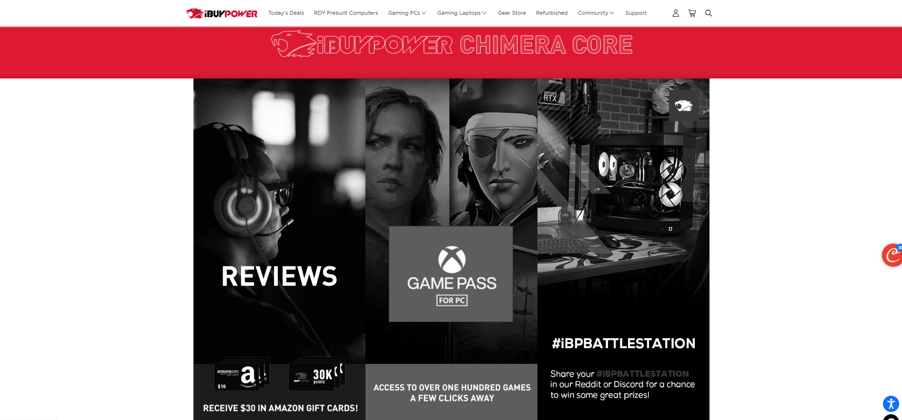
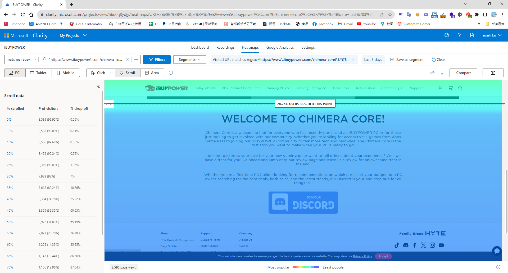

## 問題的起源
持續半年以上，從 GA 報表上發現，網站中的某頁老是每個月8-10萬流量，這讓我相當的困惑，並從 GA上的離開率報表，了解到離開率高達9成1。

## 釐清流量來源
初步推斷流量可能來自某個廣告平台，但後來發現流量的真正來源是產品外盒上的QR-code。由於公司的產品不僅在自家電商網站上銷售，也在Amazon、Walmart以及實體通路BestBuy有銷售，故流量居高不下。

## 流量的價值 
若以平均點擊成本CPC 計算 0.6美元*80000=48000 價值美金的流量。

## 使用　Clarity 分析該頁面的問題
### 四個目標引導的使用者困惑
掃描 QRcode 的使用者可能預期會得到某些好處，但在訪問頁面後，卻面對四個不同的目標而感到混淆。這不僅阻礙了使用者的行動路線，也可能是他們高跳出率的主因。

## 捲動行為分析
大多數的訪問者並未捲動到頁面最底部，也就意味著他們並未加入Discord。

## 結論
儘管數據告訴我們這個頁面潛藏豐富的價值，過多的目標顯然阻礙了將訪客轉化為實際的目標（Goal)，我也將其頁面回報給公司設計團隊，做為明年頁面改版的依據，並對頁面進行內容優化，精簡並聚焦目標，以及引導訪客成為我們的會員或Discord粉絲，都將有機會促成未來回購的關鍵動作。

