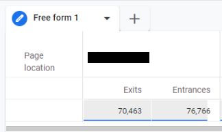
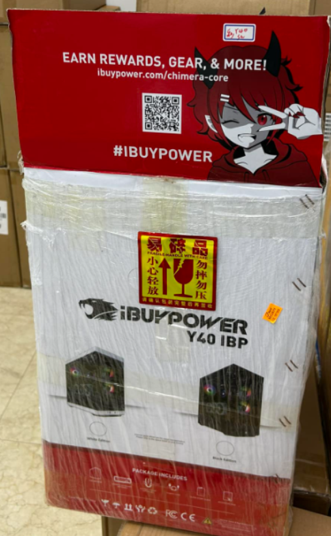

## 問題的起源
持續半年以上，從 GA 報表上發現，網站中一頁每個月高達8-10萬流量，但又從 GA上的離開率報表得，離開率高達9成，這讓我感到相當的困惑，

## 釐清流量來源
初步推斷流量可能來自某個廣告平台，但後來發現經過詢問相關人員後，查出流量的真正來源是產品外盒上的QR Code，由於公司的產品不僅在自家 B2C 電商網站上銷售，同時也在Amazon、Walmart以及實體通路BestBuy有銷售，故流量居高不下。

## 流量的價值 
若以平均點擊成本CPC 計算 0.6美元*80000=48000 價值美金的流量。

## 接著，我使用　Clarity 分析該頁面的問題
### 四個目標引導的使用者困惑
掃描 QRcode 的使用者可能預期會得到某些好處，但在訪問頁面後，卻面對四個不同的目標而感到混淆，這不僅阻礙了使用者的行動路線，也可能造成高跳出率的主因。

## 捲動行為分析
大多數的訪問者並未捲動到頁面最底部，也就意味著他們並未加入Discord。

## 結論
在這次的經驗中，我重新定義了高價值頁面，這些頁面具備以下特徵：
1. 本身就擁有高流量的頁面
2. 能創造高營收的頁面
3. 能帶來高轉換 ( 新會員、訂單、加入我們社群、評論、互動)
然而，透過數據分析，我們發現過多的目標可能妨礙了將訪客轉化為實際目標的能力。基於這項發現，我已向公司設計團隊提出有關這些頁面資訊，以作為未來改版的參考，為了最大程度地發揮這些頁面的價值，我建議進行內容優化，精簡並聚焦於主要目標，透過引導訪客成為我們的會員或 Discord 粉絲，將有機會培養未來的回購行為，並更有效地轉化訪客成為實際網站參與者，進而促使公司的長期發展。