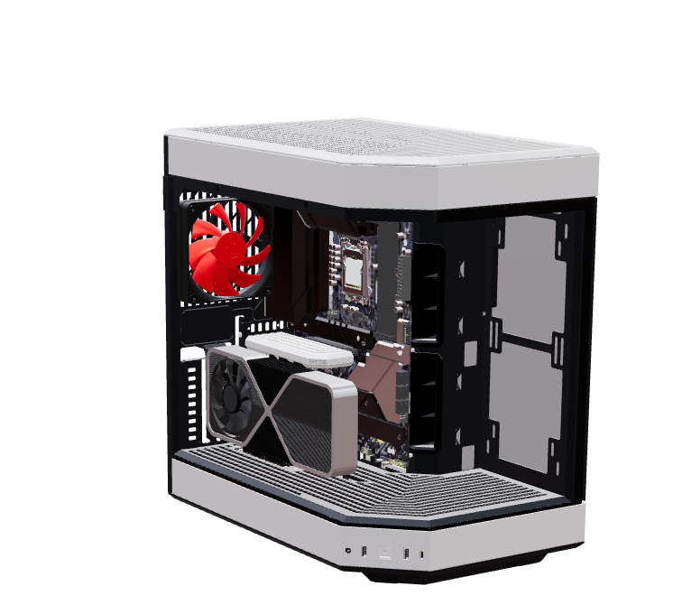
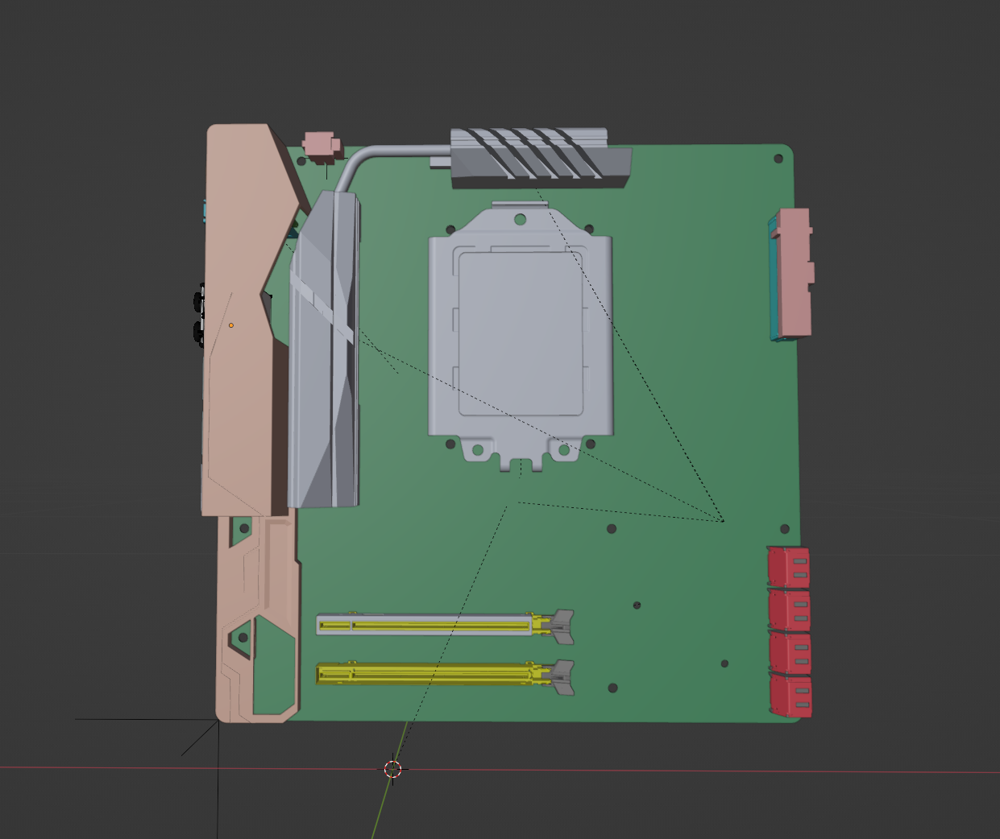
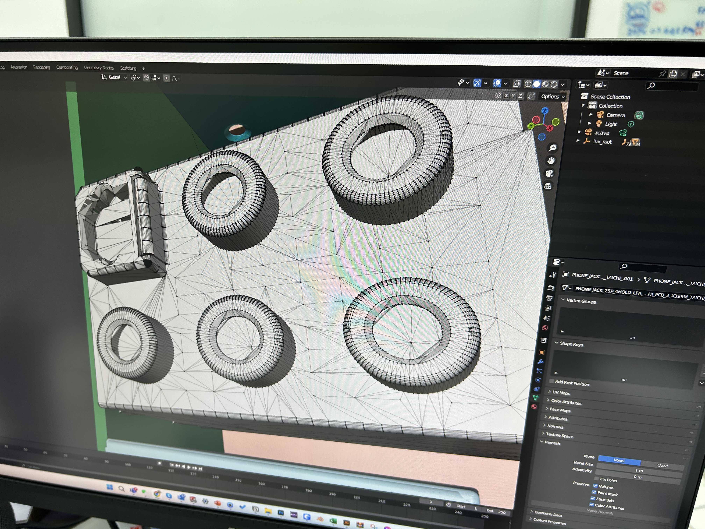
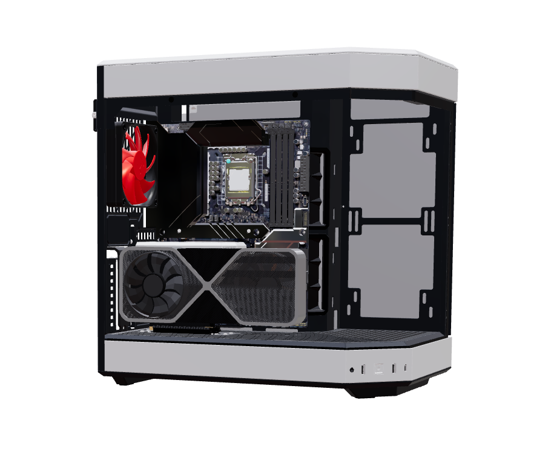

## 時空背景
競爭對手[maingear](https://maingear.com/maingear-mg-1-live-3d-configurator/
)推出 3D Configurator，因此我花了些時間研究了一下3D 技術。

## 首先，要解決 3D 圖檔格式的問題
從產品設計師要了公司的機殼模型 3D 檔，STEP 拿到的是，因此就開始從網頁常用的格式開始學習起。

## 說到 3D 產品展示，我們就必須要了解 GLB 和 GLTF 這兩個主流格式的差異 (From ChatGpt)
GLB 和 GLTF 是兩種用於表示 3D 模型的格式，它們主要用於 3D 圖形和虛擬現實。這兩種格式都基於 GL Transmission Format，但它們之間還是存在一些差異：

檔案結構：
GLB：這是二進制格式的檔案，所有的資料（包括紋理、網格等）都被儲存在單一的二進制檔案中。這使得檔案較小，載入速度更快。
GLTF：這是 JSON 格式的檔案，可選擇將紋理、網格等儲存在單獨的二進制檔案或是直接嵌入 JSON 中。相對於 GLB，GLTF 檔案結構可能更加靈活但複雜。
可讀性：

GLB：由於是二進制格式，GLB 檔案不容易人工閱讀或編輯。
GLTF：由於是基於 JSON 的，GLTF 檔案較易於閱讀和編輯。開發人員可以用普通的文字編輯器打開和修改。
使用情境：

GLB：適合需要快速載入和高效運行的場景，例如實時 3D 應用。
GLTF：由於其可讀性和靈活性，適合用於開發和調試。
檔案大小：

GLB：通常會比 GLTF 更小，因為它將所有資料打包在一個二進制檔案中。
GLTF：可能會相對較大，特別是當紋理和其他資源被嵌入 JSON 時。
總的來說，GLB 和 GLTF 都具有各自的優點和適用場景。GLB 更適合性能敏感的應用，而 GLTF 則更適合需要可讀性和可編輯性的情境。如果你在開發階段，可能會選擇使用 GLTF 進行迭代和調試，然後在產品階段轉換為 GLB 以提高效能。

## 因為公司 Soliwork 只有兩套，設計師也很忙，常常麻煩設計師很不好意思，找了幾個工具進行3D 模型的轉換
### [vectary Oline tool](https://www.vectary.com/dashboard/?workspaceId=718018e4-f18d-4318-9386-3a40019aea5a) 轉檔需付費，但可以試用幾天  

為什麼選擇vectary？
有許多3D轉換工具可以選擇，但我選擇了vectary，因為它具有直觀的界面，並提供了簡單的導入和導出功能。此外，vectary還有豐富的教學資源，幫助我快速上手。透過這個工具，我可以輕鬆將soliwork檔案轉換為網頁支持的格式
### blender ( 開源 ) + [stepper plugin](https://ambient.gumroad.com/l/stepper) (付費)


##  接著，將3D 模型轉換成 react 元件
```
npm i gltfjsx -g
npx gltfjsx <glTF model source file>

```
## GLB 
前面得知產品階段 gltfjsx 會比較好調整，但GLB 會比較小，最終上線 glb 會比較適合，
```
npm i gltf-pipeline -g
gltf-pipeline -i scene.gltf -o scene.glb 
```
### 因為 3D 模型都很大，使用者體驗會很不好，透過 gltf-pipeline  在輸出 Glb 可以設定壓縮等級
```
gltf-pipeline -i <source file> -o <output file> --draco.compressionLevel=10
gltf-pipeline -i scene.gltf -o mother-board.glb
```
### 此時，我們己經拿到製作3D 產品展示所需要的檔案，依據[此篇 blog](https://juejin.cn/post/7070009731099656229) ，我們就可以做出我們的 3d 產品展示


### 進階應用
* 加入其他電腦組件 
* 風扇轉動 
* 貼圖
* 變色功能
* 模型加載時的加載動畫 ( component loading anmiation )
* 產品特點提示 ( part's hint )
* 材質發光 ( bloom 、 emissive )
* 場景 ( Scene )

### 除錯小技巧-在 group 挷定點擊事件，可以log 點擊到什麼物件
```
  <group            
      https://hackmd.io/onPointerMissed={() => (state.current = null)}
      onPointerDown={(e) => (
        e.stopPropagation(), (state.current = e.object.material.name)
      )}
    >
```
## 手機加載崩潰
本身手機效能比較不好，從原廠拿來的主機板模型太多細節，太複雜的圖型，很容易加載就崩饋了，每個圓型都是很多三角型組成，都需要3D設計師拓樸，來減少三角形面積，如果未來要做 3D 產品選配，每塊主機板或其他零件，甚至要手動要減少一些細節方面，都需要3D 設計師協助，如果未來要做3D 產品選配，則需要一位獨立或外包的3D 設計師。  

3D在iphone 目前有蠻大的限制，在 iOS本身對Safari 記憶體的上限是[384 MB](https://github.com/wojtekmaj/react-pdf/issues/1601)，超過也是會重新整理。




## 如果你們是 Next js 在本地端除錯是正常，推到生產環境出現這個訊息"next js application error a client-side exception has occurred"，請修改成用戶端渲染，伺服器端是reder 不了3D 的元件。

## 最後

[Demo](https://www.ibuypower.com/3d-showroom/y70)  
隨著技術的發展，3D網頁模型線上展示和3D產品選配應用將會越來越廣泛，了解並掌握這些技術於開發者是至關重要的，畢竟，只有跟上時代的腳步，我們才能為客戶提供最好的使用體驗。  

僅管目前 Web 3D 仍有些限制，像網路速度跟不上，3D模型太肥大，手機在iOS 某些特效及材質顯示支援度還不夠及手機效能及記憶體較要求，但隨著技術及基礎建設的進步，未來 3D一定可以期待實作更多的應用。

## 參考資料
[參考資料](https://www.vectary.com/3d-modeling-blog/vectary-3d-converter-import-more-than-sixty-3d-file-formats/)  
[參考資料](https://www.vectary.com/)  
[參考資料](https://maingear.com/maingear-mg-1-live-3d-configurator/)  
[參考資料](https://parametric-architecture.com/8-free-browser-based-3d-modeling-software-for-beginners/)  
[參考資料](https://github.com/pmndrs/gltfjsx)  
[參考資料](https://gltf.pmnd.rs/)  
[參考資料](https://sketchfab.com/feed)  
[參考資料](https://github.com/facebookincubator/FBX2glTF/releases)  
[參考資料](https://juejin.cn/post/7070009731099656229?fbclid=IwAR336hISkigeYAP3ONzjjRYSgAQjojmO4WEX_lPV9hr15Zh99TuRFHhIbic)  
[參考資料](https://www.zakeke.com/#)  
[參考資料](https://blog.logrocket.com/configure-3d-models-react-three-fiber/)  
[參考資料](https://keyboardsimulator.xyz/)  
[參考資料](https://admin-fts.threekit.com/signin)  
[參考資料](https://zhuanlan.zhihu.com/p/349803849)  
[參考資料](https://github.com/weianweigan/DuSwToglTF/releases)  
[參考資料](https://zhuanlan.zhihu.com/p/97961663)  
[參考資料](https://www.keyshot.com/)  
[參考資料](https://sketchfab.com/search?q=coding&type=models)  
[參考資料](https://keyboardsimulator.xyz/)  
[參考資料](https://zhuanlan.zhihu.com/p/469548652)  
[參考資料](https://codesandbox.io/s/r3f-image-loader-4u8oy?from-embed=&file=/src/App.js:0-765)  
[參考資料](https://dev.to/wawasensei/creating-a-3d-table-configurator-with-react-three-fiber-1dl2)  
[參考資料](https://juejin.cn/post/7046043181406191629)  
[參考資料](https://zhuanlan.zhihu.com/p/601278889)  
[參考資料](https://threejs.org/editor/)  
[參考資料](https://github.com/belopot/3d-product-configurator/tree/master/src)  
[參考資料](https://dribbble.com/tags/configurator?page=2&s=popular)  
[參考資料](https://juejin.cn/post/7171075542882451463)  
[參考資料](https://blog.csdn.net/tucHUan1/article/details/119063265)  
[參考資料](https://hackmd.io/@TANGRAMxAR/ry9UbdEEP)  

