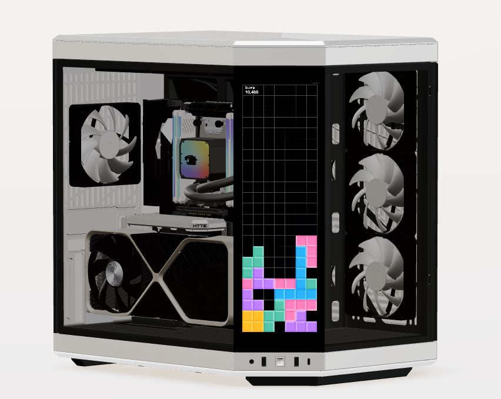
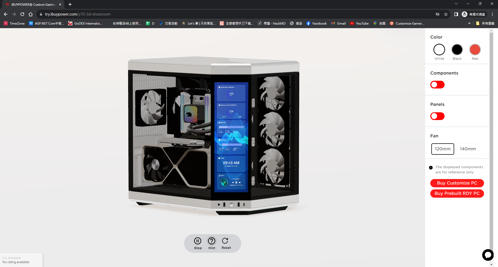

## Problem 
We have new products (computer cases). Thre is a 4K touch screen. We want to show its function in Threejs, but we have tried many video texture tutorials on the Internet but none of them work in iOS 16.
  

## I tried a lot to sort out the key 
* Using native html video outside of Three.js canvus
* Video must be mutte
* Disable auto play 
* playsInline
* crossOrigin="anonymous"

* display none 
* Video url must have full domain name with https

## Source Code
### Using native html video outside of Three.js canvus
```
<Canvas>
...
</Canvas>
  <video
                        id="video"
                        playsInline
                        webkit-playsinline
                        muted
                        loop
                        style={{ display: 'none' }}
                        crossOrigin="anonymous"
                    >
                        <source src={videoUrl} type="video/mp4"></source>
                    </video>
```
### Using Video Texture 
```

import { SHOW_ROOM_3D_URL } from '@/const/const-3d';
import { CanvasContext } from '@/lib/context/3d-showroom/canvas-context';
import { useGLTF, useTexture } from '@react-three/drei';
import React, { useContext } from 'react';
import * as THREE from 'three';
import { GLTF } from 'three-stdlib';

type GLTFResult = GLTF & {
    nodes: {
        Cube: THREE.Mesh;
    };
    materials: {
        ['default']: THREE.MeshStandardMaterial;
    };
};

type ContextType = Record<string, React.ForwardRefExoticComponent<JSX.IntrinsicElements['mesh']>>;

export function VideoCanvas(props: JSX.IntrinsicElements['group']) {
    const { nodes, materials } = useGLTF(SHOW_ROOM_3D_URL + 'y70/video-canvas.glb') as GLTFResult;

    const {
        videoPlay: { isPlaying },
    } = useContext(CanvasContext);

    const touchScreenImgTexture = useTexture(SHOW_ROOM_3D_URL + 'y70/hyte-y70-case-touch-screen.png');
    const video = document.getElementById('video');

    const VideoMaterial = () => {
        if (video instanceof HTMLVideoElement) {
            const texture = new THREE.VideoTexture(video);

            texture.wrapS = THREE.RepeatWrapping;
            texture.wrapT = THREE.RepeatWrapping;
            texture.repeat.x = -1; //  -1 為鏡像翻轉
            texture.flipY = true;

            texture.repeat.set(1, 1);

            return (
                <mesh
                    scale={[2.8, 2, 1]}
                    rotation={[0, -Math.PI / 4, 0]}
                    geometry={nodes.Cube.geometry}
                    material={materials.default}
                    castShadow
                >
                    <planeGeometry />
                    {isPlaying && <meshBasicMaterial side={THREE.FrontSide} map={texture} toneMapped={false} />}
                    {!isPlaying && (
                        <meshBasicMaterial side={THREE.FrontSide} map={touchScreenImgTexture} toneMapped={false} />
                    )}
                </mesh>
            );
        }
        return <></>;
    };

    return (
        <group {...props} dispose={null}>
            <mesh
                geometry={nodes.Cube.geometry}
                material={materials.default}
                position={[-0.114, 0.253, 0.1925]}
                rotation={[0, Math.PI / 4, 0]}
                scale={[0.0001, 0.175, 0.054]}
            >
                <VideoMaterial />
            </mesh>
        </group>
    );
}

useGLTF.preload(SHOW_ROOM_3D_URL + 'y70/video-canvas.glb');
```

## Result 
it's work for us. Hope it can help you too.
  


