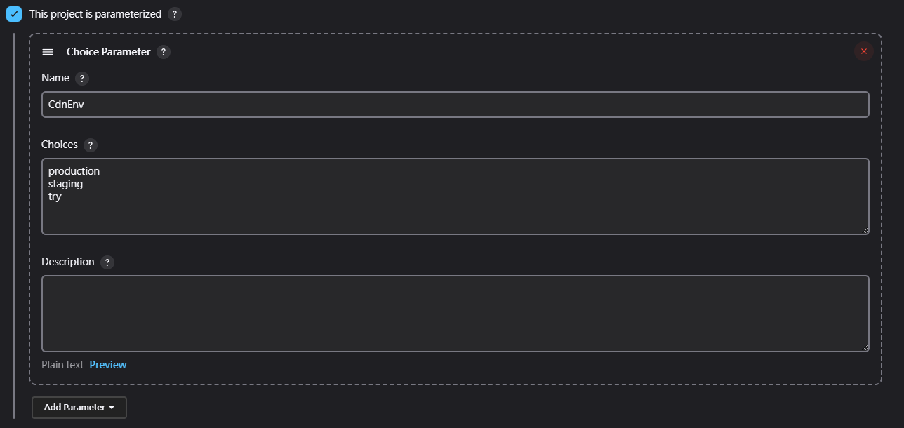
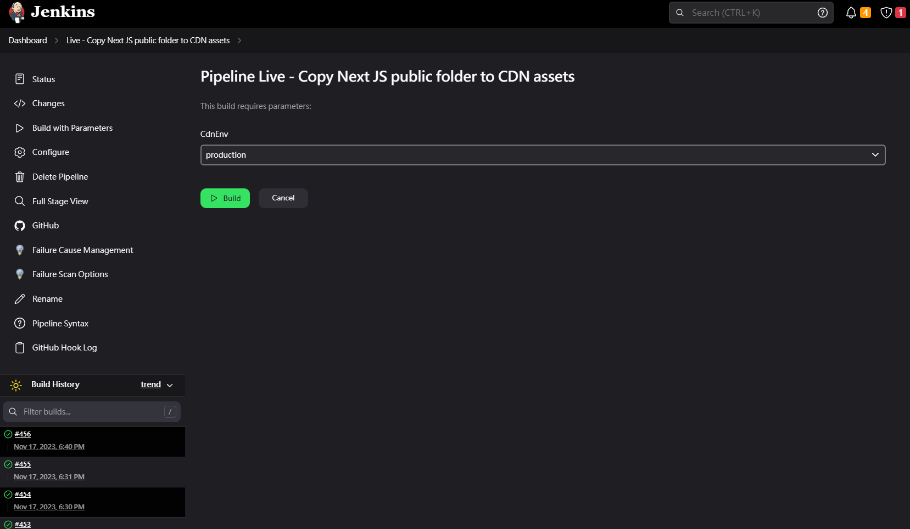
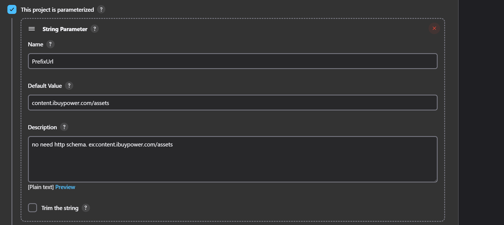
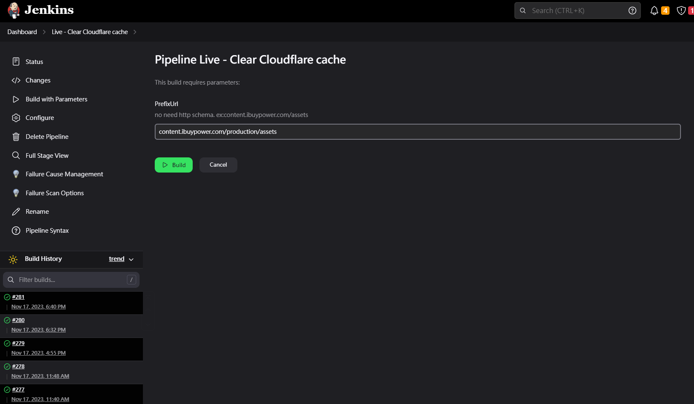
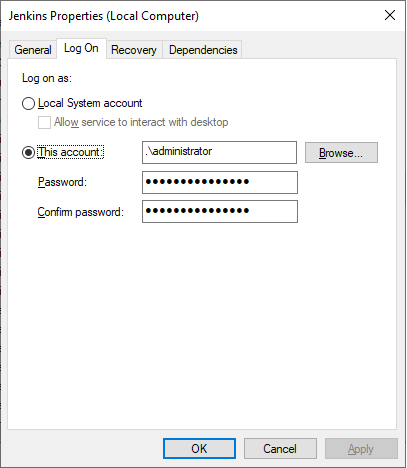

## 目的
在前端框架時，總會有些靜態檔案， 過去手動複製檔案到CDN太花時間了，花了些時間在Jenkins 寫個腳本，將靜態檔案自動複製到CDN，並順便清除Cloudflare cache。

## 首先，在建立 "Live - Copy Next JS public folder to CDN assets" Jenkins Job 的過程中，勾選 This project is parameterized，加入 String Parameter，在樣在執行 Jenkins 時可以帶入選擇性參數
  
  

### 接著撰寫 pipeline，專案資料夾下的public 檔案，複製檔案到 Content server 
```
properties([pipelineTriggers([githubPush()])])

pipeline {
    agent any
 
    tools {nodejs "Node Core"}
    
    options {
        buildDiscarder logRotator(artifactDaysToKeepStr: '', artifactNumToKeepStr: '20', daysToKeepStr: '', numToKeepStr: '20')
     
        disableConcurrentBuilds()    
    }

    stages {
        stage("GitHub Pull") {
            steps {
                script {
                

                def branchName = CdnEnv
                if (CdnEnv == "staging") {
                    branchName = "staging-master"
                } else if (CdnEnv == "production") {
                    branchName = "master"
                }
				
                echo "CdnEnv value: ${env.CdnEnv}"
                echo "branchName value: ${branchName}"

                git branch: branchName, url: "https://xxxxxxxxxxxxxxxxxx@github.com/iBuypowerUS/iBuypower.NextJS.git"
                }
                
            }
        }

    stage("Copy assets to content server ") {
    steps { 	            
            	powershell(script: """
              	robocopy \"${WORKSPACE}\\public\" \"\\\\192.168.0.20\\Content\\\\${CdnEnv}\\assets\" /E /MIR /MT:100 \r\n
              	 
              	""", returnStatus: true)
        }
    }    
 
    }
}

```
### 接著，在建立 "Live - Clear Cloudflare cache" Jenkins Job 的過程中，勾選 This project is parameterized，加入 String Parameter，在樣在執行 Jenkins 時可以帶入選擇性參數
  
  

### 撰寫 Clear Cloudflare cache 的cache 的 pipeline 
```
pipeline {
    agent any 

    environment {
        CLOUDFLARE_EMAIL = 'mark.ku@xyz.com'
        CLOUDFLARE_API_KEY = 'xxxxxxx'
        CLOUDFLARE_ZONE_ID = 'xxxxxxxxxxxxxxxxxxxxxxxxx'
    }

    stages {
        stage('Purge Cloudflare Cache') {
            steps {
                script {
                    // PowerShell script to purge Cloudflare cache
                    powershell """
                        \$headers = @{
                            "X-Auth-Email" = "${env.CLOUDFLARE_EMAIL}"
                            "X-Auth-Key" = "${env.CLOUDFLARE_API_KEY}"
                            "Content-Type" = "application/json"
                        }

                        \$body = @{
                            prefixes = @("${PrefixUrl}")
                        } | ConvertTo-Json

                        \$response = Invoke-RestMethod -Uri "https://api.cloudflare.com/client/v4/zones/${env.CLOUDFLARE_ZONE_ID}/purge_cache" -Method POST -Headers \$headers -Body \$body
                        
                        Write-Host prefix: \"${PrefixUrl}\" - response: \$response
                    """
                }
            }
        }
    }
}

```

## 最後，別的任務就可以，觸發這個Job
```
	stages {
	    stage('Copy Next JS public folder to CDN assets') {
            steps {
                script {
                    build job:  'Live - Copy Next JS public folder to CDN assets', parameters: [string(name: 'CdnEnv', value: "$cdnEnv")]
                }
            }
        }
		
		stage('Clear Cloudflare cache') {
            steps {
                script {
                build job: 'Live - Clear Cloudflare cache' , parameters: [string(name: 'PrefixUrl', value: "content.ibuypower.com/$cdnEnv/assets")]
                }
            }
        }
		
		// Original process... ...
       
	}
```
## P.S. 如果是 Windows 權限不足
Jenkins在windows的安裝後，使用命令或者某些插件的時候容易出現權限錯誤的情況，此時因為使用的是jenkins賬戶，不是administrator管理員權限的賬戶，我們可以按Ctrl+windows鍵，輸入services.msc 在服務中右鍵選中並點擊jenkins服務，查看屬性對話框，切換登錄標簽，選中此賬戶登錄，里邊填寫administrator或者有權限的賬戶，密碼就是登錄密碼，此時重啟jenkins服務即可
  