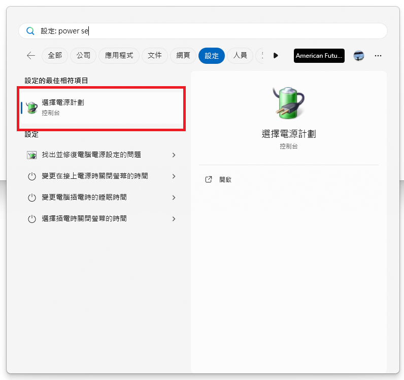

## 解決問題
隨著辨公室，有越來越多電腦，平時可能都沒在時間，但需要使用時就得遠端連線進去，長時間開著電腦容易造成熱當，也浪費電，也容易發生火災，因此就研究了如何遠端開機。

## 原理
是透過台灣的一台不關機開的機器，並透過 Cloudflare tunnel 訪問 wol-go-web 容器去喚醒各位的電腦。

## 限制
一定要插網路線，不允許走 WIFI。

## 服務架設
### 建立 Wake on lan 容器服務（伺服器架設）　
```
docker run -d  --env PORT=9090 -p 9090:9090 --restart=always chishin/wol-go-web
```
### 接著設定 Cloudflare Tunenl ，挷定localhost 的9090 port，可以讓外網可以訪問到 wol-go-web 容器服務
```
https://wol.ec666.com => http://localhost:9090
```
## Windows 11 設定
### 首先 Windows 搜尋找到，選擇電源計劃

### 選擇按下電源鈕的行為 >　變更目前無法使用的設定

### 勾選掉 『快速啟動』的設定 > 儲存

### 接著，開啟命令字元  > 執行ipconfig /all > 往上捲，找到自己的乙太網路(不能是 wifi 的網卡)，接著就能找到 IP 及 Mac id


## Bios 設定
### 重開機按 Del 進入 BIOS 調整 > Boot >  Boot Configuration > First boot  > Disable


## 接著，Advanced > APM Configuration > POWER ON BY PCI-E


## 最後，依據這個URL 換掉自己的內網 IP 和 MAC網卡位置 參數，訪問 URL 就能遠端喚醒辨公室的電腦了。
```
https://wol.ec666.com/wol?mac=58-11-22-B6-4A-60&ip=192.168.0.1
```
## 參考
[參考連結](https://github.com/xiaoxinpro/WolGoWeb)  
[參考連結](https://zhuanlan.zhihu.com/p/302835122)  
[參考連結](https://www.anyviewer.com/tw/how-to/can-you-remotely-access-a-computer-that-is-turned-off.html)
