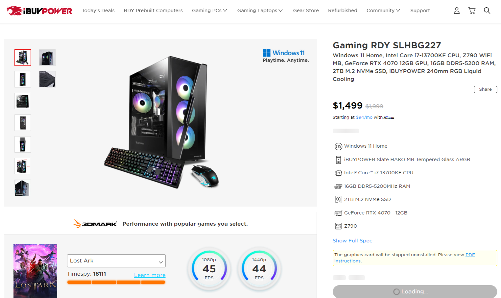

## 事件
美國時間黑色星期五，一早被 Call 了起來，運營在網站折扣給到 400~650美金，瞬間湧進大量的人，每秒都有人下單，訂單量是平常的XX倍以上，網站加載頁面後後無法正確在redis 拿到即時庫存，導致畫面卡死在加載從 redis 拉取庫存的loading 按鈕上，造成了用戶正確加入購物車。

### 分析問題
經過調查發現 3台redis 同步異常，分析硬體效能後發現這三台 redis slave 容器在一台巢狀的 Hyper-v host中 ，依序檢檢查CPU 、記憶體、硬碟IO、且共用一張網卡，Host 被分配的記憶體只有16G ，Windows docker 最高只有 8GB的記憶體可以，且使用率都是接近滿載，推測記憶體資源不足是導致同步異常的主因，最後把那台的host裡 redis 容器實體關掉一個，讓 Host 資源能能夠被充份使用。

## 解決方案
### 短期
* 關閉一個實體，讓Host 能被正常使用
* 加大記憶體

### 中期
* 用nginx 替換掉巢狀 hyper-v
* 調整 Redis 緩存淘汰機制設定

### 長期
* 用 linux 容器替代 Windows Server 
* 導入 K8S 自動部署、擴展和管理容器化應用程序的系統。

## 參考
[Redis的主从复制是如何做的？复制过程中也会产生各种问题？](https://juejin.cn/post/7151593533130948621)
[Redis 的缓存淘汰机制（Eviction）](https://www.cnblogs.com/buttercup/p/13888110.html)