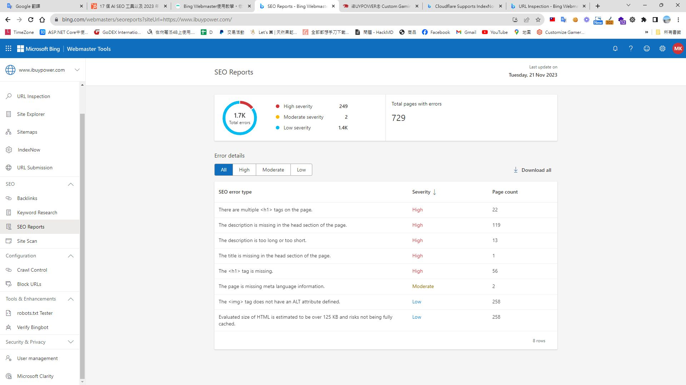

## 前言
隨著人工智能（AI）技術的迅速發展和普及，搜索引擎優化（SEO）的也在發生變化，大多數人在談論SEO時會立即想到Google，隨著微軟在AI 領域越來越不可以被忽視地位，
我們不應忽視Bing 的SEO 優化。

## Bing的獨特之處和重要性
* Bing，作為微軟的搜索引擎，擁有獨特的算法和用戶群。
* Bing在某些地區和特定人群中占有相當的市場份額。
* Bing與微軟的其他產品（如Office 365和Windows）的整合，為特定用戶群提供了無縫的搜索體驗。
* 微軟越來越重視深度用戶體驗。( Redeem 、reward )
* 微軟對於AI扮演舉足輕重的角色。

## [入門教學](https://gooptions.cc/bing-webmaster%E4%BD%BF%E7%94%A8%E6%95%99%E5%AD%B8/)
## [登錄網站 - webmasters](https://www.bing.com/webmasters/)
在半年前在導入 [Clarity](https://blog.markkulab.net/microsoft-clarity/) ，我就順手登錄 Bing 的SEO

## 點擊 SEO Report，會顯示出一些SEO的優化建議
  
大多問題是，圍繞在標題及內容的優化，猜想 AI 機械人是個標題黨，多個H1 tag 會困惑，內容過多或過少都不好採樣。

## 結論
Bing的SEO優化在AI時代不應被忽視，了解Bing的特點和它如何運作，以及AI如何影響搜索行為，優化網站對Bing SEO 爬蟲友善，我們或許可以從中獲得新的機會流量。

