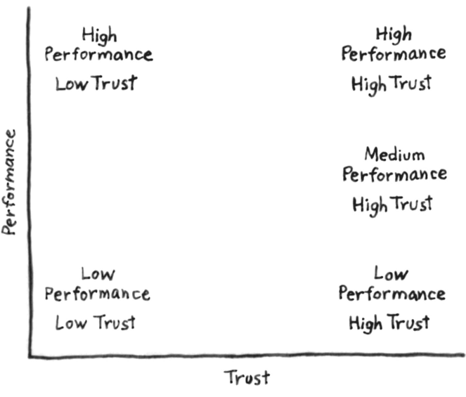

## 在美國海豹部隊裡有一種獨特管理思維，通過將個人績效與信任進行矩陣分析，來識別最適合領導的人選，首先，我們先來看一段[影片](https://www.youtube.com/watch?v=PTo9e3ILmms&fbclid=IwAR03T_gO9Jrc-SoBbA1BXL2CakNw6Cecr4aKXtVb1k40lRzV9XZQQd0H1CI)

## 特別是在以下兩種情境中，信任顯得尤為關鍵：
* 深入阿富汗山區的美軍特遣隊： 在這種充滿挑戰和不確定性的環境中，隊員之間的相互信任不僅是完成任務的關鍵，更是他們生存的基石。
* 長期海上航行的船隊： 在這樣封閉而持續的海上環境中，強烈的團隊凝聚力和信任是保障航行安全與效率的重要因素。

## 這種管理思維，將個人績效與信任做矩陣分析

這種分析揭示了幾個關鍵觀點：
1. 有 n 種方式衡量高績效，卻沒有1種方法衡量信任的方法。
2. 衡量信任的方法，當離開戰場後( 台面下 )，是什麼樣子 ?  是否還可以信任 ?
3. 高績效的人，低信任度的人，往往對長期運營來說，對團隊是不利的，因為只考量個人利益最大，而這種人相當容易找。
4. 中等績效，高信任度的人，是最適合當領導者的，因為出了事情他不會跑，會和你一起解決。

## 信任的團隊
一起工作的人不等於夥伴，信任就是敢表現脆弱，敢大聲承認犯錯，敢舉手尋求幫助。 (From 無限賽局 )

## 如何在職場建立信任
在職場中，每個人都有看不見的信任賬戶 ( Trust amout )，你剛到一間公司可能是從0開始，通過正確的行為和決策，可以逐步積累信任，隨著信任的增加，信任累積越多，可以換取的資源及職場自由度就會不同。

## 如何增加別人對你的認任
1. 完成事情主動回報及並同步資訊。
2. 做錯事情提前承認，並提出預防的方法。
3. 主動承擔責任，並對事情結果負責。
4. 協助團隊解決棘手問題。
5. 對團隊是否有正面影響等。。
6. 在團隊合作中展現工作的專業度。
7. 遇到不清楚的問題，會把問題釐清。
8. 面對不合理的工作任務，不會默不吭聲，會主動去溝通協調。
9. 會協助團隊其他成員成長。  
...

### 如何減少別人對你的認任
1. 做事情應付，也不考慮品質，只把事情做完。
2. 遇到未知的問題不了解，也不想把他弄懂，就隨便回答。
3. 只做自己感興趣的事情，忽視公司及主管的要求。
4. 不承認自己的錯誤。
5. 在面對困難時推卸責任。  
6. 孤芳自賞 (narcissism)，總覺得自己做的很完美。
7. 總是責怪他人。
8. 總是把自己永遠放在首位。
9. 對團隊產生負面影響。
...

## 結論
從美國海豹部隊的管理哲學中我們學到，無論是在極端環境還是日常職場，信任和團隊都是成功及失敗的關鍵，通過建立和維護信任，我們不僅可以提高個人和團隊的績效，還能創造一個更加和諧有效的工作環境。

## 參考資料
[連結](https://albert-kuo.blogspot.com/2022/04/the-infinite-game-trusting-teams.html)