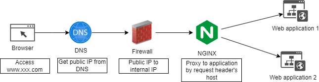
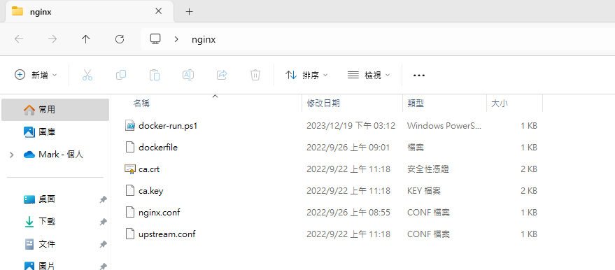
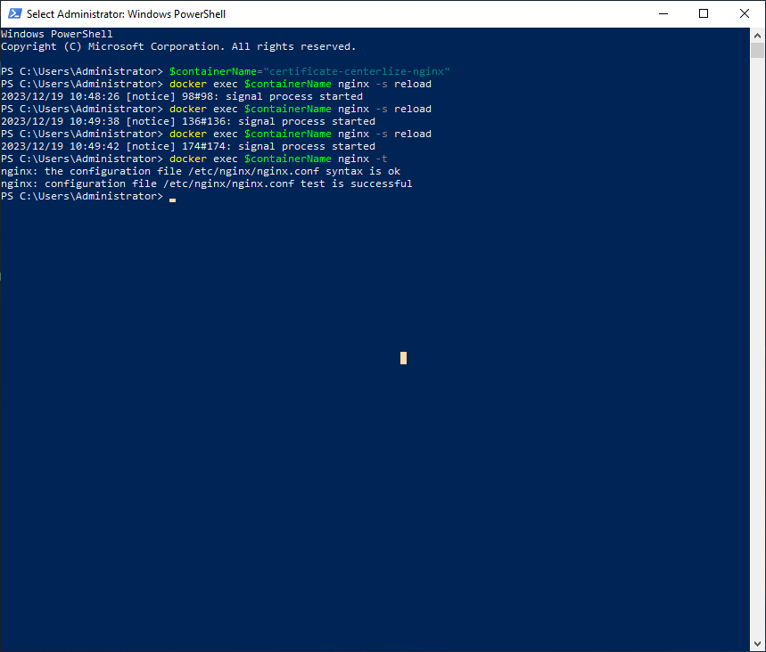

## 時空背景
目前公司的伺服器架構是巢狀Hyper-V，但我們都知道一台電腦只有一個 Https (443) 埠，因此每次需要這架構在擴展Web應用服務都得開一個虛擬器 ( Virtual Machine )，這非常的沒有效率，且又浪費伺服器資源(CPU 、記憶體、硬碟、外部IP)，而如今這個時代，只要透過 Docker 一行指令，就能輕鬆架起一堆服務也不需要像過去安裝OS，設定很多的環境，才能佈署，因為短時間我們也暫時還無法走到K8S，先透過 Nginx 簡化這個伺服器架構。

## 效益
* 伺服器利用率極大化，減少不必要的效能消耗。
* 備份容易及佔用的容量更小。
* 橫向擴展更容易。
* 因為我們 DNS 託管於 Cloudflare 己挷定的IP，增加新域名可以不用找網管人員再設定防火牆

## 網路架構設計


## 建立 nginx 容器所需的設定檔案



### 首先，下載 Https 憑證
因為我們將 DNS 託管於 Cloudflare，因此可以免費使用 Https ，可以從 Cloudflare 後台[下載憑證](https://developers.cloudflare.com/ssl/client-certificates/create-a-client-certificate/)。

### 接著，撰寫 dockerfile 

```
FROM nginx
COPY nginx.conf /etc/nginx/conf.d/default.conf
COPY upstream.conf /etc/nginx/conf.d/upstream.conf
COPY ca.crt /etc/nginx/ca.crt
COPY ca.key /etc/nginx/ca.key

```

### 再設定 nginx.config 
Nginx 會根據 server_name 指令中指定的域名來轉發請求到不同的伺服器。當一個 HTTPS 請求抵達 Nginx 伺服器時，Nginx 會檢查請求的 HTTP Host 頭部來決定使用哪個伺服器區塊（server block）來處理該請求。

```
server {
    # Listen HTTP - From Firewall
    listen 80;
    server_name aafes.abc.com;

    # Redirect HTTP to HTTPS
    return 301 https://$host$request_uri;
}

server {
    # Listen HTTPS - From Firewall
    listen 443 ssl;
    server_name aafes.abc.com;

    # SSL config
    ssl_certificate /etc/nginx/ca.crt;
    ssl_certificate_key /etc/nginx/ca.key;

    # Proxy Config
    location / {
        proxy_pass http://192.168.0.99:20080;
        proxy_http_version 1.1;
        proxy_set_header X-Forwarded-Host $host;
        proxy_set_header X-Forwarded-Server $host;
        proxy_set_header X-Real-IP $remote_addr;
        proxy_set_header X-Forwarded-For $proxy_add_x_forwarded_for;
        proxy_set_header X-Forwarded-Proto $scheme;
        proxy_set_header Host $http_host;
        proxy_set_header Upgrade $http_upgrade;
        proxy_set_header Connection "Upgrade";
        proxy_pass_request_headers on;
    }
}
 
server {
    # Listen HTTP - Cloudflare Tunnel
    listen 80;
    server_name new-aafes.abc.com;

    location / {
        proxy_pass http://192.168.0.99:10080;
        proxy_http_version 1.1;
        proxy_set_header X-Forwarded-Host $host;
        proxy_set_header X-Forwarded-Server $host;
        proxy_set_header X-Real-IP $remote_addr;
        proxy_set_header X-Forwarded-For $proxy_add_x_forwarded_for;
        proxy_set_header X-Forwarded-Proto $scheme;
        proxy_set_header Host $http_host;
        proxy_set_header Upgrade $http_upgrade;
        proxy_set_header Connection "Upgrade";
        proxy_pass_request_headers on;
    }
}

server {
      # Listen on HTTP
    listen 80;
    server_name cdn.abc.com;

    # Root directory for static content
    root /var/www/html;

    # Default location
    location / {
        # Enable directory listings
        autoindex off;
		
		# Try to serve file as is, return 404 if not found
        try_files $uri $uri/ =404;
    }

    # Other configurations (if needed)
}

```

### 設定負載平衡 ( 如果應用程式有多台才需要 ) upstream.conf 

```
upstream cms.abc.com {
     server 192.168.0.99:27777;
}
```

### 建立並執行 Powershell 建啟及啟動容器
```
$imageName = "certificate-centerlize-nginx"
docker build -t $imageName . 
$containerName="certificate-centerlize-nginx"
$port80="80:80"
$port443="443:443"
docker run -d --name $containerName --restart=always -p "${port80}" -p "${port443}"  $imageName 
PAUSE
```
## 不停機重載設定
Nginx 強大的地方，就是config 或憑證變更，使用 nginx -s reload 命令重載 Nginx 配置時，通常不會導致服務中斷或訪問不到的情況。

```
$containerName = "certificate-centerlize-nginx"
$localDir = (Get-Location).Path
$nginxConfigPath = "$localDir\nginx.conf"
$nginxUpstreamConfig = "$localDir\upstream.conf"

docker cp "${nginxConfigPath}" "${containerName}:/etc/nginx/conf.d/default.conf"
docker cp "${nginxUpstreamConfig}" "${containerName}:/etc/nginx/conf.d/upstream.conf"
docker exec $containerName nginx -s reload
```


## 最後
通過本文的步驟，讀者可以學習到如何利用 Docker 架設 Nginx 處理 Https 集中轉發及配置負載平衡，提高Web 應用服務佈署的效率和靈活性，這個解決方案不僅適用於小型專案，也能輕鬆擴展到大型企業級應用。

## 參考資料
[Nginx负载均衡配置](https://blog.csdn.net/xyang81/article/details/51702900)  
[五分钟看懂 Nginx 负载均衡](https://juejin.cn/post/6844904106541203464)  
[實作Hyper-V巢狀虛擬化　測試研發效率大提升](https://www.netadmin.com.tw/netadmin/zh-tw/feature/85DC7EDD93F546AF81E8EBAEE18B8992#google_vignette)  
[為 Nginx 提供友善管理介面與自動化 HTTPS - Nginx Proxy Manager](https://blog.darkthread.net/blog/nginx-proxy-manager/)

