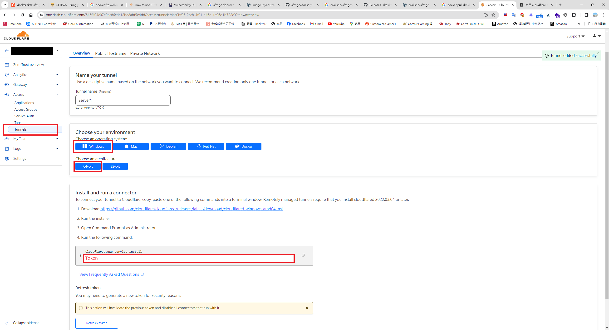
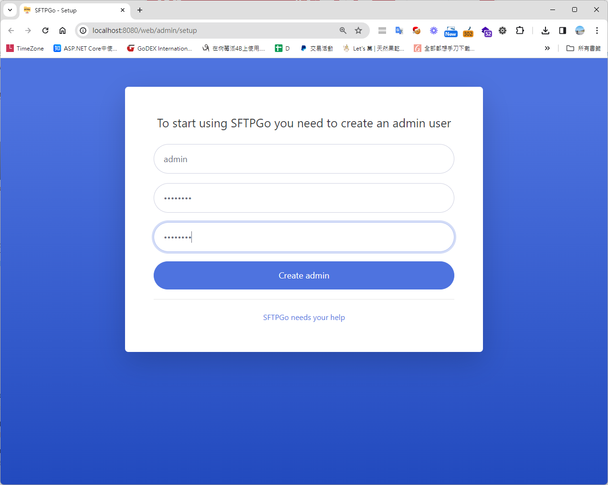
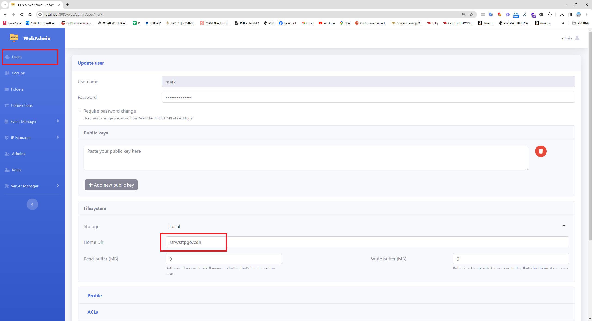
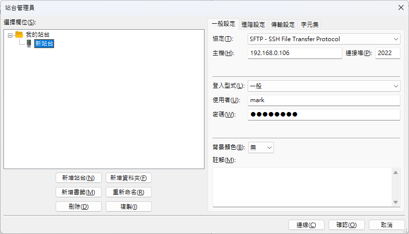
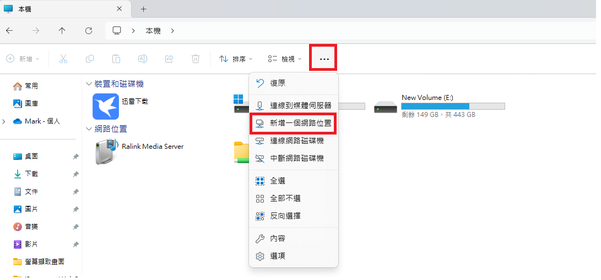
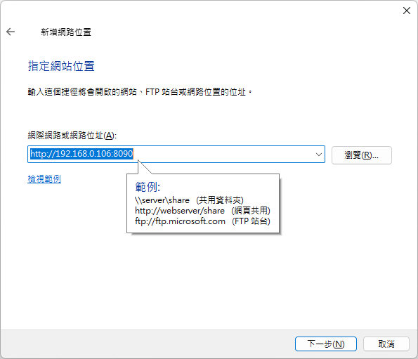
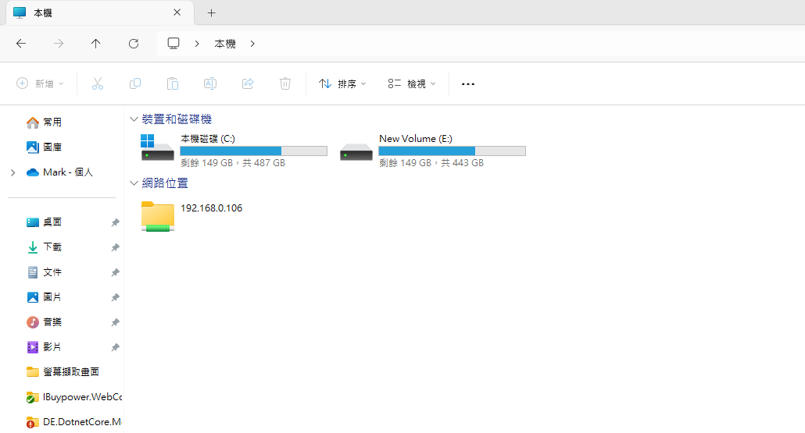

## 時空背景
因為德國及美國的網站需要一套全新的FTP Server，因此花了些時間研究，試了幾套 Docker FTP後，終於找到擁有 Web UI 管理界面，且開源 FTP Server - sftpgo。

## 官方資料
[sftpgo官網](https://sftpgo.com/)  
[Github](https://github.com/drakkan/sftpgo)

## 預先準備
* 在宿主主機，安裝 Docker Desktop
* 安裝及設定 Cloudfalre Tunnel，並挷定 sftpgo 所需要的連接埠。(sftpgo Web 透過 Cloudflare Tunnel 讓外部可以透過web 上傳檔案，但SFTP 詢問Cloudflare 官方 SFTP 仍有bug， 這邊先直接用防火牆指向)


## 首先，建立及啟動 FTP Docker 容器
```
docker run -d --name sftpgo --restart always -p 8080:8080 -p 2022:2022 -p 8090:8090 -e TZ=America/Los_Angeles -e SFTPGO_HTTPD__BINDINGS__0__PORT=8080  -e SFTPGO_WEBDAVD__BINDINGS__0__PORT=8090 -v E:\ftp\:/srv/sftpgo drakkan/sftpgo
```
### sftpgo 預設目錄
* SFTP/FTP/WebDAV預設目錄: /srv/sftpgo  
* 用戶預設目錄: /srv/sftpgo/data/{UserName}
* 主機金鑰目錄: /var/lib/sftpgo 

### SFTPGo TCP 埠：
* 2022 用於 SFTP 服務。  
* 8080 用於 Web 管理員用戶界面。  
* 8090 用於 Webdav


## 接著，訪問Web 管理員用戶界面，建立後台管理帳號 - [連結](http://localhost:8080/web/admin/setup)



## 再登入後點擊菜單中的 Users > 點擊新增按鈕 + > 建立 ftp 帳號 - [連結](http://localhost:8080/web/admin/login)

P.S.Home Dir預設目錄/srv/sftpgo/data/{你的帳號名}，因為想每個帳號預設的目錄都是 /srv/sftpgo/cdn 

## 如果測試建立的帳號可以訪問 web client(/web/client/login) - [連結](http://localhost:8080/web/client/login)

## 使用 FileZilla Client 做測試
### 1.[下載及安裝FileZilla Client](https://filezilla-project.org/)
### 2.檔案 > 站台管理員 > 新增站台 > 協定選擇 『SFTP - SSH Transfer Protocol』


## Windows 掛載 WebDEV 資料夾
### 1.設置完整的註冊檔路徑，用管理權限Powershell 執行以下指令
```
// 設定
Set-ItemProperty -Path "HKLM:\SYSTEM\CurrentControlSet\Services\WebClient\Parameters" -Name "BasicAuthLevel" -Value 2

// 檢查 BasicAuthLevel
Get-ItemProperty -Path "HKLM:\SYSTEM\CurrentControlSet\Services\WebClient\Parameters" -Name "BasicAuthLevel"

// 重新啟動 webclient
net stop webclient
net start webclient
```

### 2.開啟本機 > 點擊 ... > 新增一個網路位置

### 3. 輸入 WebDev 的主機及IP 及帳密


### 4.下一步


### 5.新增完成


## 最後
在當今這個充滿創新的時代，開源軟件層出不窮，不僅功能豐富，使用起來也非常便捷。對於具備一定程式設計知識的人來說，這些開源資源提供了無限的可能性，可以根據自己的需要進行調整和改進，本文旨在提供一份全面的指南，指引讀者如何利用 Cloudflare Tunnel 和 Docker 快速搭建一個配備 Web UI 的 FTP Server - sftpgo。希望這篇文章能對尋求此類解決方案的你有所幫助，使你能夠更輕鬆地掌握和運用這些強大的開源工具。

## 參考資料
[參考資料](https://blog.csdn.net/networken/article/details/133963932)  


