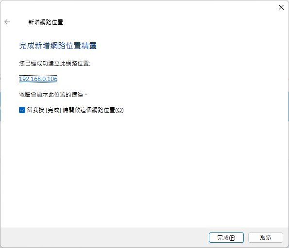

## 時空背景
因為德國及美國的網站需要一套全新的FTP Server，因此花了些時間研究，試了幾套 Docker FTP後，終於找到擁有 Web UI 管理界面，且開源 FTP Server - sftpgo。

## sftpgo - 官方資料
功能齊全，且高度可配置的 SFTP 伺服器，具有可選的 HTTP/S、FTP/S 和 WebDAV 支援，支援的儲存後端：本機檔案系統、加密本機檔案系統、S3（相容）物件儲存、Google 雲端儲存、Azure Blob 儲存、其他 SFTP 伺服器，並擁有 WebAdmin 及 WebClient 使用者界面，並可以透過使用者界面備份，FTP 設定。
[sftpgo官網](https://sftpgo.com/)  
[Github](https://github.com/drakkan/sftpgo)

## 談到FTP 就順便了解一下，常見的FTP 協定
### 1. SFTP : SFTP（Secure File Transfer Protocol）是一種通過SSH（安全外殼協議）提供加密和安全的檔案傳輸服務的網絡協議。 (22 port) 
### 2. FTP / FTPS :FTP是一種用於網絡上檔案傳輸的標準協議，而FTPS是FTP的安全版本，通過SSL/TLS提供加密傳輸。
當然可以。FTP的主動模式（PORT）和被動模式（PASV）的主要差異在於資料連接的建立方式：
* 主動模式(PORT)：客戶端打開一個隨機端口以接收資料，然後通過PORT命令告知伺服器這個端口號，伺服器隨後從其端口20連接到客戶端指定的端口來傳輸資料，這時要求客戶端的防火牆若不允許來自FTP伺服器的入站連接時可能會遇到問題。
* 被動模式(PASV)：客戶端從伺服器的端口請求一個被動連接，伺服器打開一個隨機端口並通知客戶端，進行資料傳輸。
總結來說，主動模式和被動模式的主要區別在於資料連接的發起方和連接的建立方式，這影響了對防火牆設定的需求，被動模式通常更適合於現代的網絡環境，特別是當客戶端位於受限的網絡環境中時。

## 預先準備
* 在宿主主機，安裝 Docker Desktop
* 安裝及設定 Cloudfalre Tunnel，並挷定 sftpgo 所需要的連接埠。(sftpgo Web 透過 Cloudflare Tunnel 讓外部可以透過web 上傳檔案，但SFTP 詢問Cloudflare 官方 SFTP 仍有bug， 這邊先直接用防火牆指向)


## 首先，建立及啟動 FTP Docker 容器
```
docker run -d --name sftpgo --restart always -p 8080:8080 -p 2022:2022 -p 8090:8090 -e TZ=America/Los_Angeles -e SFTPGO_HTTPD__BINDINGS__0__PORT=8080  -e SFTPGO_WEBDAVD__BINDINGS__0__PORT=8090 -v E:\ftp\:/srv/sftpgo drakkan/sftpgo
```
### sftpgo 預設目錄
* SFTP/FTP/WebDAV預設目錄: /srv/sftpgo  
* 用戶預設目錄: /srv/sftpgo/data/{UserName}
* 主機金鑰目錄: /var/lib/sftpgo 

### SFTPGo TCP 埠：
* 2022 用於 SFTP 服務。  
* 8080 用於 Web 管理員用戶界面。  
* 8090 用於 Webdav

## 接著，訪問Web 管理員用戶界面，建立後台管理帳號 - [連結](http://localhost:8080/web/admin/setup)


## 再登入後點擊菜單中的 Users > 點擊新增按鈕 + > 建立 ftp 帳號 - [連結](http://localhost:8080/web/admin/login)

P.S.Home Dir預設目錄/srv/sftpgo/data/{你的帳號名}，因為想每個帳號預設的目錄都是 /srv/sftpgo/cdn 

## 如果測試建立的帳號可以訪問 web client(/web/client/login) - [連結](http://localhost:8080/web/client/login)

## 使用 FileZilla Client 做測試
### 1.[下載及安裝FileZilla Client](https://filezilla-project.org/)
### 2.檔案 > 站台管理員 > 新增站台 > 協定選擇 『SFTP - SSH Transfer Protocol』


## Windows 掛載 WebDEV 資料夾
### 1.設置完整的註冊檔路徑，用管理權限Powershell 執行以下指令
```
// 設定
Set-ItemProperty -Path "HKLM:\SYSTEM\CurrentControlSet\Services\WebClient\Parameters" -Name "BasicAuthLevel" -Value 2

// 檢查 BasicAuthLevel
Get-ItemProperty -Path "HKLM:\SYSTEM\CurrentControlSet\Services\WebClient\Parameters" -Name "BasicAuthLevel"

// 重新啟動 webclient
net stop webclient
net start webclient
```

### 2.開啟本機 > 點擊 ... > 新增一個網路位置

### 3. 輸入 WebDev 的主機及IP 及帳密


### 4.下一步


### 5.新增完成


## 最後
在當今這個充滿創新的時代，開源軟件層出不窮，不僅功能豐富，使用起來也非常便捷。對於具備一定程式設計知識的人來說，這些開源資源提供了無限的可能性，可以根據自己的需要進行調整和改進，本文旨在提供一份全面的指南，指引讀者如何利用 Cloudflare Tunnel 和 Docker 快速搭建一個配備 Web UI 的 FTP Server - sftpgo。希望這篇文章能對尋求此類解決方案的你有所幫助，使你能夠更輕鬆地掌握和運用這些強大的開源工具。

## 參考資料
[參考資料](https://blog.csdn.net/networken/article/details/133963932)  


