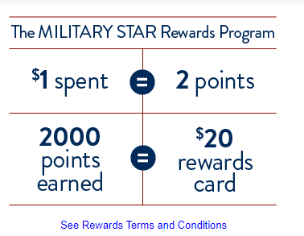
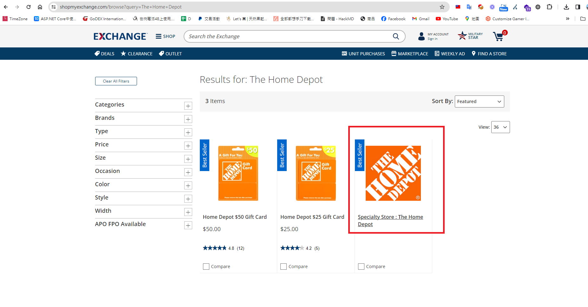
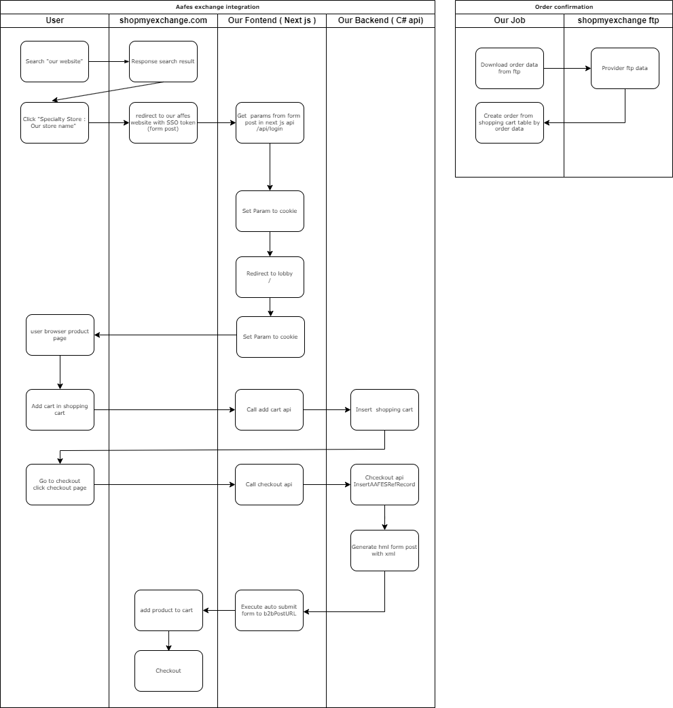

## 時空背景
公司想翻寫軍方共同供應網站 （Army and Air Force Exchange Service,AAFES）的網站，順便了解一下運作規則及了解 AAFES 和 ShopMyExchange 之間的關係。

## 了解 AAFES（Army and Air Force Exchange Service, AAFES）
美國國防部下屬的軍事交換服務（AAFES）成立於1895年，擔任著為美國軍方及其家屬提供服務的重要角色，同時也負責經營位於軍事基地內的零售店鋪、服務設施和食品服務，旨在提升軍人及其家屬的生活品質，作為美國第53大零售商，AAFES 透過提供優質商品和服務來支持軍人的士氣和福利。

AAFES 還運營著 ShopMyExchange.com 電商網站，專門為現役軍人、退伍軍人、預備役、國民警衛隊人員、駐外的美國國防部平民員工、在外國工作的國務院官員及其家屬等授權顧客服務。這個平台提供各種產品，包括廚房用具、庭院和園藝用品、家庭用品以及運動和戶外裝備，所有商品都是免稅的，讓軍事社區成員可以享受到更加實惠的價格。

ShopMyExchange 非常重視顧客信息的隱私和安全，無論是透過網站、電話還是傳真訂單，供應商無法得知下單的人及軍事單位是誰。

## MILITARY STAR® Card：專為軍人設計的信用卡
[MILITARY STAR® Card](https://www.myecp.com/) 是由 AAFES 發行的一種信用卡，專門為美國軍人及其家屬量身打造，這張卡片提供了多種獨特的優惠和便利，包括：

* 特殊優惠：在軍事交換店及其線上平台購物時，持卡人可享受折扣和促銷優惠。 (常常有 10% 左右的回饋)
* 靈活的支付選項：卡片提供了分期支付等多樣化的付款方式。
* 低利率：與許多商業信用卡相比，MILITARY STAR® Card 通常擁有更低的利率。
* 獎勵計劃：消費者可以累積積分，並在軍事交換店使用這些積分。
* 專門服務：為軍人及其家庭設計的客戶服務和支持。
* ShopMyExchange.com：網上購物的極致便利

## 兩種購物方式
ShopMyExchange.com用戶有兩種購買商方式，但只有第二種需要程式界接(此案例為第二種)
* 1. 上架到商品到ShopMyExchange.com網站
* 2. 建立我們自己家的的 AAFES 網站，依據我們的後台資料庫設定，提供更豐富的商品資訊。

## 目標
提供軍方授權客戶在 [ShopMyExchange 網站購物](https://www.shopmyexchange.com/)，當點擊 " Specialty Store :XXX"時，導頁至我們的 AAFES 網站，提供更多的商品資訊，並加入購物車，直到結帳時導回去ShopMyExchange 付款，最終使用者在ShopMyExchange完成付款後，ShopMyExchange 會上傳指定FTP，我方在依據用排程任務下載FTP的資料產生訂單。

## 非功能性需求
* 整合GA4 及進階電子商務報表 ( 只有到 Checkout，不含 Purchase  ) 
* 整合Clarity 熱圖分析

## 泳道圖
有點像台灣的共同供應契約的界接方式，此種交易方式保障購買人的交易安全隱私，我們也能夠更彈性客製我們的網頁。

