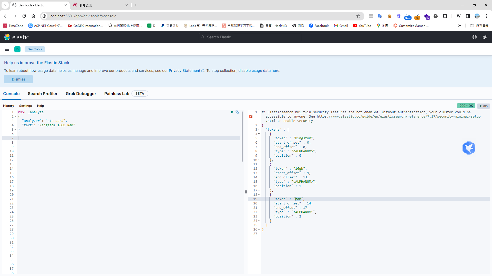
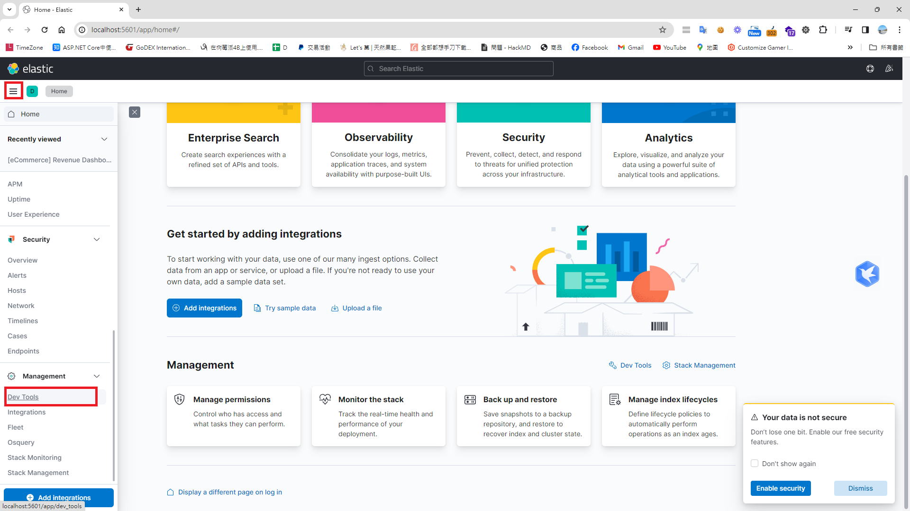
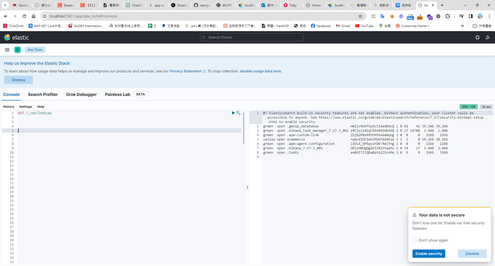
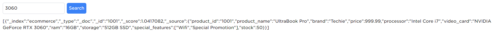

## 時空背景
客服經理和我們反應，網站的搜尋功能體驗非常的差，用戶常常搜尋不到的規格，然後他說希望能像 Google 一樣搜尋體驗，因此我就花了些時間了解後，發現全文檢索應該是能解決我們的問題。

## 為何需要使用 - 全文檢索
全文檢索工具（Full-Text Search Tools）是一種軟體工具，主要功能在有效地搜索和檢索大量的文字數據，並返回相關的搜索結果，可以在數秒內檢索大規模文本數據集，提供多種搜索選項，例如關鍵字搜索、短語搜索、模糊搜索等，使用戶能夠以多種方式查找所需資訊。

## 全文檢索原理 

因為全文檢索技術和資料庫最大的差別就是，當資料量越大時，要對全表查詢時，對資料庫要耗費相當長的時間，但全文檢索技術採用[倒排索引](https://www.zhihu.com/question/23202010)的檢索技術，以依據各種分詞器將資料以 key 及 value 的形式儲存，查詢時就會變得簡單及快速。

### 以資料庫存儲的商品為例

| SkuID | Column 2 | 
| -------- | -------- | 
| 1     | Kingstom 16GB Ram  | 
| 2     | Transcend 16GB Ram  | 

### 在全文檢索技術採用倒排索引，這樣查詢就變得非常簡單

| Term | SkuID | 
| -------- | -------- | 
| kingstom | 1        | 
| 16gb     | 1,2      | 
| ram      | 1,2      | 
| transcend| 1,2      | 

## 內建分詞
Elasticsearch 就內建的分詞器和分析器，有標準分詞器、空格分析器、簡單分析器等等，它們的主要工作就是把文字拆成一個個詞彙，還有做一些處理，像是轉成小寫、詞幹提取、過濾停用詞等等，讓系統可以更好地建立索引和進行全文檢索。你可以根據需要，選擇適合的分詞器和分析器，或者自己客製化一個，這樣就能有更好的搜尋效果了。

### 測試分詞器
後面 ElasticSearch 及 Kabana 架好後，可以透過下面語法測試分詞
```
POST _analyze
{
  "analyzer": "standard",
  "text": "Transcend 16GB Ram"
}
```

P.S. Elasticsearch 並沒有內建中文的分詞器，但可以另外安裝常用的[中文分詞器](https://blog.csdn.net/qq_26803795/article/details/106522611)，EX:IK 分词器、Smartcn 分词器和 Jieba 。

## ElasticSearch 與 RDBMS 的概念類似，這邊整理了名詞的對照表

| ElasticSearch | RDBMS | 
| --------  | -------- | 
| INDEX (索引)    | 表   　   | 
| DOCUMENT (文件) | 行   　   | 
| FIELD   (欄位)  | 欄位   　 | 
| MAPPING (結構)  | 表結構　　 | 


## 建立及啟動容器
### Docker Compose  (docker-compose.yml )
```
# 注意version要和docker-compose的版本對應 docker-compose --version
version: '3.8'
services:
  elasticsearch:
    image: elasticsearch:7.17.3
    ports:
      - "9200:9200"
      - "9300:9300"
    environment:
      - discovery.type=single-node
    container_name: elasticsearch

  kibana:
    image: kibana:7.17.3
    ports:
      - "5601:5601"
    environment:
      - ELASTICSEARCH_HOSTS=http://elasticsearch:9200
    container_name: kibana
    depends_on:
      - elasticsearch
```

### 運行及啟動 Docker Compose
```
docker-compose -p ibp-us-elasticsearch-group up
```

### 開啟防火牆
```
New-NetFirewallRule -DisplayName "elasticsearch -Port 5000" -Direction Inbound -Protocol TCP -LocalPort 5000 -Action Allow

New-NetFirewallRule -DisplayName "elasticsearch -Port 9200" -Direction Inbound -Protocol TCP -LocalPort 9200 -Action Allow

New-NetFirewallRule -DisplayName "kibana -Port 9200" -Direction Inbound -Protocol TCP -LocalPort 5601 -Action Allow
```



### 首先，先訪問 ElasticSearch http://localhost:9200/_cat/indices 查詢所有的索引，ElasticSearch 其實很單純，他本身就內建了rest api ，透過訪問URL 就能拿到我們要的結果

### 接著，再訪問 Kabana http://localhost:5601/ ，點開導覽列，找到DevTools，就可以透過 UI  去操作先前在Docker 指定的ElasticSearch 。

```
GET /_cat/indices 
```



### 像資料庫則需要先定表結構，才能新增資料，但ElasticSearch 相當強大，先新增資料，自動推斷欄位型態
#### 單筆新增資料
```
POST product/_doc/1004
{
    "product_id": "1004",
    "product_name": "Super Tablet",
    "brand": "Techie",
    "price": 599.99,
    "processor": "ARM Cortex-A76",
    "video_card": "Integrated Mali-G76",
    "ram": "4GB",
    "storage": "128GB SSD",
    "special_features": ["Touchscreen", "Lightweight"],
    "stock": 25
}

```
P.S _doc => 為預設文檔的類型，新版本中不建議修改文檔的類型，此功能逐步會被淘汰。

#### 批量新增資料
```
POST _bulk
{"index": {"_index": "product", "_id": "1001"}}
{"product_id": "1001", "product_name": "UltraBook Pro", "brand": "Techie", "price": 999.99, "processor": "Intel Core i7", "video_card": "NVIDIA GeForce RTX 3060", "ram": "16GB", "storage": "512GB SSD", "special_features": ["Wifi", "Special Promotion"], "stock": 50}
{"index": {"_index": "product", "_id": "1002"}}
{"product_id": "1002", "product_name": "Gamer PowerHouse", "brand": "Xtreme", "price": 1299.99, "processor": "AMD Ryzen 7", "video_card": "AMD Radeon RX 6800 XT", "ram": "32GB", "storage": "1TB SSD", "special_features": ["Custom Liquid Cooling", "Special Promotion"], "stock": 30}
{"index": {"_index": "product", "_id": "1003"}}
{"product_id": "1003", "product_name": "PortaLight", "brand": "SleekTech", "price": 799.99, "processor": "Intel Core i5", "video_card": "Integrated Intel Iris Xe Graphics", "ram": "8GB", "storage": "256GB SSD", "special_features": ["Wifi"], "stock": 70}
```

### 查詢 product 的結構
```
GET /product/_mapping
```
###  查詢該筆id=1的資料
```
GET /product/_doc/1001
```
#### 查詢回來的結果
```
{
  "_index" : "ecommerce",
  "_type" : "_doc",
  "_id" : "1001",
  "_version" : 1,
  "_seq_no" : 0,
  "_primary_term" : 1,
  "found" : true,
  "_source" : {
    "product_id" : "1001",
    "product_name" : "UltraBook Pro",
    "brand" : "Techie",
    "price" : 999.99,
    "processor" : "Intel Core i7",
    "video_card" : "NVIDIA GeForce RTX 3060",
    "ram" : "16GB",
    "storage" : "512GB SSD",
    "special_features" : [
      "Wifi",
      "Special Promotion"
    ],
    "stock" : 50
  }
}

```

#### 依據查詢回來的結果，整理了一些對照

| 欄位           | 說明                                                         |
| ---------------- | ------------------------------------------------------------ |
| _index           | document 所屬的 index 名稱                                 |
| _type            | document 類型                                               |
| _id              | document ID 編號                                            |
| _version         | 版本訊息，每進行一次更新、刪除，都會增加 version 的值        |
| _source          | 此 document 的原始 json 資料                                |

### 獲取所有的資料
```
GET /product/_search
```
### 查詢單筆資料
```
GET /product/_search
{
  "query": {
    "match": {
      "product_name": "ibp002"
    }
  }
}
```
### 整理一些常見的查詢條件
| 查詢類型           | 描述                                                                                          | 範例                        |
|--------------------|-----------------------------------------------------------------------------------------------|-----------------------------|
| **`match` 查詢**     | 用於全文檢索，對搜尋詞進行分詞，然後搜索每個分詞，支援文本字段的分析，適用於搜索文本字段。 | 搜尋 "快速的電腦"          |
| **`match_phrase` 查詢** | 也用於全文檢索，但要求匹配整個詞組，考慮詞序，適用於精確詞組匹配的情況。               | 搜尋 "快速的電腦"          |
| **`multi_match` 查詢** | 允許在多個字段中進行 `match` 查詢，適用於在多個字段中搜索相同關鍵字的情況。           | 在標題和描述中搜尋 "蘋果"     |
| **`term` 查詢**       | 用於精確值匹配，不進行分詞，適用於非分析字段，通常用於數字、日期或未分析的文本字段。   | 搜尋具有特定 ID 的文件         |
| **`fuzzy` 查詢**      | 用於處理拼寫錯誤和近似匹配，基於 Levenshtein 編輯距離算法，適用於容忍拼寫錯誤的情況。 | 搜尋 "aple" 可以匹配 "蘋果"   |
| **`wildcard` 查詢**   | 允許使用通配符 `*` 和 `?` 進行模糊匹配。適用於需要匹配特定模式的情況。              | 搜尋 "te*t" 可以匹配 "測試"  |

### 糊模查詢
```
GET /product/_search
{
  "query": {
    "wildcard": {
      "product_name": "pro*"
    }
  }
}
```
###  模糊查詢，允許錯字
```
GET /product/_search
{
  "query": {
    "fuzzy": {
      "product_name": {
        "value": "pro",
        "fuzziness": "AUTO"
      }
    }
  }
}
```

### 多欄位搜尋
```
GET /product/_search
{
  "query": {
    "multi_match": {
      "query": "您的關鍵字",
      "fields": ["price", "processor", "video_card", "ram", "storage", "special_features"]
    }
  }
}
```
### 查出索引文件資訊 - ( 筆數 )

```
POST /product/_doc
{
  "query": {
    "bool": {
      "must": [
        { "match": { "name": "4060" } }
      ]
    }
  }
}
```

### 依據ID刪除該筆資料

```
DELETE /product/_doc/1
```
### 刪除索引含資料
```
DELETE /product
```
### 刪除所有資料
```
POST /product/_delete_by_query
{
  "query": {
    "match_all": {}
  }
}
```


##  應用程式 - NextJS 整合
### 安裝 @elastic/elasticsearch 套件
```
npm install @elastic/elasticsearch
```
### 接著，建立 elasticsearch Client
```
// lib/elasticsearch.ts
import { Client } from '@elastic/elasticsearch';

const client = new Client({
    node: 'http://localhost:9200', // 更改為您的 Elasticsearch 節點地址
});

export default client;

```
### 在 Next.js 中建立 查詢 Elasticsearch 的 Api 

```
// pages/api/search.ts
import client from '../../lib/elasticsearch';

import client from '@utils/elasticsearch';
import { NextApiRequest, NextApiResponse } from 'next';

export default async function handler(req: NextApiRequest, res: NextApiResponse) {
    try {
        // 從請求體或查詢參數中獲取搜索關鍵字
        const keyword = req.body.keyword || req.query.keyword;

        // 建立多字段 Elasticsearch 查詢
        const query = {
            multi_match: {
                query: keyword,
                fields: ['price', 'processor', 'video_card', 'ram', 'storage', 'special_features'],
            },
        };

        // 執行 Elasticsearch 查詢
        const body = await client.search({
            index: 'product',
            body: { query },
        });

        // 返回查詢結果
        res.status(200).json(body.hits.hits);
    } catch (error: any) {
        res.status(500).json({ message: error.message });
    }
}

```
### 最後在前端建立搜索框

```
'use client';
import { useState } from 'react';

export default function Search() {
    const [keyword, setKeyword] = useState<string>('3060');
    const [searchResults, setSearchResults] = useState<any[]>([]); // 存儲搜索結果的狀態

    async function searchProducts(keyword: string): Promise<any[]> {
        const response = await fetch('/api/search', {
            method: 'POST',
            headers: { 'Content-Type': 'application/json' },
            body: JSON.stringify({ keyword }),
        });
        const data = await response.json();
        debugger;
        return data;
    }

    const handleSearch = async () => {
        const results = await searchProducts(keyword);
        debugger;
        // 更新搜索結果的狀態
        setSearchResults(results);

        // 處理搜索結果
    };

    return (
        <div className="p-4">
            <input
                type="text"
                value={keyword}
                onChange={(e) => setKeyword(e.target.value)}
                className="mr-2 rounded-md border border-gray-300 p-2"
            />
            <button onClick={handleSearch} className="rounded-md bg-blue-500 p-2 text-white">
                Search
            </button>

            {/* 渲染搜索結果 */}
            <div className="mt-4">{JSON.stringify(searchResults)}</div>
        </div>
    );
}

```

### 整合完成，是不是很簡單呢!


## 參考資料
* [Elasticsearch全文检索入门这一篇就够了](https://zhuanlan.zhihu.com/p/94181307)  
* [elasticsearch模仿淘宝、京东、百度、谷歌搜索，自动补全、自动完成](https://blog.csdn.net/successCodeMan/article/details/115181760?ops_request_misc=%257B%2522request%255Fid%2522%253A%2522170576110716800197022855%2522%252C%2522scm%2522%253A%252220140713.130102334.pc%255Fvipall.%2522%257D&request_id=170576110716800197022855&biz_id=0&utm_medium=distribute.pc_search_result.none-task-blog-2~vipall~first_rank_ecpm_v1~rank_v31_ecpm-8-115181760-null-null&utm_term=ElasticSearch%20%E9%9B%BB%E5%95%86&spm=1018.2226.3001.4187)
* [搜索功能全流程解析](https://www.woshipm.com/pd/5762531.html)
* [訂單搜索優化](https://blog.csdn.net/CrossLimit/article/details/124908251)
* [oramasearch 開源全文檢索工具](https://cloud.oramasearch.com/indexes)