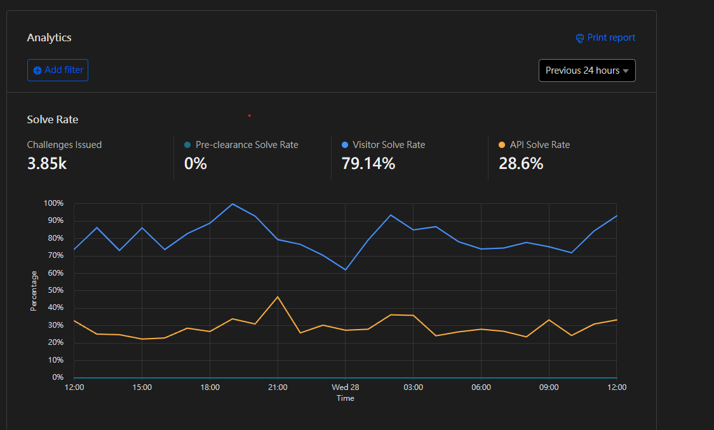
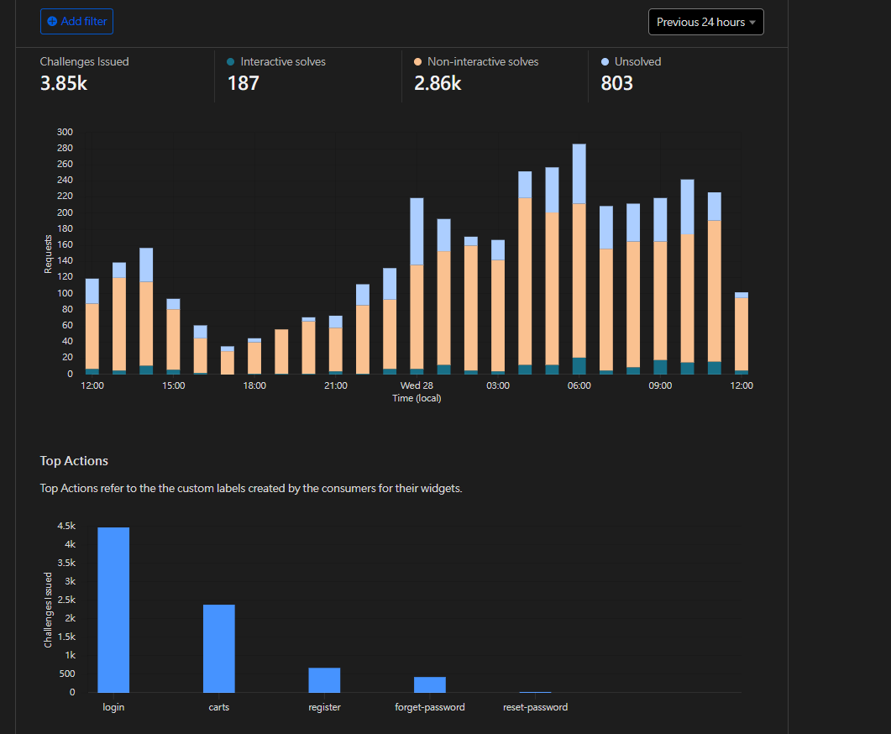

## 時空背景
* 某日發現網站機械人被註冊了一萬多個會員帳號
* Visa公司通知我們太多機械人在試不存在的卡號，失敗率太高，將會停用我們的信用卡收款
* 發現有機械人在試重置密碼及訂單狀態
評估 Google recaptcha v2/v3使用者體驗不是這麼好，因此請我同事研究界接了Cloudflare Turnstile ，Google recaptcha 常常要選很久，浪費使用者蠻多時間的。

## 工作原理
* 行為分析：分析用戶的行為模式（如鼠標移動、鍵盤輸入、滾動行為等），來判斷是否為真實人類。
* 機器學習：使用機器學習模型來識別和適應新的自動化威脅，這些模型根據真實世界的數據進行訓練。
* 隱私保護：不依賴個人識別信息進行驗證，使用非個人識別的行為特徵和模式來保護用戶隱私。
* 無障礙訪問：提供對所有用戶的無障礙訪問，包括視覺障礙人士，不依賴於視覺挑戰。
* 靈活性和定制：允許網站所有者根據需求定制保護級別和用戶體驗，從自動背景檢查到在檢測到高風險時觸發人購驗證。

## 為何選擇 Cloudflare Turnstile
在找解決方案時發現Cloudflare Turnstile ，免費又好介接，使用者體驗好，又更少誤判，且又提供相關的報表服務。

## 界接方式
### 1.閱讀界接[文件](https://developers.cloudflare.com/turnstile/get-started/client-side-rendering/#reset-a-widget)


### 2. 註冊並獲取 Turnstile 站點密鑰和密鑰
首先，你需要在 Cloudflare Turnstile 控制面板中註冊你的網站，並獲取一個站點密鑰（Site Key）和一個密鑰（Secret Key）。站點密鑰將用於前端集成，而密鑰將用於服務器端驗證。

### 3. 前端整合
在你的網頁中，你需要添加 Turnstile 的 JavaScript 庫，並使用你的站點密鑰初始化它。這通常涉及到在 HTML 表單中添加一個特定的元素，Cloudflare 的腳本將自動處理這個元素，為用戶展示一個挑戰（如果需要的話）。

```
<script src="https://challenges.cloudflare.com/turnstile/v0/api.js" async defer></script>
<div class="turnstile" data-sitekey="你的站點密鑰"></div>

 const widgetId = turnstile.render(`#${containerId}`, {
            sitekey,
            language: 'en',
            action,
            execution,
            callback: function (token: string) {
                // console.log(`${widgetId}: Challenge Success ${token}`);
                setTurnstileToken(token);
            },
            'expired-callback': function () {
                // console.log('Expired Callback');

                // refresh token
                setTurnstileToken('');
                turnstile.reset(`#${containerId}`); // 當過期時,透過這方法重新刷新這個 token
                turnstile.execute(`#${containerId}`);
            },
        });

```

### 4. 服務器端驗證
當表單被提交時，Turnstile 將生成一個令牌（token），這個令牌需要被發送到你的服務器，以驗證用戶的請求是否合法。在 C# 中，你可以使用 HttpClient 類來向 Cloudflare 的驗證 API 發送請求，並傳入令牌和你的密鑰。

```
using System.Net.Http;
using System.Threading.Tasks;
using Newtonsoft.Json;

public class TurnstileVerification
{
    private const string VerifyUrl = "https://challenges.cloudflare.com/turnstile/v0/siteverify";
    private readonly string _secretKey;

    public TurnstileVerification(string secretKey)
    {
        _secretKey = secretKey;
    }

    public async Task<bool> VerifyTokenAsync(string token)
    {
        using (var httpClient = new HttpClient())
        {
            var response = await httpClient.PostAsync(VerifyUrl, new FormUrlEncodedContent(new[]
            {
                new KeyValuePair<string, string>("secret", _secretKey),
                new KeyValuePair<string, string>("response", token),
            }));

            if (response.IsSuccessStatusCode)
            {
                var responseContent = await response.Content.ReadAsStringAsync();
                var verificationResponse = JsonConvert.DeserializeObject<TurnstileVerificationResponse>(responseContent);
                return verificationResponse.Success;
            }
        }

        return false;
    }
}

public class TurnstileVerificationResponse
{
    [JsonProperty("success")]
    public bool Success { get; set; }

    // 根據需要添加更多屬性
}

```
### 4. 處理驗證結果
根據 VerifyTokenAsync 方法的返回值，你可以決定是否處理用戶的請求。如果驗證成功（返回 true），則可以繼續處理請求；如果失敗，則可能需要拒絕請求或要求用戶重試。

## 成效
Cloudflare turnstile同時上線，阻止20-30% 以上的機器人重置密碼、登入、建立帳號、機械人惡意測試銀行信用卡的請求。  




