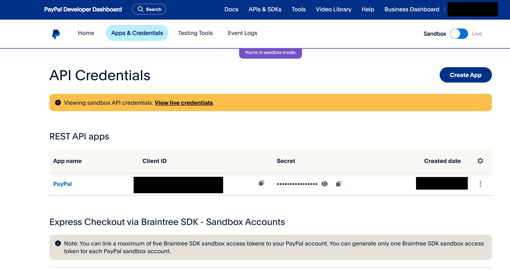
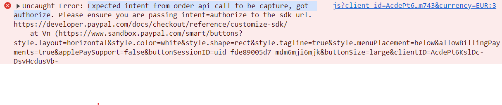
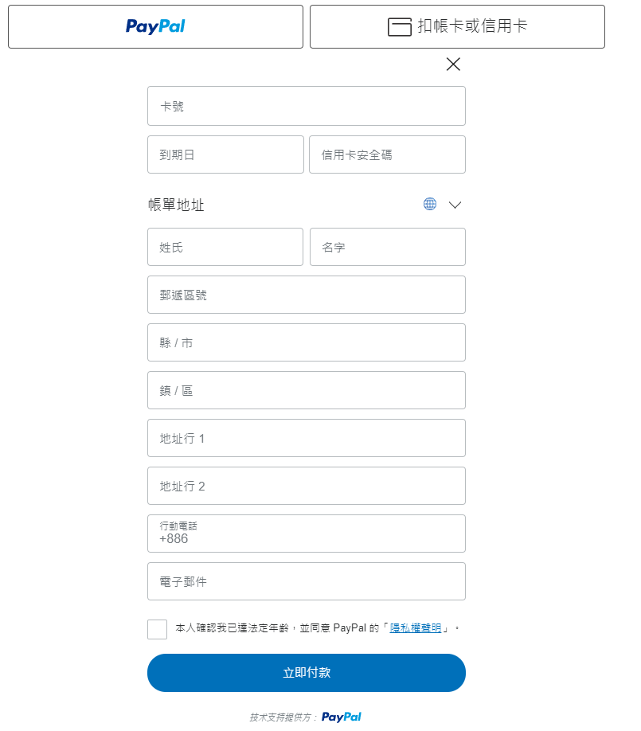

## 時空背景
據[統計](https://www.rapyd.net/blog/ecommerce-and-payment-trends-germany/) Paypal 在德國擁有22%以上的市佔，並在歐盟也相的普及，但過去因為電商詐欺太嚴重，因此User 決定把Paypal 先關閉，藉由此次重新打造德國網站，把Paypal 重新串接，並搭配 [Riskified](https://www.riskified.com/) 保險服務，來分攤掉網路電商的詐欺的運營風險。


## Paypal 串接
Paypal 的Api 看起來昇級了，官方也建議用新版的 Rest api v2 版本串接。

### 相關文件
* [前端串接文件](https://developer.paypal.com/docs/checkout/standard/integrate/#link-integratefrontend)
* [取得Api Access Token](https://developer.paypal.com/api/rest/authentication/)
* [Api Request相關](https://developer.paypal.com/api/rest/requests/)
* [建立訂單及授權請款相關的api](https://developer.paypal.com/docs/api/orders/v2/#orders_create)

### Api Endpoint 
```
Sandbox. https://api-m.sandbox.paypal.com
Live. https://api-m.paypal.com
```
### 取得Api 金鑰
[連結](https://developer.paypal.com/dashboard/applications/sandbox)


## 新版相當的方便，可以透過Event logs [偵錯](https://developer.paypal.com/dashboard/dashboard/sandbox)


## 前端的錯誤也可以透過瀏覽器偵錯

## 進階付款功能
進階模式多了，Venmo(社交支付)、Debit or Credit Card、Paypal Pay Later (先買後付)，但需要申請 PayPal 的 Braintree 付款閘道。

P.S. PayPal 的 Braintree 是一個全面的支付解決方案，類似於Payment gateway，主要是幫助商家接受、處理和分配支付，它解決了多個與接受線上支付相關的問題，提供了一個安全、靈活且易於集成的平台。

## 整合的流程圖


## 開始串接
首先，可以先參考官方的 [Integration builder](https://developer.paypal.com/integration-builder/) 的範例，其實寫的不錯，基本上照著界接就能做完了


### 前端範例 ( Next js app route )
#### 安裝SDK
```
npm install @paypal/react-paypal-js --save
```

### 撰寫前端串接的程式

```
'use client'; // next js client component
import { PaymentOptions } from '@/const/payment/payment-option';
import { useCaptureMutation, useGetConfigQuery, useProcessMutation } from '@/redux/api/test-payment-apiSlice';
import { IGernalPaymentParams } from '@/typing/cart';
import { PayPalButtons, PayPalScriptProvider } from '@paypal/react-paypal-js';
import { v4 as uuidv4 } from 'uuid';

export default function TestPaypal() {
    const { data: paymentInitOption, isLoading: isPaymentInitLoading } = useGetConfigQuery(); // rtk query 取得 payal sdk 前端初始化的參數

    const [Process] = useProcessMutation(); // rtk query 用來呼叫建立建立授權訂單的api

    const [Capture] = useCaptureMutation(); // rtk query 用來呼叫提取信用請款的api

    const gernalPaymentParams: IGernalPaymentParams = {
        paymentTypeCode: PaymentOptions[PaymentOptions.Paypal],
        orderNo: uuidv4(),        
    } as IGernalPaymentParams;

    const createOrder = (): Promise<string> => {
        return Process(gernalPaymentParams)
            .unwrap()
            .then((res: ApiResponse<IGeneralPaymentResult>) => {
                if (res.isSuccess) {
                    const orderId = res.data.paymentReturnValue;

                    return orderId;
                }
                return '';
            });
    };

    const onApprove = (data: any) => {
        return Capture(gernalPaymentParams)
            .unwrap()
            .then((res: ApiResponse<IGeneralPaymentResult>) => {
                if (res.isSuccess) {
                    debugger;
                    paypalOrderId.current = res.data.paymentReturnValue;
                    alert('Payment success');
                }
            });
    };

    return (
        <>
            {!isPaymentInitLoading && (
                <PayPalScriptProvider options={paymentInitOption}>
                    <PayPalButtons
                        createOrder={createOrder}
                        onApprove={onApprove}
                        style={{ layout: 'horizontal', color: 'white', tagline: true }}
                    />
                </PayPalScriptProvider>
            )}
        </>
    );
}
```

## 後端範例 (C#)
### 定義Appsetting.json
```
  "Payment": {
    "PaymentOptions": [
      {
        "PaymentName": "Paypal",
        "IsSandbox": true,
        "ClientId": "Your paypal clientId",
        "Secret": "Your paypal secret",             
        "EndPoint": "https://api-m.sandbox.paypal.com" // sandbox		 
      }
  }
```

### 從後端環境變數組出來SDK 初始化需要的參數給前端
```
     public async Task<Result<Dictionary<string, string>>> GetConfig()
     {
        var dic = new Dictionary<string, string>();
        dic.Add("client-id", GeneralPaymentConfig.ClientId);
        dic.Add("currency", HardCodeKey.BasedCurrency);
		// dic.Add("disable-funding", "credit,card"); // 關閉信用卡及借記卡

        var result = new Result<Dictionary<string, string>> { IsSuccess = true, Message = "", Data = dic };
        return result;
     }
```
### PAYPAL API 請求授權 - Authorization paypal 支援，兩種token，這邊採用 <client_id:secret> 當成登入的token 

依據官方文件，所述，我們可以呼叫 api 取得 Access-Token 或是使用 client_id:secret 當成 token 去呼叫paypal API

```
// To make REST API calls, include the bearer token in this header with the Bearer authentication scheme. The value is Bearer <Access-Token> or Basic <client_id:secret> 

public async Task<string> Authorization()
   {
      return Convert.ToBase64String(Encoding.ASCII.GetBytes($"{GeneralPaymentConfig.ClientId}:{GeneralPaymentConfig.Secret}")); ;
}
```
### 接著，我們實作 /api/orders 建立訂單及授權

```
public async Task<Result<GeneralPaymentResult>> ProcessAsync(GernalPaymentParameter paymentParameter)
{
   var result = new Result<GeneralPaymentResult>
   {
      IsSuccess = false,
      Message = "",
      Data = new GeneralPaymentResult
      {
         PaymentReturnType = PaymentReturnType.OrderId,
      }
   };

   try
   {
      var headers = new Dictionary<string, string>
    {
      { "Authorization", $"Basic  {Authorization()}" },
      { "PayPal-Request-Id",  HttpContext.Current.TraceIdentifier},
    };

      var paymentCapture = new PaymentCapture
      {
         Intent = "CAPTURE",
         PurchaseUnits = new List<PurchaseUnit>
   {
   new PurchaseUnit
   {
      ReferenceId = paymentParameter.OrderNo,
      Amount = new Model.ViewModels.Payment.Amount
      {
          CurrencyCode = "EUR",
          Value = "1.00"
      },
      Shipping = new PaypalShipping
      {
          Address =  new PaypalAddress
          {
              AddressLine1 = "2211 N First Street",
              AddressLine2 = "Building 17",
              AdminArea2 = "San Jose",
              AdminArea1 = "CA",
              PostalCode = "95131",
              CountryCode = "US"
          }
      }
      }
      },
         PaymentSource = new PaymentSource
         {
            PayPal = new PayPal
            {
               ExperienceContext = new ExperienceContext
               {
                  PaymentMethodPreference = "IMMEDIATE_PAYMENT_REQUIRED",
                  BrandName = "EXAMPLE INC",
                  Locale = "en-US",
                  LandingPage = "LOGIN",
                  ShippingPreference = "SET_PROVIDED_ADDRESS",
                  UserAction = "PAY_NOW",
                  ReturnUrl = "https://example.com/returnUrl",
                  CancelUrl = "https://example.com/cancelUrl"
               }
            }
         }
      };

      // Use Newtonsoft.Json to serialize the object to JSON (for demonstration)
      string body = JsonConvert.SerializeObject(paymentCapture, Formatting.Indented);

      var orderRsult = await HttpHelper.PostAsync<PaypalOrderResponse>(GeneralPaymentConfig.EndPoint + "/v2/checkout/orders", body, headers);
      result.Data.PaymentReturnValue = orderRsult.Id;
      result.Success();
   }
   catch (Exception ex)
   {
      result.Fail(ex.Message);
      NLogUtil.WriteSEQLog($"[Paypal][ProcessAsync]Error:{ex.Message},StackTrace:{ex.StackTrace}", NLog.LogLevel.Error);
   }

   return result;
}
```

### 最後，再來實作 /api/orders 請款 ( capture )
```
public virtual async Task<Result<GeneralPaymentResult>> CaptureAsync(GernalPaymentParameter paymentParameter)
{
   // Sandbox have some issue.cannot use capture
   var result = new Result<GeneralPaymentResult>
   {
      IsSuccess = false,
      Message = "Capture fail!",
      Data = new GeneralPaymentResult
      {
      }
   };

   try
   {
      var url = GeneralPaymentConfig.EndPoint + $"/v2/checkout/orders/{paymentParameter.PaymentGatewayOrderId}/capture";
      var requestBody = "";

      var headers = new Dictionary<string, string>
    {
      { "Authorization", $"Basic  {Authorization()}" },
      { "PayPal-Request-Id",  HttpContext.Current.TraceIdentifier},
    };

      var response = await HttpHelper.PostAsync<PaypalOrderResponse>(url, requestBody, headers);

      if (response.Status == "COMPLETED")
      {
         result.IsSuccess = true;
         result.Message = "Capture success";
      }

   }
   catch (Exception ex)
   {
      result.Fail(ex.Message);
      NLogUtil.WriteSEQLog($"[Paypal][CaptureAsync]Error:{ex.Message},StackTrace:{ex.StackTrace}", NLog.LogLevel.Error);
   }

   return result;
}
```
## Paypal 不登入也能使用信用卡


### 參考文章
* [美國電子商務實務筆記 - 信用卡授權(Authorize)及請款(Capture)](https://blog.markkulab.net/usa-ecommerce-note-credit-card-authorize-and-capture/)
* [Paypal express Checkout 整合指南](https://www.paypalobjects.com/webstatic/lvm/tw/zh/using-paypal/integration-guide.pdf)
