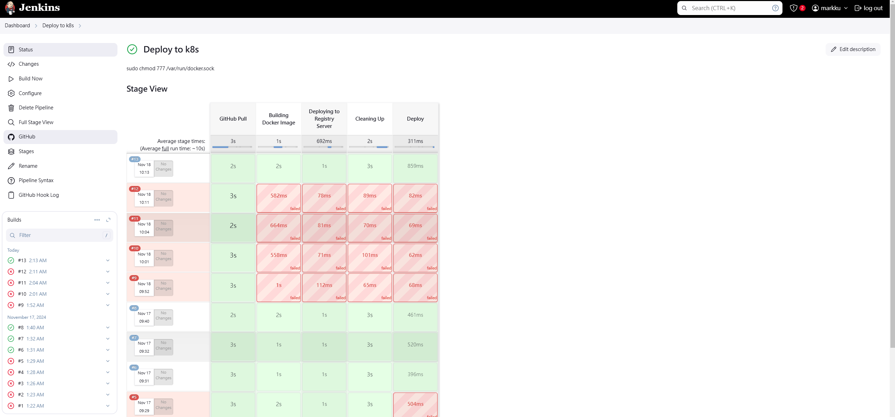

## 時空背景
因為公司的容器越來越多，好幾台的Docker desktop ，實在不好調度及橫向擴展，因此花了些時間研究，如何在 Docker Desktop for windows 裡安裝jenkins 整合 K8s。

## 為什麼要用 Kubernetes 
1. 按需的垂直擴展，新的服務器(node)能夠輕易的增加或刪除，HA 集群內的溝通
1. 依據需自動橫向擴展，縮減資源能力
1. 服務及效能監控 
1. Auto Recovery 
1. 伺服器資源，最佳化
1. 負載平衡 ( 分流 )
1. 服務融斷
1. 自動部署和回滾，如果應用狀態錯誤，可以實現自動回滾
1. 混合雲佈署

## 為什麼使用Windows kubernetes
公司沒Linux Server ，多數成員不擅長用 Linux 

## 佈署流程


## 預先準備
### 1.安裝Docker Desktop，並勾選 Kubernetes 及 Show system containers

### 2. 架設Private Docker registry server
```
docker run -d -p 5000:5000 -e REGISTRY_STORAGE_DELETE_ENABLED=true --name registry registry:2
docker update --restart always registry
```
### 3. 設定 Docker Engine，加入private ip
```
 "insecure-registries": [
    "192.168.50.49:5000"
  ]  
```
P.S. 192.168.50.49 為我的實驗機IP，可透過訪問 http://192.168.50.49:5000/v2/_catalog 檢查目前私有的docker hub 有那些映像檔

## 設定 Kubernetes 
### Dashboard 
```
kubectl apply -f https://raw.githubusercontent.com/kubernetes/dashboard/v2.7.0/aio/deploy/recommended.yaml

kubectl get pod -n kubernetes-dashboard

kubectl proxy

訪問此目錄
http://127.0.0.1:8001/api/v1/namespaces/kubernetes-dashboard/services/https:kubernetes-dashboard:/proxy/#/login
```
### 建立 Token 
```
kubectl describe secrets -n kube-system (kubectl get secrets -n kube-system | Select-String "dashboard" | ForEach-Object { $_ -split " " | Select-Object -First 1 })
```
### 查詢 Token 
```
$TOKEN=((kubectl -n kube-system describe secret default | Select-String "token:") -split " +")[1]
kubectl config set-credentials docker-for-desktop --token="${TOKEN}"
echo $TOKEN
```


也可以透過config 查詢 token
```
kubectl config view // 同等於訪問 C:\Users\Mark\.kube\config 
```


## Jenkins 配置 Kubernetes
### 安裝 Jenkins 
參考先前撰寫的[文章](https://blog.markkulab.net/docker-jenkins-build-docker-image-and-github-integration/) 

### 在Jenkins 容器中中安裝 kubectl
```
docker exec -it -uroot jenkins bash // 進入jenkins 容器中
 curl -LO https://storage.googleapis.com/kubernetes-release/release/v1.29.1/bin/linux/amd64/kubectl // 下載 kubectl
 chmod +x ./kubectl // 給予權限
 sudo mv ./kubectl /usr/local/bin/kubectl // 複製到系統環境資料夾
 kubectl version --client // 查詢版本
```
P.S. Docker Desktop 和 Jenkins 容器的 kubectl 版本最好一致

### 複製 kubectl 設定至 Jenkins 容器中 (需要逐行執行)
```
docker exec -it -uroot jenkins /bin/bash 
mkdir -p /.kube
exit 
docker cp C:/Users/Mark/.kube jenkins:/root/.kube // 複製檔案到 Jenkins 容器中
```

### Jenkins 透過 Kubernetes CLI 連線 kubernetes 
1. 要想把jenkins關聯到Kubernetes中需要安裝幾個最件，打開  系統管理 > 套件管理
* Kubernetes plugin
* Kubernetes CLI Plugin

2. [set up cloud](http://localhost:8080/configureClouds/)

3. set Disable https certificate check => true

4. Kubernetes URL => kubectl cluster-info
https://host.docker.internal:6443
5. Jenkins URL
Jenkins URL:http://host.docker.internal:8080/
Jenkins tunnel:host.docker.internal:50000
6. Credentials =>

7. Copy dashboard token to here


### 撰寫 Jenkins pipeline 
```
properties([pipelineTriggers([githubPush()])])
pipeline {
    agent any 

    environment {
        tag = ':latest'
        imageShortName = 'de-next-ap'
        imageName = "${imageShortName}${tag}"
        containerName = "${imageShortName}-1"
        containerUrl = "192.168.50.49:2376"
        dockerfile = "./Dockerfile"
        port = "30000:80"
        registry = "192.168.50.49:5000/next-ec"				
		
    }   
   
    stages {
        stage("GitHub Pull") {
             steps {
                git branch: 'main', 
                credentialsId: '946a703f-dff7-4138-84b2-0aba700dedca', 
                url:  'git@github.com:markku636/ec.git/'
            }
            
        }
		
        stage("Building Docker Image") {
			steps {
				script {
					dockerImage = docker.build "$registry:latest"
				}
			}
		}
		
		stage("Deploying to Registry Server") {
			steps {
				script {
					docker.withRegistry("http://192.168.50.49:5000", "") {
						dockerImage.push()
					}
				}
			}
		}
		
		stage("Cleaning Up") {
			steps {
				sleep(time: 3, unit: "SECONDS")

				sh "docker rmi --force $registry:latest"
			}
		}
		
        stage("Deply") {
             steps {
                    withKubeConfig([credentialsId: 'k8s-secret', serverUrl: 'https://host.docker.internal:6443']) {                     
                     sh 'kubectl apply -f ./next-js-deployment.yaml'
                    }
                
             }
        }    			        
    }
}
```

## 在 Github next-ec 專案裡建立 Kubernetes 的 YAML 佈署設定檔(next-js-deployment.yaml) 
```
apiVersion: v1
kind: Deployment
metadata:
  name: nextjs-deployment
  labels:
    app: nextjs
spec:
  replicas: 1
  selector:
    matchLabels:
      app: nextjs
  template:
    metadata:
      labels:
        app: nextjs
    spec:
      containers:
      - name: nextjs
        image: 192.168.50.49:5000/next-ec:latest
        ports:
        - containerPort: 80
        resources:
          limits:
            memory: "128Mi"
            cpu: "500m"

---

apiVersion: v1
kind: Service
metadata:
  name: nextjs-service
spec:
  type: NodePort
  selector:
    app: nextjs
  ports:
  - protocol: TCP
    port: 80
    targetPort: 80
    nodePort: 30099

```

此時執行 Jenkins 執行建置，應該己經可以執行成功。


## 結論
K8S 功能及配置還蠻複雜的，光配置就花蠻多時間，蠻多細節還需要花些時間實驗及測試。

## 其他遇到問題
### 1. no matcher for kind "Deploy" in version v1 問題
yaml 檔改了幾次版本，請依據[官方文件](https://kubernetes.io/docs/concepts/services-networking/service/#type-nodeport)撰寫最新的 YAML 佈署檔
### 2. kubectl: command not found
[需要在Jenkins 容器中安裝 kubectl](https://blog.markkulab.net/jenkins-deploy-kubernetes-with-docker-for-windows/#%E5%9C%A8jenkins-%E5%AE%B9%E5%99%A8%E4%B8%AD%E4%B8%AD%E5%AE%89%E8%A3%9D-kubectl)


## 參考資料
* [從0開始學習DevOps，並部署CICD至Java專案中 ](https://ithelp.ithome.com.tw/articles/10339029)
* [通过jenkins交付微服务到kubernetes](https://blog.csdn.net/m0_53758775/article/details/121157016?ops_request_misc=%257B%2522request%255Fid%2522%253A%2522170578082016800186589323%2522%252C%2522scm%2522%253A%252220140713.130102334.pc%255Fvipall.%2522%257D&request_id=170578082016800186589323&biz_id=0&utm_medium=distribute.pc_search_result.none-task-blog-2~vipall~first_rank_ecpm_v1~rank_v31_ecpm-3-121157016-null-null&utm_term=windows%20%E5%AE%89%E8%A3%85kubernetes%20jenkins&spm=1018.2226.3001.4187)
* [windows系统docker Desktop 和k8s 安装jenkins等软件
](https://blog.csdn.net/qq_40250122/article/details/120966650?utm_medium=distribute.pc_relevant.none-task-blog-2~default~baidujs_utm_term~default-1-120966650-blog-121157016.235^v40^pc_relevant_anti_vip_base&spm=1001.2101.3001.4242.1&utm_relevant_index=4)
* [Jenkins执行shell脚本报错：bash: kubectl: command not found](https://blog.csdn.net/m0_45806184/article/details/128190069)

