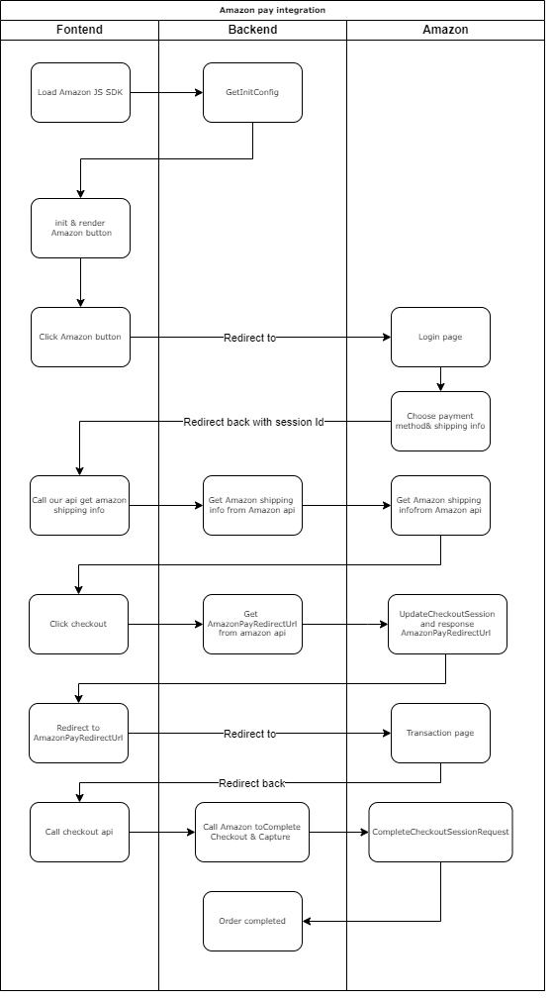
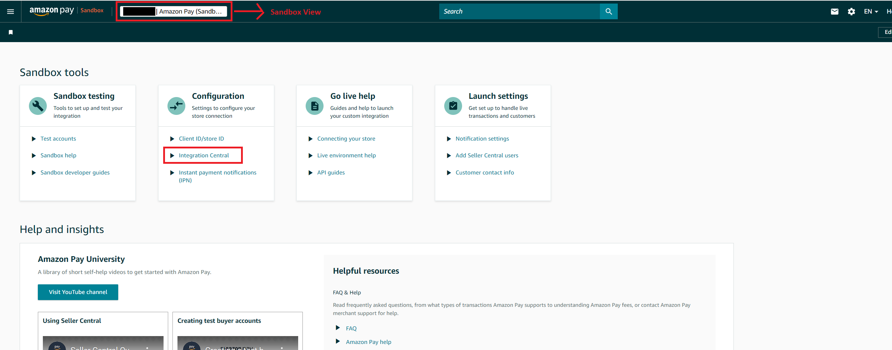
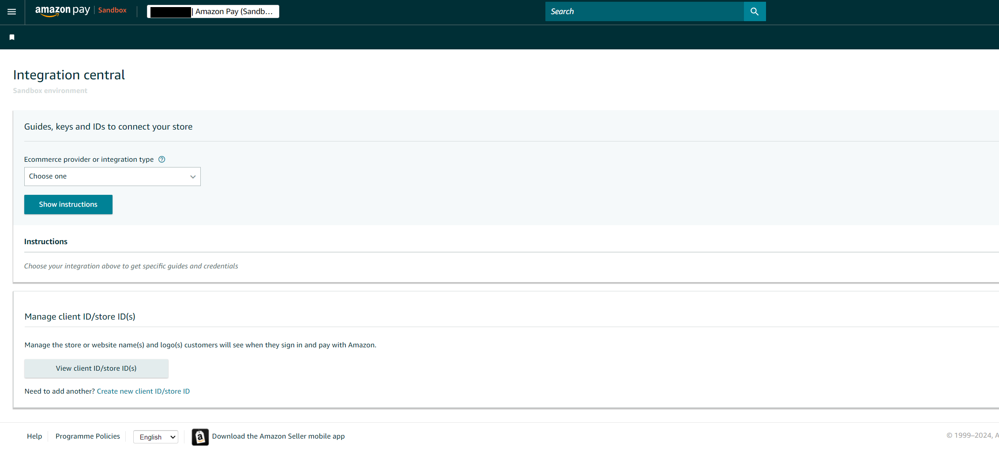
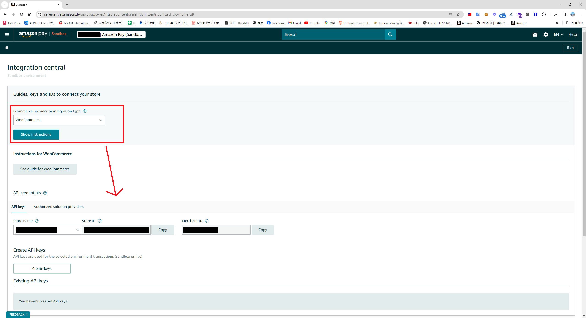
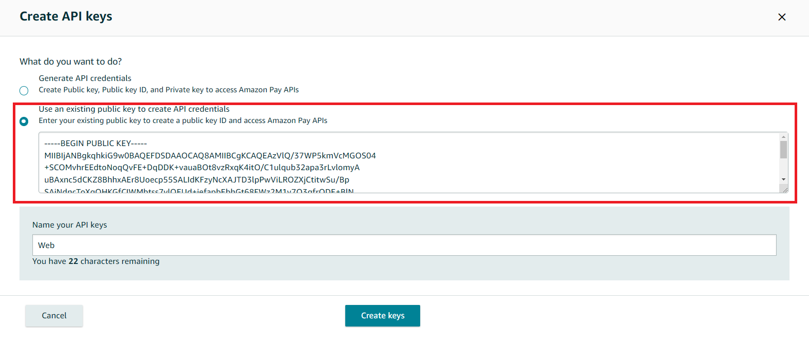
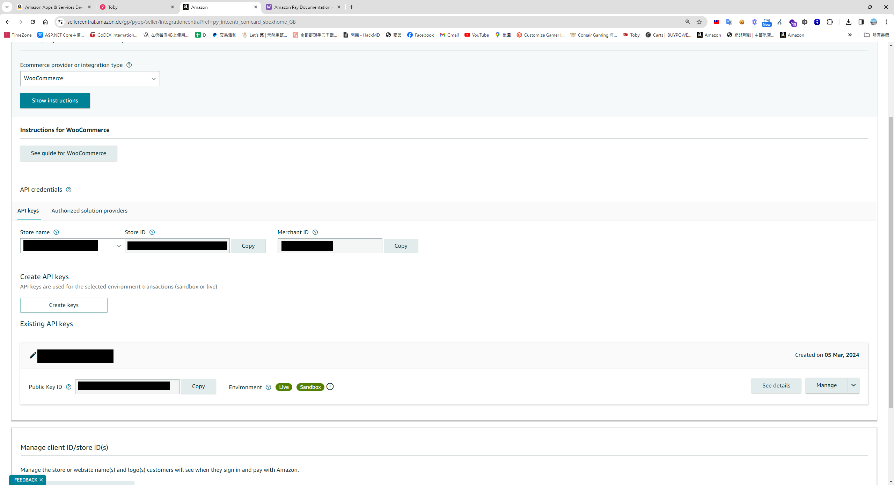
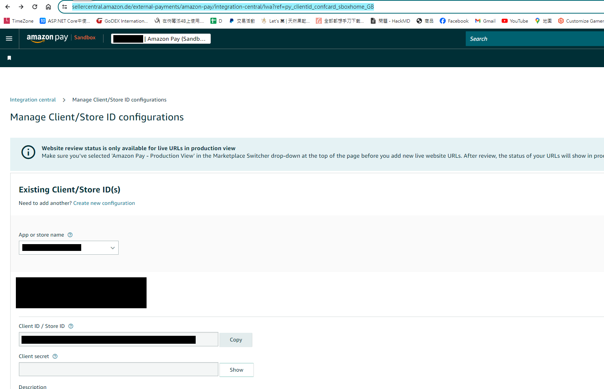

## 時空背景
這是我第二次接手 Amaozn pay，上次是因為剛加入公司時，幫忙處理Amazon pay 一直瘋狂掉單，這次重新接 Amazon pay 是為了德國的電商網站，藉由此次重新整理了一下界接的技巧。

## 相關界接文件
* [界接文件](https://developer.amazon.com/docs/amazon-pay-checkout/get-set-up-for-integration.html)
* [如何產生公私鑰](https://sellercentral.amazon.de/external-payments/amazon-pay/integration-central/lwa?ref=py_clientid_confcard_sboxhome_GB)

## 界接流程圖


## 上傳自己的公鑰及取得相關秘鑰
### 首先，進入後台 > Sandbox View > [Integration central](https://sellercentral.amazon.de/gp/pyop/seller/integrationcentral?ref=py_intcentr_confcard_sboxhome_GB) 



### 因為我有兩個國家的帳號，對照後發現這邊有個bug，會找不到上傳 public key的功能

如果你沒有Self-developed 下拉選項，此時可以 Woo Commerce


### 依據官方文件[doc](https://developer.amazon.com/docs/amazon-pay-api-v2/manually-generating-key-pairs.html#generating-key-pair) , 產生 rsa 公鑰與私鑰

```
ssh-keygen -t rsa -b 2048 -m PKCS8 -f privateKey.pem
ssh-keygen -f privateKey.pem -e -m PKCS8 > publicKey.pub
```       

### 因為第一個選項應該是壞了，只會產生公鑰，而無法下載私鑰，請選擇第二個選項，請自行上傳 Amazon pay 公鑰，


### 此時在這畫面，你就能找到大部份所需要的金鑰


### Store Id 和 Client secret 你需要在另外一個[頁面](https://sellercentral.amazon.de/external-payments/amazon-pay/integration-central/lwa?ref=py_clientid_confcard_sboxhome_GB)去查詢


## 測試方式
* 因為需要導頁來導頁去，需要有https，也要有自己的domain，我這邊是透過Cloudfalre tunnel 當反向代理測試
* 正式和測試的金鑰一樣其實蠻方便的，要使用 Sandbox 環境 只要初始化時將 isSandbox 設定成true 即可
* 關於測試帳號部份，進入後台切到Sandbox view 就能找到 [Test accunts](https://sellercentral.amazon.de/external-payments/sandbox/home)，這邊就可以增加sandbox 的測試帳號。


## 前端範例程式 - React (Next js App route)
```
'use client';
import { PaymentReturnType } from '@/const/cart/payment-image';
import { PaymentOptions } from '@/const/payment/payment-option';
import {
    useBuildPaymentInfoMutation,
    useCaptureMutation,
    useLazyGetConfigQuery,
    useProcessMutation,
} from '@/redux/api/test-payment-apiSlice';
import { IGeneralPaymentInfo, IGeneralPaymentResult, IGernalPaymentParams } from '@/typing/cart';
import { ApiResponse } from '@/typing/common';
import { useSearchParams } from 'next/navigation';
import { useEffect, useRef } from 'react';
import { v4 as uuidv4 } from 'uuid';

export default function TestAmaonPay() {
    const gernalPaymentParams: IGernalPaymentParams = {
        paymentTypeCode: PaymentOptions[PaymentOptions.Paypal],
        orderNo: uuidv4(),
    } as IGernalPaymentParams;

    const [GetConfig, result] = useLazyGetConfigQuery(); // rtk query 取得sdk 初始化的參數

    const [Process] = useProcessMutation(); // rtk query 用來呼叫建立建立授權訂單的api

    const [Capture] = useCaptureMutation(); // rtk query 用來呼叫提取信用及完成訂單的api
    const [BuildPaymentInfoMutation] = useBuildPaymentInfoMutation(); // rtk query 用來取得Amazon Pay 付款資訊

    const amazonCheckoutSessionId = useRef('');
    const amazonHasRedirectedBack = useRef(false);

    const searchParams = useSearchParams();

    const loadAmazonPay = () => {
        const script = document.createElement('script');

        script.src = 'https://static-eu.payments-amazon.com/checkout.js';
        script.async = true;
        script.onload = () => {
            // debugger;
            if (window.amazon && window.amazon.Pay) {
                GetConfig(gernalPaymentParams.paymentTypeCode)
                    .unwrap()
                    .then((data: any) => {
                        if (!data) {
                            return;
                        }
                        window.amazon.Pay.renderButton('#amazonpaybutton', {
                            merchantId: data.merchantId,
                            sandbox: data.isSandbox === 'True', // dev environment
                            ledgerCurrency: data.ledgerCurrency, // Amazon Pay account ledger currency
                            checkoutLanguage: 'en_GB', // render language
                            productType: 'PayAndShip', // checkout type
                            placement: 'Cart', // button placement
                            buttonColor: 'Gold',
                            createCheckoutSessionConfig: {
                                payloadJSON: data.payloadJSON,
                                signature: data.signature,
                                publicKeyId: data.publicKeyId,
                            },
                        });
                    });
            }
        };
        document.body.appendChild(script);
    };

    const getPaymentInfoFromToken = (token: string) => {
        const params: IGernalPaymentParams = { ...gernalPaymentParams, paymentGatewaySessionID: token };

        BuildPaymentInfoMutation(params)
            .unwrap()
            .then((res: ApiResponse<IGeneralPaymentInfo>) => {
                document.getElementById('paymentInfo')!.innerText = JSON.stringify(res.data);
            });
    };

    useEffect(() => {
        // Dynamically load the Amazon Pay script
        loadAmazonPay();
        const session = searchParams?.get('amazonCheckoutSessionId') || '';

        const isComplete = searchParams?.get('isComplete') || '';

        if (session) {
            amazonCheckoutSessionId.current = session;
            amazonHasRedirectedBack.current = true;

            if (!isComplete) {
                getPaymentInfoFromToken(session);
            } else {
                const params: IGernalPaymentParams = {
                    ...gernalPaymentParams,
                    paymentGatewaySessionID: session,
                };

                Capture(params)
                    .unwrap()
                    .then((res: ApiResponse<IGeneralPaymentResult>) => {
                        if (res.isSuccess) {
                            alert('Payment success');
                        }
                    });
            }
        }
    }, []); // Empty dependency array means this effect runs once on mount

    const clickHandler = () => {
        const params: IGernalPaymentParams = {
            ...gernalPaymentParams,
            paymentGatewaySessionID: amazonCheckoutSessionId.current,
        };

        Process(params)
            .unwrap()
            .then((res: ApiResponse<IGeneralPaymentResult>) => {
                // debugger;
                if (res.isSuccess && res.data.paymentReturnType === PaymentReturnType.RedirectUrl) {
                    location.href = res.data.paymentReturnValue;
                }
            });
    };

    return (
        <div>
            <h1>test amazon pay</h1>
            <div id="amazonpaybutton"></div>
            <div id="paymentInfo"></div>

            <button
                className="bg-blue-500 hover:bg-blue-700 text-white font-bold py-2 px-4 rounded"
                onClick={clickHandler}
            >
                Checkout
            </button>
        </div>
    );
}
```

## 後端程式範例 - C#
### 首先，Nuget安裝 Amazon.Pay.API.SDK

### 定義Appsetting.json
```
"Payment": {
    "PaymentOptions": [
 {
   "PaymentName": "AmazonPay",
   "ClientId": "Your clientId", // live and sandbox are the same
   "Secret": "Your clientId secret", // live and sandbox are the same
   "IsSandbox": true,
   "StoreID": "",
   "StoreName": "Your storename",
   "MerchantID": "Your MerchantID", // from amazon 
   "PublicKeyID": "Upload to amazon backoffice PublicKeyID", // 將公鑰上傳amazon pay 產上的ID
   "PrivateKey": "Your private key", // 透過電腦自己產的公鑰，base64 加密起來就不用額外檔案
   "EndPoint": "https://api.paypal.com"
  }
 ]
 }
```

### 初始化 Amazon SDK 的 WebStoreClient，因為後面很常使用到，所以抽成一個function 
```
 private WebStoreClient InitiateClient()
 {
    var payConfiguration = new ApiConfiguration
    (
        region: Region.Europe,
        environment: GeneralPaymentConfig.IsSandbox ? Amazon.Pay.API.Types.Environment.Sandbox : Amazon.Pay.API.Types.Environment.Live,
        publicKeyId: GeneralPaymentConfig.PublicKeyID,
        privateKey: System.Text.Encoding.UTF8.GetString(Convert.FromBase64String(GeneralPaymentConfig.PrivateKey))
    );

    var client = new WebStoreClient(payConfiguration);

    return client;
 }
```

### 從後端取回init Amazon button 所需要的參數
```
 public async Task<Result<Dictionary<string, string>>> GetConfig(string returnUrl = "")
 {
    var req = HttpContext.Current.Request;
    var result = new Result<Dictionary<string, string>> { IsSuccess = false, Message = "" };
    try
    {
       if (string.IsNullOrWhiteSpace(returnUrl))
       {
          returnUrl = "/en/test-payment/";
       }

       string ChangePaymentReferID = string.Empty;
       var isChangePayment = !string.IsNullOrEmpty(ChangePaymentReferID);  // for change payment

       var client = InitiateClient();
       var request = new CreateCheckoutSessionRequest(
           checkoutReviewReturnUrl: AppSettingsConstVars.FontendUrl + returnUrl + (isChangePayment ? $"/payments?id={ChangePaymentReferID}" : ""),
           storeId: GeneralPaymentConfig.StoreID
       );
       request.PaymentDetails.CanHandlePendingAuthorization = false;
       request.DeliverySpecifications.AddressRestrictions.Type = RestrictionType.Allowed;
       request.DeliverySpecifications.AddressRestrictions.AddCountryRestriction("DE");

       //generate the button signature
       var signature = client.GenerateButtonSignature(request);
       var payload = request.ToJson();

       result.Data.Add("signature", signature);
       result.Data.Add("payloadJSON", payload);
       result.Data.Add("publicKeyId", GeneralPaymentConfig.PublicKeyID);
       result.Data.Add("merchantId", GeneralPaymentConfig.MerchantID);
       result.Data.Add("isSandbox", GeneralPaymentConfig.IsSandbox.ToString()); // need test 
       result.Data.Add("ledgerCurrency", HardCodeKey.BasedCurrency);

       result.Success();
    }
    catch (Exception ex)
    {
       NLogUtil.WriteSEQLog($"[Paypal][GetConfig]Error:{ex.Message},StackTrace:{ex.StackTrace}", NLog.LogLevel.Error);
    }

    return result;
 }
```


### 接著實作取回付款地址
```
 public async Task<Result<GeneralPaymentInfo>> GetPaymentInfoAsync(GernalPaymentParameter paymentParameter)
 {
    Result<GeneralPaymentInfo> result = new Result<GeneralPaymentInfo> { IsSuccess = false, Message = "" };

    try
    {
       var client = InitiateClient();
       var getInfo = client.GetCheckoutSession(paymentParameter.PaymentGatewaySessionID);

       if (getInfo == null)
       {
          throw new Exception($"[AmazonPayService][GetPaymentInfoAsync]:{getInfo.RawResponse}");
       }

       result.Data.Address = ConvertToGeneralAddress(getInfo.ShippingAddress, getInfo.Buyer.Email);

       result.Success();
    }
    catch (Exception ex)
    {
       NLogUtil.WriteSEQLog($"[Paypal][GetPaymentInfoAsync]Error:{ex.Message},StackTrace:{ex.StackTrace}", NLog.LogLevel.Error);
    }

    return result;
 }
 
 private GeneralAddress ConvertToGeneralAddress(Address amazonShipAddress, string Mail)
{
   GeneralAddress generalAddress = new GeneralAddress();
   generalAddress.Line1 = amazonShipAddress.AddressLine1;
   generalAddress.Line2 = (string.IsNullOrEmpty(amazonShipAddress.AddressLine2) && string.IsNullOrEmpty(amazonShipAddress.AddressLine3)) ? "" : string.Join(",", amazonShipAddress.AddressLine2, amazonShipAddress.AddressLine3);
   generalAddress.FirstName = GetMaxLengthStr(ParseName(amazonShipAddress.Name).Item1, 80);
   generalAddress.LastName = GetMaxLengthStr(ParseName(amazonShipAddress.Name).Item2, 80);
   generalAddress.CountryCode = amazonShipAddress.CountryCode;
   generalAddress.PostalCode = amazonShipAddress.PostalCode;
   generalAddress.City = amazonShipAddress.City;
   generalAddress.StateProvinceCode = amazonShipAddress.StateOrRegion;
   generalAddress.Phone = amazonShipAddress.PhoneNumber;
   return generalAddress;
}

private string GetMaxLengthStr(string Text, int Max)
{
   if (string.IsNullOrWhiteSpace(Text))
   {
      return "";
   }

   return Text.Substring(0, Math.Min(Max, Text.Length));
}

private Tuple<string, string> ParseName(string Name)
{
   if (string.IsNullOrWhiteSpace(Name))
   {
      return Tuple.Create("", "");
   }

   var names = Name.Split(' ');

   if (names.Length == 1)
   {
      return Tuple.Create(Name, "");
   }

   var last = names.Last();

   return Tuple.Create(Name.Replace(last, "").Trim(), last);
} 
```
### 取得 Amazon 交易頁面 Url( PurchaseGetAmazonPayRedirectUrl )
```
 public async Task<Result<GeneralPaymentResult>> ProcessAsync(GernalPaymentParameter paymentParameter, string returnUrl)
 {
    Result<GeneralPaymentResult> result = new Result<GeneralPaymentResult> { IsSuccess = false, Message = "Please select another credit card or change payment method and try again." };

    try
    {
       var client = InitiateClient();
       var request = new UpdateCheckoutSessionRequest();

       if (string.IsNullOrWhiteSpace(returnUrl))
       {
          returnUrl = "/en/test-payment/?isComplete=true";
       }

       request.WebCheckoutDetails.CheckoutResultReturnUrl = AppSettingsConstVars.FontendUrl + returnUrl;

       var currencyCode = (Currency)Enum.Parse(typeof(Currency), HardCodeKey.BasedCurrency);

       request.PaymentDetails.ChargeAmount.Amount = HardCodeKey.Payment.TestAmount;
       request.PaymentDetails.ChargeAmount.CurrencyCode = currencyCode;
       request.PaymentDetails.CanHandlePendingAuthorization = false;
       request.PaymentDetails.PaymentIntent = Authorize ? PaymentIntent.Authorize : PaymentIntent.AuthorizeWithCapture;

       NLogUtil.WriteSEQLog($"[AmazonPay][AmazonV2Helper][PurchaseGetAmazonPayRedirectUrl][UpdateCheckoutSession][Authorize]:{Authorize}", NLog.LogLevel.Info);
       request.MerchantMetadata.MerchantReferenceId = paymentParameter.OrderNo;

       request.MerchantMetadata.MerchantStoreName = GeneralPaymentConfig.StoreName;
       request.MerchantMetadata.NoteToBuyer = GetProductDescription();

       var updateResult = client.UpdateCheckoutSession(paymentParameter.PaymentGatewaySessionID, request);

       if (updateResult.Success)
       {
          result.Data.PaymentReturnType = PaymentReturnType.RedirectUrl;
          result.Data.PaymentReturnValue = updateResult.WebCheckoutDetails.AmazonPayRedirectUrl;
          result.Success();

          // TODO Remove this log when stable
          NLogUtil.WriteSEQLog($"[AmazonPayService][ProcessAsync][UpdateCheckoutSession][Success]{JsonConvert.SerializeObject(updateResult)}", NLog.LogLevel.Info);
       }
       else
       {
          NLogUtil.WriteSEQLog($"[AmazonPayService][ProcessAsync][UpdateCheckoutSession][Error]Request:{JsonConvert.SerializeObject(request)},Response:{JsonConvert.SerializeObject(updateResult)}", NLog.LogLevel.Error);
       }
    }
    catch (Exception ex)
    {
       NLogUtil.WriteSEQLog($"[Paypal][ProcessAsync]Error:{ex.Message},StackTrace:{ex.StackTrace}", NLog.LogLevel.Error);
    }

    return result;
 }
```
### 完成訂單及請款(Capture)
```
 public virtual async Task<Result<GeneralPaymentResult>> CaptureAsync(GernalPaymentParameter paymentParameter)
 {
    var result = new Result<GeneralPaymentResult> { IsSuccess = true, Message = "No need implemented" };

    try
    {
       var currencyCode = (Currency)Enum.Parse(typeof(Currency), HardCodeKey.BasedCurrency);
       var client = InitiateClient();
       var request = new CompleteCheckoutSessionRequest(HardCodeKey.Payment.TestAmount, currencyCode);
       CheckoutSessionResponse complete = client.CompleteCheckoutSession(paymentParameter.PaymentGatewaySessionID, request);

       if (complete.Success)
       {
          var paymentTransition = new GeneralPaymentTransition();
          paymentTransition.Authcode = complete.ChargeId;
          paymentTransition.TransactionID = complete.ChargeId;
          paymentTransition.Amount = HardCodeKey.Payment.TestAmount.ToString(); // todo
          paymentParameter.PaymentTypeCode = GeneralPaymentConfig.PaymentName;
          result.Data.PaymentTransition = paymentTransition;
          NLogUtil.WriteSEQLog($"[Paypal][CaptureAsync][Complete][Success]complete:{JsonConvert.SerializeObject(complete)}", NLog.LogLevel.Info);
          result.Success();
       }
       else
       {
          NLogUtil.WriteSEQLog($"[Paypal][CaptureAsync][Complete][Fail]complete:{JsonConvert.SerializeObject(complete)}", NLog.LogLevel.Error);
       }            
    }
    catch (Exception ex)
    {
       NLogUtil.WriteSEQLog($"[Paypal][CaptureAsync]Error:{ex.Message},StackTrace:{ex.StackTrace}", NLog.LogLevel.Error);
    }

    return result;
 }
```
## 最後
Amazon pay 界接方式真的蠻復古的，導頁來導頁去，而且後台常常會有功能改壞，接了兩次，其實不是很好界接。