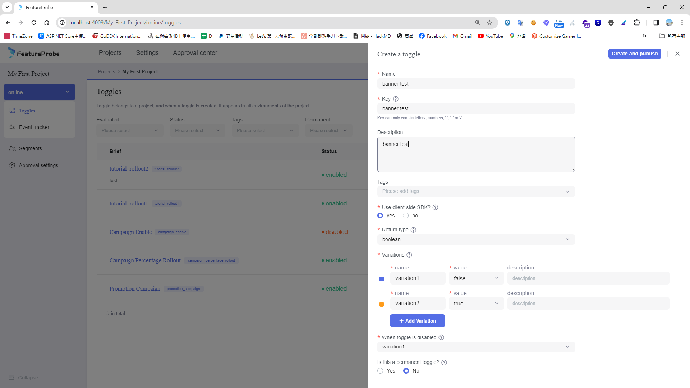
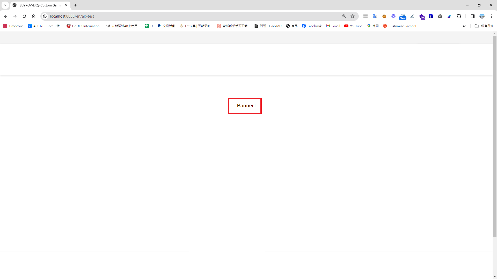

## 時空背景
評估了很多套AB test 都要收費，幸運地，終於找到一套免費開源又好用的AB Test工具 Featureprobe。

## 了解  AB Test 能幫助我們做些什麼呢?
透過AB 我們可以得知
* 通過測試不同的頁面佈局、按鈕顏色、文案等，找出哪些元素更能激勵用戶採取期望的行動，如購買產品、註冊會員或下載應用，藉此提高轉換率。
* 測試不同的定價策略或促銷活動對銷售的影響。
* 衡量重新設計的頁面或功能，有沒有比以前更好，並識別用戶界面中的問題。


## 假定測試事件
設計師設計了兩個Banner，想了解Banner A、Banner B，想了解那個Banner 的使用者點擊率比較好。

## 官方文件[連結](https://docs.featureprobe.com/)

## 首先，我們得先建立應用程式，建立 Docker 容器

```
git clone https://gitee.com/featureprobe/FeatureProbe.git

cd FeatureProbe
docker compose up
```

## 接著，訪問先前建立的Featureprobe應用程式後台[連結](http://localhost:4009)
username: admin
password: Pass1234

### 新增測試事件


### 設定預設規則，依據設定的百分比顯示測試項目


### 啟用測試，接著按下發佈按鈕(Publish)


### 定義轉換率事件，並開按下 Start iteration 按鈕，開始蒐集事件分析


## 撰寫測試程式 
點選 Connect SDK 按鈕，就會跳出一些程式的範例．範例雖然漏了一些東西，因此我小改了一下。

### 安裝 SDK 
```
npm install featureprobe-client-sdk-react --save
```
### 前端程式範例 - 採用 Next js app route
#### 將SDK 封裝成一個HOOK - use-featureprobe.ts
```
import { FPUser, FeatureProbe } from 'featureprobe-client-sdk-react';
import { useCallback, useEffect, useRef, useState } from 'react';

/**
 * Custom hook to initialize and use FeatureProbe client, providing feature flag value,
 * loading state, and a method to track events.
 *
 * @param {string} featureKey The key of the feature flag to evaluate
 * @param {any} defaultValue The default value of the feature flag
 * @param {FPUser} user The user object for feature evaluation
 * @returns An object containing the feature flag value, loading state, and a track method
 */
const useFeatureProbe = (featureKey: string, defaultValue: any, user: FPUser) => {
    const [featureValue, setFeatureValue] = useState<any>(defaultValue);
    const [isLoading, setIsLoading] = useState(true);
    const fpClientRef = useRef<FeatureProbe | null>(null);

    useEffect(() => {
        if (!fpClientRef.current) {
            const client = new FeatureProbe({
                remoteUrl: 'http://127.0.0.1:4007',
                user: user,
                clientSdkKey: 'client-xxxxxxxxxxxxx',
                refreshInterval: 5000,
            });

            client.start();
            fpClientRef.current = client;

            // Listener when client is ready
            const handleReady = () => {
                let result: any;

                if (typeof defaultValue === 'boolean') {
                    result = client.boolValue(featureKey, defaultValue);
                } else if (typeof defaultValue === 'string') {
                    result = client.stringValue(featureKey, defaultValue);
                }
                // Add more types as needed

                setFeatureValue(result);
                setIsLoading(false);
            };

            client.on('ready', handleReady);

            // Cleanup
            return () => {
                // client.off('ready', handleReady);
                // client.stop();
            };
        }
    }, []); // This effect depends on user, since user-specific features may require re-initialization

    // Method to track events
    const trackEvent = useCallback((eventName: string) => {
        if (fpClientRef.current) {
            fpClientRef.current.track(eventName);
        }
    }, []);

    return { featureValue, isLoading, trackEvent };
};

export default useFeatureProbe;
```

#### 再來撰寫 Banner A Component
```
'use client';
const BannerA = ({ featureValue, trackEvent }: IFeatureProbe) => {
    const clickHandler = () => {
        alert(featureValue + ' clicked');
        trackEvent('banner_click');
    };

    return (
        <div id="boolean-result" onClick={clickHandler}>
            {featureValue.toString()}
        </div>
    );
};

export default BannerA;

interface IFeatureProbe {
    featureValue: any;
    trackEvent: (eventName: string) => void;
}

```
#### 新增 AB Test 的頁面
```
'use client';

import useFeatureProbe from '@/hooks/use-featureprobe';
import BannerA from '@components/ab-test/banner-a';
import { FPUser } from 'featureprobe-client-sdk-react';

export default function Page() {
    const user = new FPUser();
    const { featureValue, isLoading, trackEvent } = useFeatureProbe('Banner_test', '', user);

    return (
        <main className="flex flex-col items-center justify-between min-h-screen p-24">
            {isLoading && <div>Loading...</div>}

            {!isLoading && <BannerA featureValue={featureValue} trackEvent={trackEvent}></BannerA>}
            {!isLoading && <BannerA featureValue={featureValue} trackEvent={trackEvent}></BannerA>}
        </main>
    );
}
```
#### 再來撰寫 Banner B Component
```
'use client';
const BannerB = ({ featureValue, trackEvent }: IFeatureProbe) => {
    const clickHandler = () => {
        alert(featureValue + ' clicked');
        trackEvent('banner_click');
    };

    return (
        <div id="boolean-result" onClick={clickHandler}>
            {featureValue.toString()}
        </div>
    );
};

export default BannerB;

interface IFeatureProbe {
    featureValue: any;
    trackEvent: (eventName: string) => void;
}
```
## 此時只要在畫面重新整理，就會依據先前設定的比例出現相對應的測試情境


## 如何除錯 - 按下 Open 才開啟除錯模式，就像Google 的除錯模式


## 數據報表
### 流量報表


### 轉換率報表


## 進階應用，依據傳入條件及分組規則獲取相對應的測試情境

當我成規則中指定 City 等於台北則，顯示 Banner A，City 等於高雄，就顯示Banner B ，在程式中指定使用者為台北的用戶，就可以彈性依據不同的資料，而給不同的測試。

```
const user = new FPUser().with('City', '台北');
```


當然不僅有 true 和false ，在建立時可以選擇其他種型態，像string ，這樣就能一次測試多種的


## 最後
透過使用Featureprobe進行A/B測試，我們快速地得到了實用的洞察。Featureprobe以其直觀的用戶界面和強大的分析功能脫穎而出，使測試設計和結果評估變得簡單高效。我們確定了哪些改動最能提高用戶參與度和轉化率，從而指導了我們的產品迭代。Featureprobe的靈活性和易用性對於支持多樣化測試非常有幫助，確保我們能夠基於數據做出精確的產品決策。總的來說，Featureprobe為我們提供了一個高效的途徑來進行A/B測試，並且是實現數據驅動產品優化的關鍵工具。

## 參考資料
[如何提供一个可信的AB测试解决方案](https://tech.meituan.com/2023/08/24/ab-test-practice-in-meituan.html)


