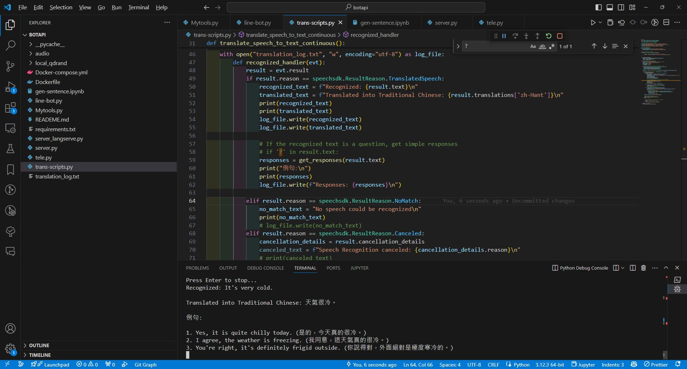

## 前言
在多語言溝通日益重要的今天，掌握一門外語已經成為許多人的目標。不過，語言學習不僅需要時間和耐心，還需要有效的實踐機會。本文將介紹如何使用最新的人工智能技術，結合微軟的Azure語音識別和OpenAI的ChatGPT，來創建一個可以即時翻譯和回應的工具，幫助使用者更好地學習和應用新語言。

## 預先準備
在開始之前，你需要準備以下幾樣東西：
* Python 環境：用於執行我們的腳本。
* Microsoft Azure 訂閱：用於訪問語音識別服務。
* Azure OpenAI API 密鑰：用於生成基於ChatGPT的回答。

## 運作原理
這個系統的核心是結合了Azure的語音識別技術和OpenAI的語言理解能力。整個流程可以分為以下幾個步驟：  

1. 語音輸入：系統通過麥克風捕捉用戶的語音。  
2. 語音識別：Azure的語音服務將捕捉到的語音轉換成文本。  
3. 生成回答：將識別出的文本傳送給ChatGPT，生成三個簡單的回答。  
4. 顯示結果：將ChatGPT提供的回答即時顯示給用戶。  

程式碼實現
下面是一個簡單的Python腳本示例，展示了如何整合Azure語音服務和OpenAI的ChatGPT模型：

```
import os
import azure.cognitiveservices.speech as speechsdk
from langchain.prompts import ChatPromptTemplate
from langchain_openai import AzureChatOpenAI

# 設定OpenAI環境變數
os.environ["AZURE_OPENAI_ENDPOINT"] = "https://xxx.openai.azure.com/"
os.environ["AZURE_OPENAI_API_VERSION"] = "2024-02-15-preview"
os.environ["AZURE_OPENAI_CHAT_DEPLOYMENT_NAME"] = "gpt3-turbo"

# 初始化OpenAI模型
model = AzureChatOpenAI(
    openai_api_version=os.environ["AZURE_OPENAI_API_VERSION"],
    azure_deployment=os.environ["AZURE_OPENAI_CHAT_DEPLOYMENT_NAME"],
)

# 為OpenAI設定聊天模板
chat_template = ChatPromptTemplate.from_messages(
    [
        ("system", "你是一個國中英文老師.善於用簡單的單詞溝通."),
        ("human", "關於英文問題{question}, 給我怎麼回覆的三個句子，並給中文翻譯. 比較音節困難的單字額外給音標，音標放在單字後面"),
    ]
)

def get_responses(question):
    message = chat_template.format_messages(question=question)
    response = model.invoke(message)
    return response.content

def translate_speech_to_text_continuous():
    # 用於語音翻譯的Azure訂閱金鑰和服務區域
    speech_key = "<Your-Azure-Speech-Key>"
    service_region = "eastus"
    from_language = "en-US"
    to_language = "zh-Hant"

    # 創建語音翻譯配置和識別器
    translation_config = speechsdk.translation.SpeechTranslationConfig(
        subscription=speech_key, region=service_region,
        speech_recognition_language=from_language)
    translation_config.add_target_language(to_language)

    recognizer = speechsdk.translation.TranslationRecognizer(translation_config=translation_config)

    with open("translation_log.txt", "w", encoding="utf-8") as log_file:
        def recognized_handler(evt):
            result = evt.result
            if result.reason == speechsdk.ResultReason.TranslatedSpeech:
                recognized_text = f"Recognized: {result.text}\n"
                translated_text = f"Translated into Traditional Chinese: {result.translations['zh-Hant']}\n"
                print(recognized_text)
                print(translated_text)
                log_file.write(recognized_text)
                log_file.write(translated_text)

                # 如果識別的文字是問題，獲得簡單的回答
                responses = get_responses(result.text)
                print("例句:\n")
                print(responses)
                log_file.write(f"Responses: {responses}\n")

            elif result.reason == speechsdk.ResultReason.NoMatch:
                no_match_text = "No speech could be recognized\n"
                print(no_match_text)
                # log_file.write(no_match_text)
            elif result.reason == speechsdk.ResultReason.Canceled:
                cancellation_details = result.cancellation_details
                canceled_text = f"Speech Recognition canceled: {cancellation_details.reason}\n"
                # print(canceled_text)
                # log_file.write(canceled_text)
                if cancellation_details.reason == speechsdk.CancellationReason.Error:
                    error_text = f"Error details: {cancellation_details.error_details}\n"
                    print(error_text)
                    log_file.write(error_text)

        recognizer.recognized.connect(recognized_handler)

        # 開始連續識別
        recognizer.start_continuous_recognition()
        print("Listening...")

        try:
            # 保持程序運行直到按Enter鍵停止
            input("Press Enter to stop...\n")
        finally:
            recognizer.stop_continuous_recognition()

if __name__ == "__main__":
    translate_speech_to_text_continuous()
```
## 運行結果
1. 當您運行這個Python腳本時，執行畫面的交互將會按照以下步驟展開：  
2. 啟動提示：當您啟動腳本後，系統會首先顯示"請說些什麼..."，提示用戶開始說話。  
3. 語音輸入：此時您可以向麥克風說話。您說的話將被系統捕捉。  
4. 顯示識別結果：一旦語音輸入結束，Azure的語音識別服務會處理這段語音並將其轉換為文字。這個轉換過程通常非常快速。系統將在屏幕上顯示識別的文本，例如："識別的文本: 你好，我想了解更多關於AI的資訊。"  
5. 回答生成：識別的文字會被發送到ChatGPT，ChatGPT會基於這些文本生成回答。這個過程大約需要幾秒鐘。  
