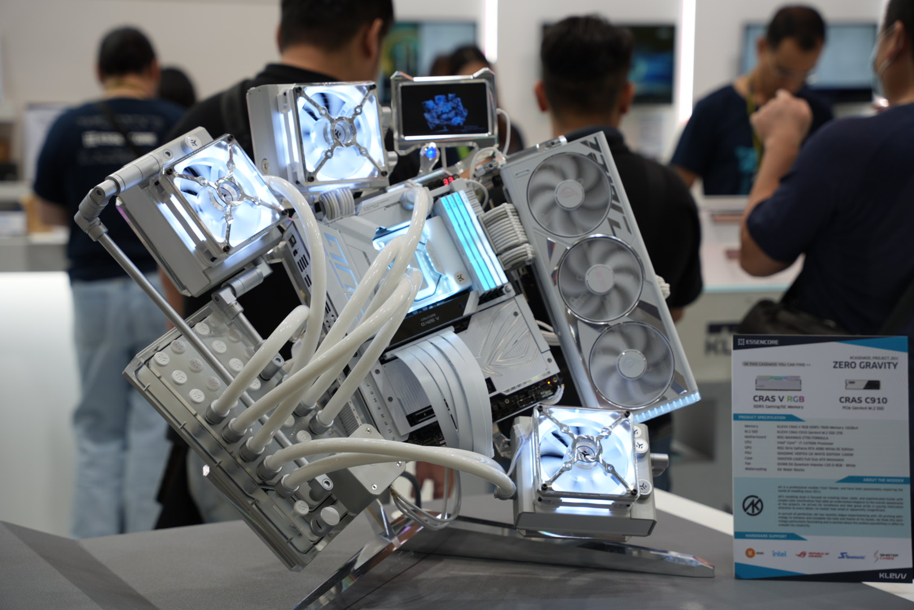

## 時空背景
今年應該是AI PC 元年，各大廠在聚焦在離線及私有的 AI，各大廠商推出自己的開源軟體生態（一堆預訓練的模型），好讓終端多買顯示卡和CPU，讓終端用戶可以自己訓練自己的AI。

我想自己訓練的成本仍然太高，跟Open AI 沒得比，但在限定的場域或離線，比較有機會用到，但有一天應該開源模型成熟度夠時，拿了再訓練，就能用。

台灣的Computex，大多是硬體廠商在火力展示，軟體及AI 解決方案比較少，如果要看軟體的解決方案，應該要去美國的CES 展。

## 離線 AI 解決方案

花了蠻多和硬體廠商交流，順便，整理了一下，Computex 中大所使用的離線預訓練語言模型及軟體生態

* 1.Intel - open vino   => 訓練完可以丟到比較輕量的IPC中 
 
[相關連結](https://docs.openvino.ai/2022.3/home.html#:~:text=OpenVINO%20is%20an%20open%2Dsource,Get%20started%20with%20OpenVINO.)
 
* 2.Nvidia - ngc  
 
[相關連結](https://catalog.ngc.nvidia.com/?filters=&orderBy=weightPopularDESC&query=&page=&pageSize=)
 
* 3.Ollama - 開源免費、可以搭配 Google 及Facebook 的語言模型及Open AI 一起用  
 
[相關連結](https://www.youtube.com/watch?v=JpQC0W91E6k)
 
* 4. 訓練微調語言模型  
 
[相關連結](https://unsloth.ai/)
 

## 展場照片

