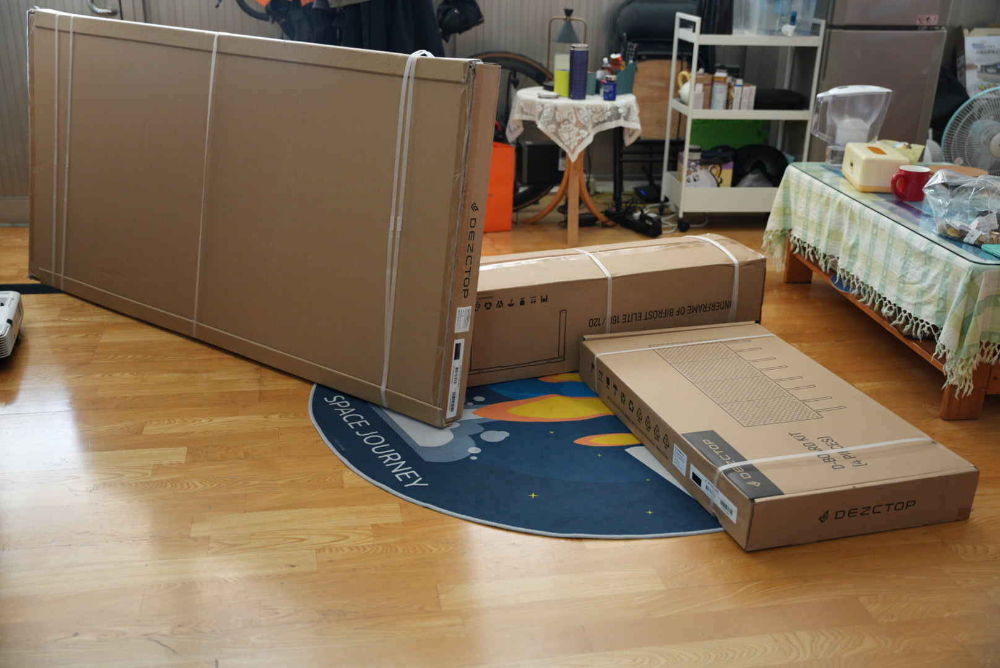
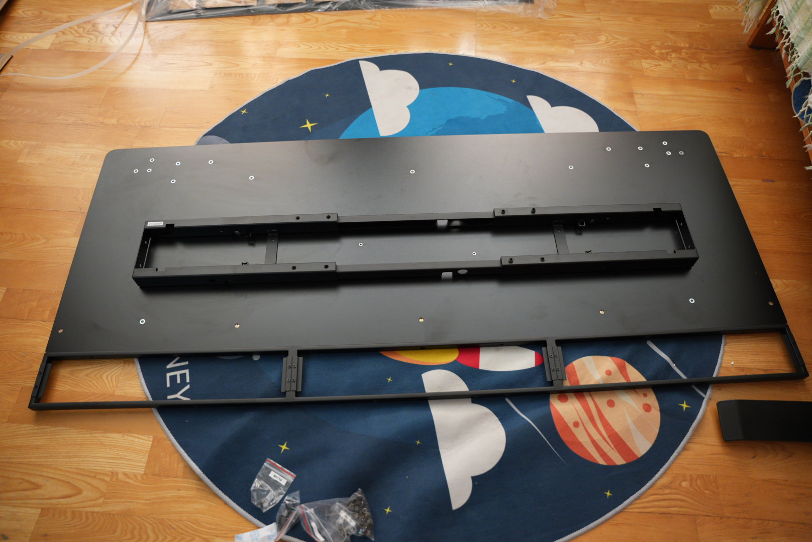
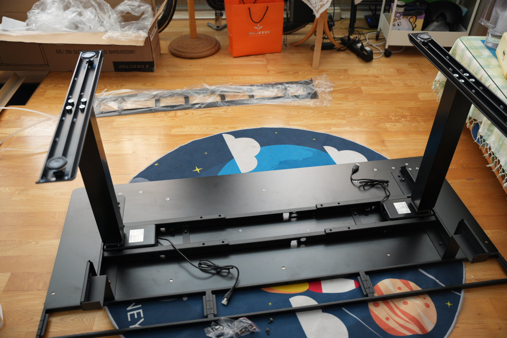
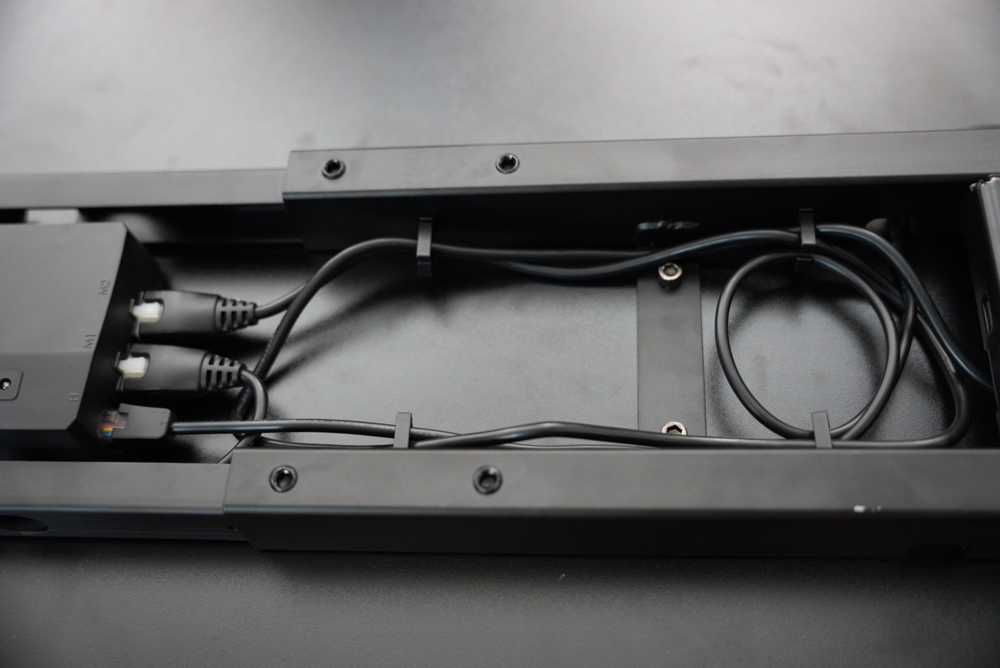
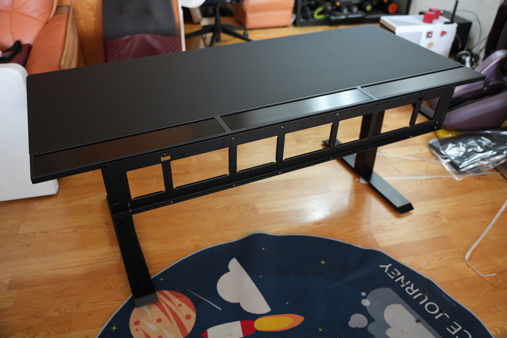
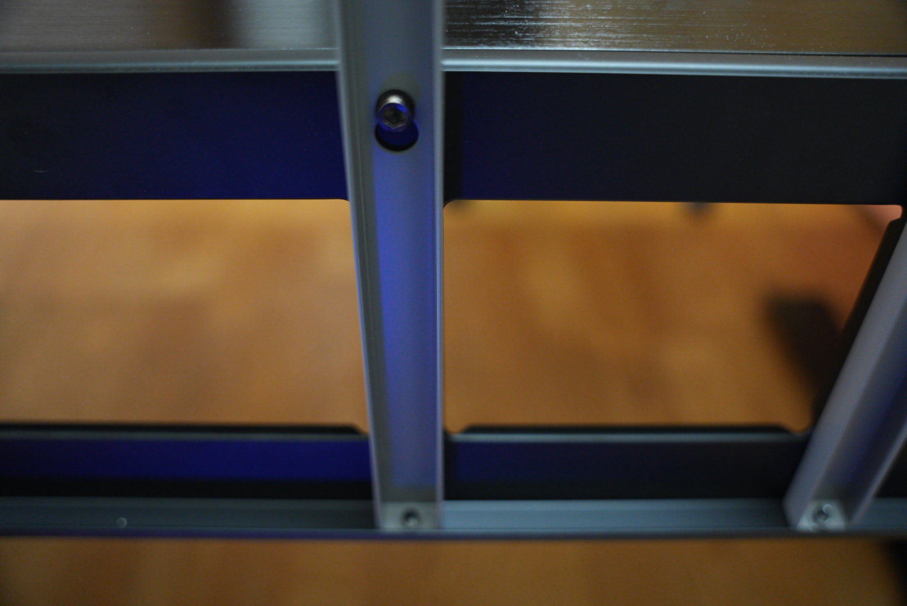
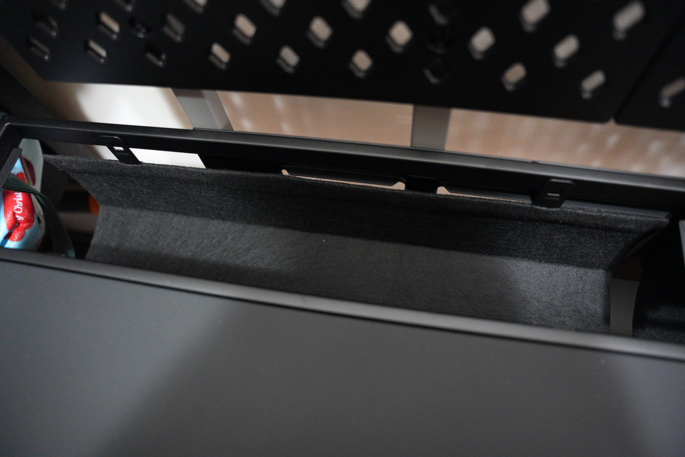
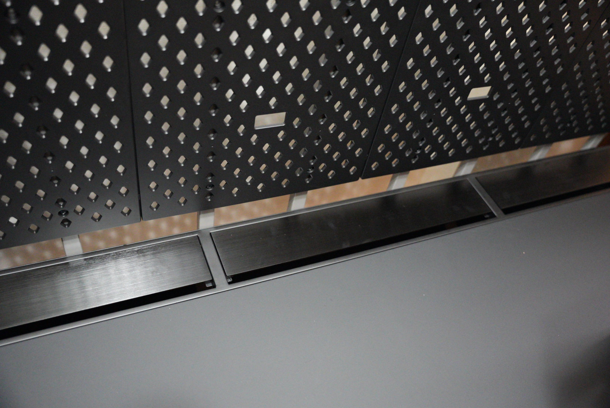
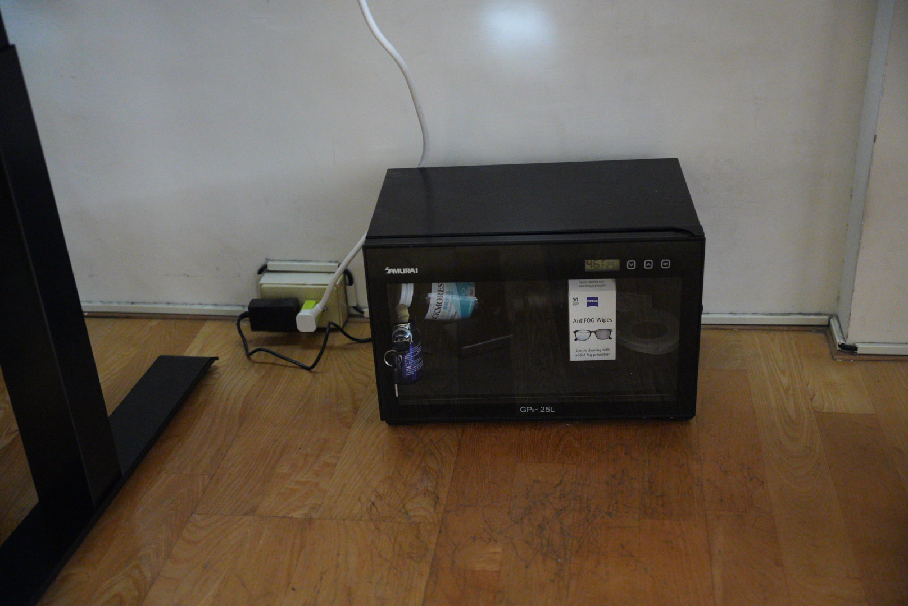
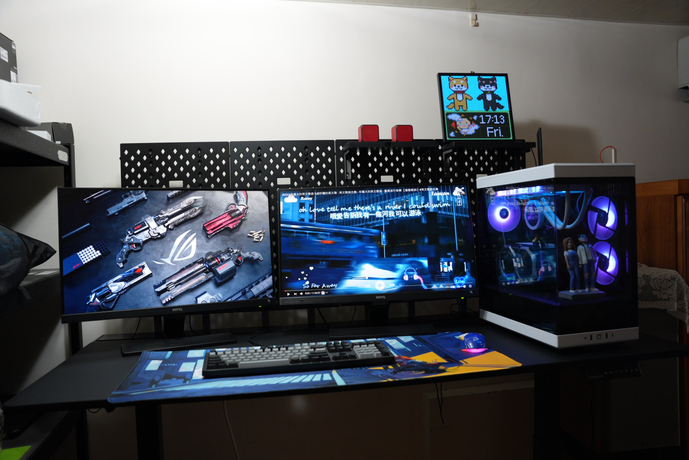

## 時空背景
自從公司換了站立桌後，就在也回不去了，我自己也去買了一組，120公分的桌子，這個高度，其實最適合站立寫程式，我想可以把椅子丟了。  
 
因我也快從事軟體工程師10年，長年長期久坐的工作，血液循環不好，且容易肚子大及肌肉鬆弛，站立桌，正好蠻能改善這些毛病。

## iBUYPOWER & Dezctop 
因為公司有和 Dezctop 合作，因為看到別人在用，覺得品質很不錯，同時在美國在iBUYPOWER 官網銷售，就去詢問一下，最後選擇了 DEZCTOP Bifrost Elite 160。   
[連結](https://www.ibuypower.com/gear-store/gaming-setup/dezctop-bifrost-elite-160-adjustable-gaming-desk---black)

## 安裝過程  & 產品細節
### 參考了[ Dezctop 安裝手冊](https://dezctop.com/tw/support/user-guide)
### 到貨速度很快，一次就來三個大箱子

### 首先，開始安裝申縮背版

### 安裝底座

### 接著，安裝控制器，其實蠻貼心的，都有預留走線的位置

### 再將其轉正面，接著安裝洞洞版支架

### 比較特別的部份是，線糟採用是特殊的布料，延長線及電腦要走線的位置也都幫你考慮好了。

### 蓋版是磁吸的，相當方面安裝線糟及走線

### 全部安裝完後，桌面及桌腳變得很乾淨

### 完成照

## 最後
這款DEZCTOP的設計充滿細節，用料實在，桌子配有充足的線槽，方便走線而不會在腳下造成混亂，桌子採用模組化設計，安裝簡便，幾乎不會出現裝錯的情況，特別的磁吸式蓋板，顯示了設計師的用心。  

我覺得這是我用過最好的桌子，不僅提供便利的洞洞板來整理收納，用料不會有那種很廉價桌子的感覺，雖然初次購買時有些猶豫，但考慮到其耐用性和實用性，這個價格其實相當合理。一張好桌子，可以陪伴你多年，所以我真心推薦 DEZCTOP Bifrost Elite 160  

it's your dream table.  
I think you should buy the one.  

## 相關連結
### [ Dezctop 官網](https://dezctop.com/)
### [momo 也有銷售](https://www.momoshop.com.tw/goods/GoodsDetail.jsp?i_code=11025475&Area=search&oid=1_2&cid=index&kw=Dezctop)

