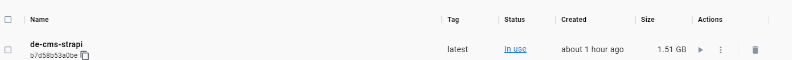
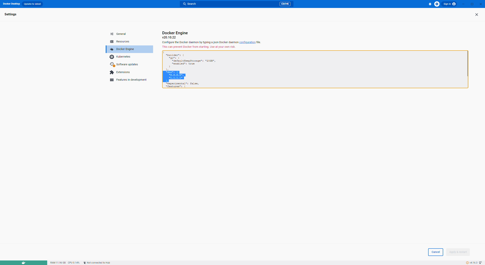

### Windows Subsystem for Linux 核心過舊
在上線前兩週，開始建置德國網站生產環境時，Docker 一直建置不過，經過調查及測試，最後發現 台灣的開發環境都架設在一台Win 11 上的Docker，而 Windows Server 2019 的內核是 Win 10， Linux 內核過會舊導致 Docker build 失敗，並在多次重裝和不同機器上的嘗試後仍未解決，但在台灣開發環境正常，一佈署到生產環境中卻反復出現 Docker Build 失敗，推測這可能與 Windows 的作業系統版本有關，Windows Server 2019 核心是對照 Win 10，Windows Server 2022 核心是對照 Win 11，最後在找了台 Windows 11 建構，建構完推到正式環境。

### Strapi 版本更新頻繁，建構過程一直出錯，且映像檔過大
我們的 CMS 採用的是 Strapi，但由於 Strapi 版本迭代的速度太快，相依的套件使用 yarn 時遇到插件無法正確識別的問題，因解決此問題，後來轉而使用npm 來安裝套件。  

此外因為美國機房缺少 Windows 11 內核的伺服器版本，最後從美國的生產線借了一台伺服器虛擬 Win 11 的虛擬主機做CICD，但從美國的辦公室要將映像檔佈署到 IDC 的生產環境，雖然一樣在加州，還是有點距離，為了提高網絡傳輸速度，改使用輕量版的node (node:18.17.0-alpine3.18) 映像將檔案大小從 3.8 GB 壓縮至 1.5 GB。  



### Docker 容器中 DNS 查詢異常
在所有環境部署完成後，Docker 容器的 DNS 查詢出現異常，錯誤訊息如下：

```
Error fetch multi lang data, fallback to local file, environment: production, error: {"cause":{"errno":-3001,"code":"EAI_AGAIN","syscall":"getaddrinfo","hostname":"e645f404c07e0ac86.ibuypower.com"}}
```

我們都知道DNS 主要是用於解析 IP 和域名的服務，Dcoker 為了把網路隔離，因此並不會直接繼承宿主主機的DNS ，透過以下設定解決容器無法解析 DNS 伺服器的問題：
```
  "dns": [
    "8.8.8.8",
    "1.1.1.1"
  ],
```



### SQL Server 版本過舊，在staging 是正常的，上live 就遇到問題 
```
Error: Client network socket disconnected before secure TLS connection was established 
```
在佈署當天，應徵程式佈署完後，程式一直出現 TLS 相關的的錯誤，比較了測試環境是 SQL Server 2017 ，德國網站正式環境的的資料庫是 SQL Server 2016 ，而SQL Server 2016 是使用過時的 TLS 1.0，導致新應用程式無法通過 TLS 驗證，為解決此問題，將 SQL Server 升級至 SQL Server 2017，導致部署時間延長三小時。

### 頁面渲染卡住
當我們將網站上線後，發現有些頁面偶爾會卡住，我們都知道 Next.js 採用伺服器渲染技術，如果有任一 API 回應過慢或未能返回，頁面渲染就會被卡住，經過一番埋Log 及分析後，發現是因為多語系 API 的請求頻率過高導致了 SharePoint 的不穩定性，為了解決這個問題，我們最終決定將 Office 365 的多語系寫入 Redis 進行緩存，這樣不僅解決了請求頻率問題，也顯著提升了頁面的加載速度和穩定性。

## 總結
技術說破都不值錢，但當下要查出關鍵原因，準時上線，都不是這麼容易事，光這麼多Ifra 問題，我自己就加班兩週以上，最終，歷經了各種困難，終於德國間在7/1 上線，在這些挑戰中學到，使用 Windows Server 環境時，應保持系統及其組件更新至最新版，以避免類似的技術問題。

