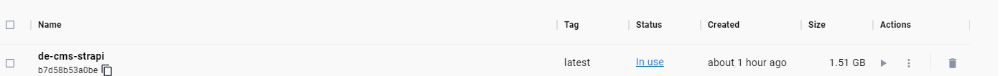
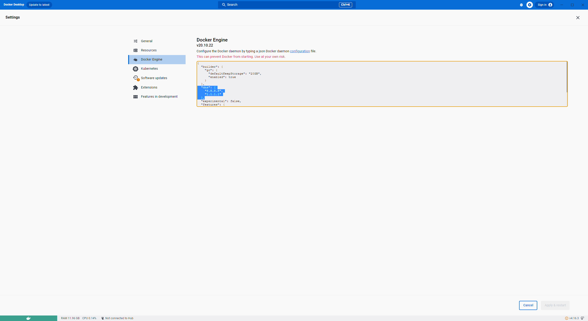

## 德國網站上線 - 遇到比較特別的技術問題
### Windows 子系統 Linux 內核過舊
在 Windows Server 2019 環境下，我們發現 Linux 內核過舊導致 Docker build 失敗，並在多次重裝和不同機器上的嘗試後仍未解決。雖然在台灣開發環境表現正常，生產環境中卻反復出現 Docker Build 失敗，推測這可能與 Windows 的內核版本有關，Windows Server 2019 核心是對照 Win 10，最後在找了台 Windows 11 建構，建構完推到正式環境。

### Strapi 版本更新頻繁，建構過程一直出錯，且映像檔過大
由於 Strapi 更新速度快，使用 yarn 時遇到插件無法正確識別的問題。因應此問題，我們轉而使用 npm。  

此外因為美國機房缺少 Windows 11 內核的伺服器版本，需要從美國的辦公室將映像檔佈署到Live環境，為了提高網絡傳輸速度，我們使用輕量版的node (node:18.17.0-alpine3.18) 映像將檔案大小從 3.8 GB 壓縮至 1.5 GB。  



### Docker 容器中 DNS 查詢異常
在所有環境部署完成後，Docker 容器的 DNS 查詢出現異常，錯誤訊息如下：

```
Error fetch multi lang data, fallback to local file, environment: production, error: {"cause":{"errno":-3001,"code":"EAI_AGAIN","syscall":"getaddrinfo","hostname":"e645f404c07e0ac86.ibuypower.com"}}
```

我們透過以下設定解決容器無法解析 DNS 伺服器的問題：
```
  "dns": [
    "8.8.8.8",
    "1.1.1.1"
  ],
```



### SQL Server 版本過舊
我們發現 SQL Server 2016 使用過時的 TLS 1.0，導致新應用程式無法通過 TLS 驗證，為解決此問題，我們迅速升級至 SQL Server 2017，導致部署時間延長三小時。

### 頁面渲染卡住
當我們將網站上線後，發現有些頁面會卡住，我們都知道 Next.js 採用預渲染技術，如果有任一 API 回應過慢或未能返回，頁面渲染就會被卡住，經過一番埋Log 及分析後，發現是因為多語系 API 的請求頻率過高導致了 SharePoint 的不穩定性，為了解決這個問題，我們最終決定將 Office 365 的多語系寫入 Redis 進行緩存，這樣不僅解決了請求頻率問題，也顯著提升了頁面的加載速度和穩定性。

## 總結
最終，歷經了各種挑戰，終於德國間在7/1 上線，在這些挑戰中學到，使用 Windows Server 環境時，應保持系統及其組件更新至最新版，以避免類似的技術問題。

