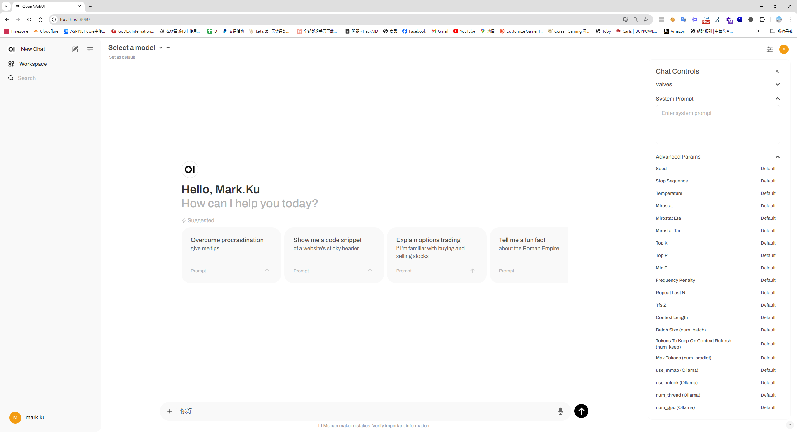
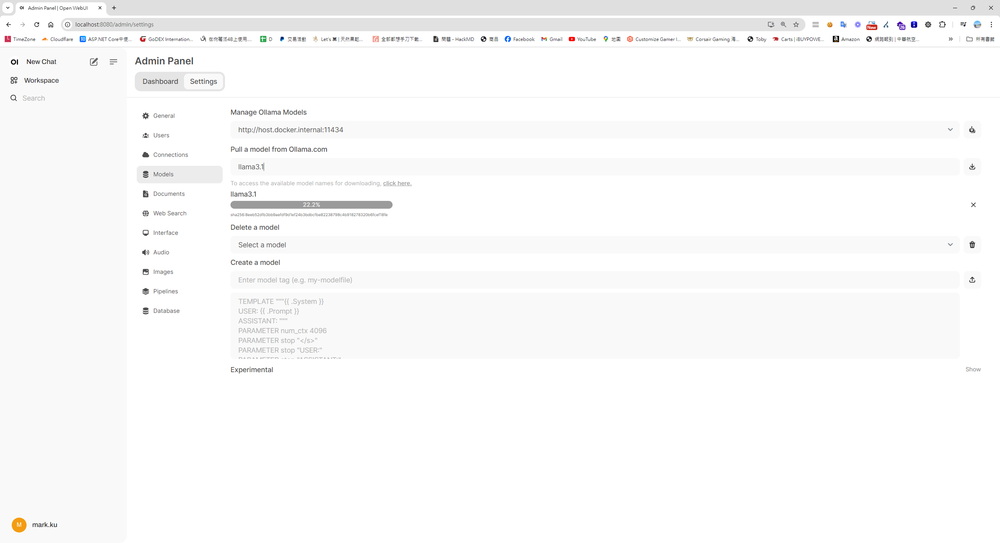
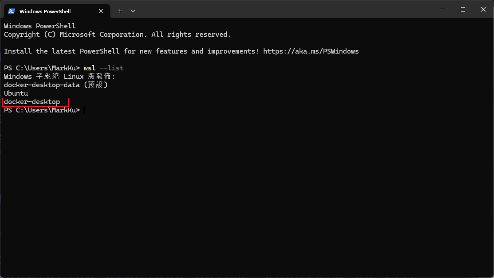
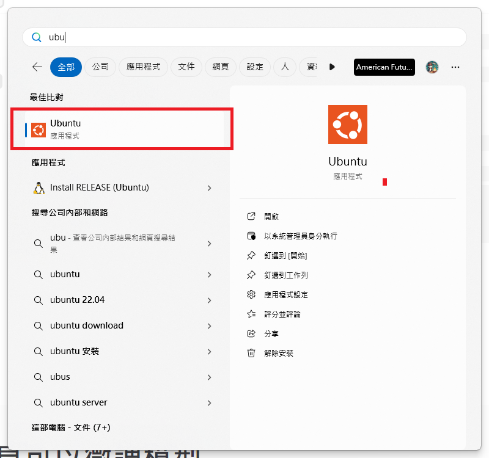
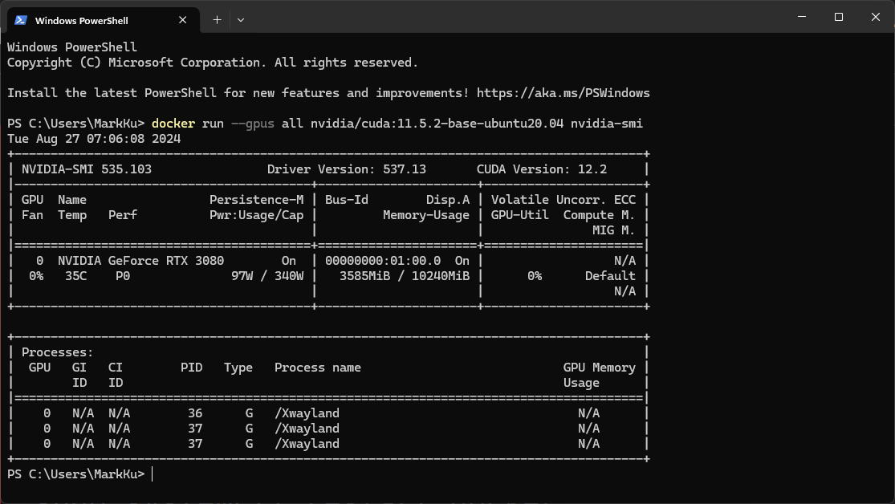
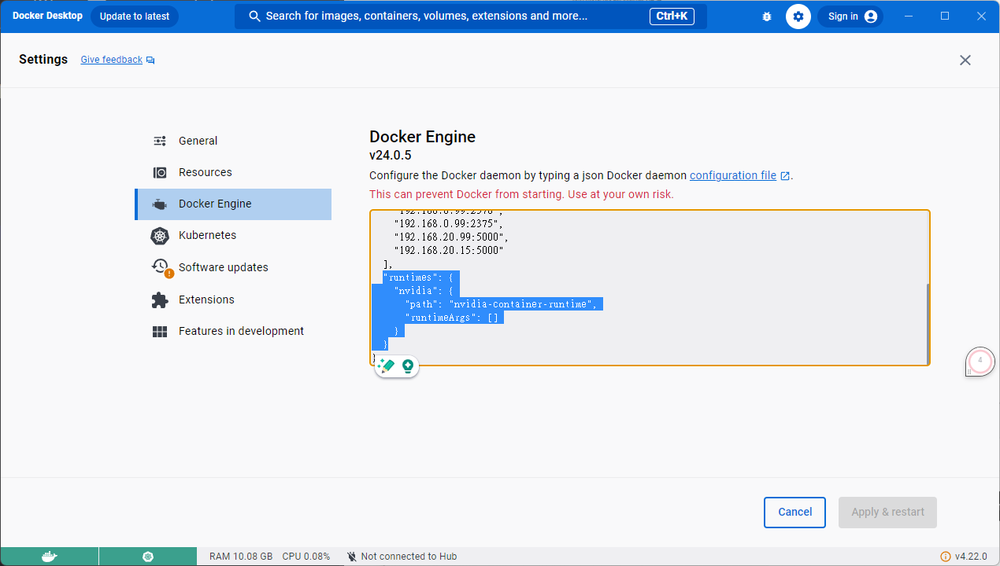
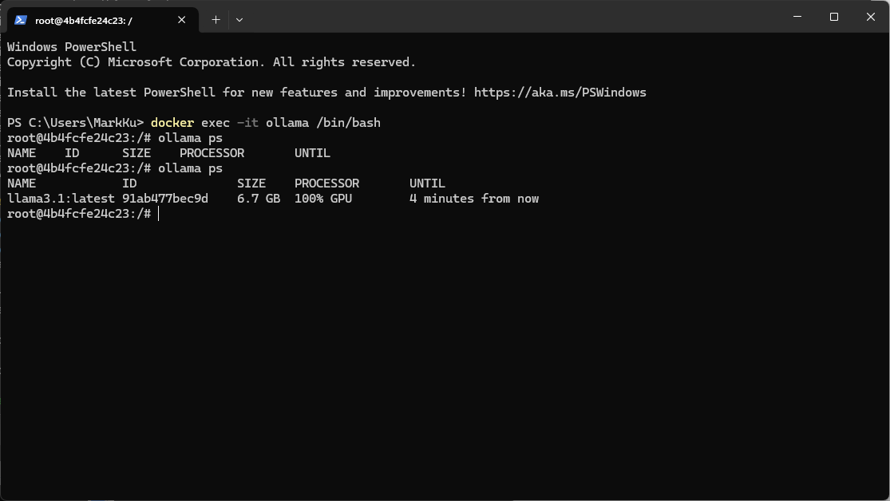

## 背景說明
過去使用 Azure Open AI 來優化 SEO，但由於 Azure Open AI 每月僅有 $150 美金的額度，常在月底因 MSDN 額度不足而被停用。因此，我們開始尋找其他替代方案，最終選擇了 Facebook 開源的 Ollama。

## 安裝及設定
### 首先，建立 Docker Compose 檔案 (GPU 版本)

```
version: '3.8'
services:
  ollama:
    image: ollama/ollama:latest
    ports:
      - 11434:11434
    volumes:
      - .:/code
      - ./ollama/ollama:/root/.ollama
    container_name: ollama
    pull_policy: always
    tty: true
    restart: always
    networks:
      - ollama-docker

  open-webui:
    image: ghcr.io/open-webui/open-webui:main
    container_name: open-webui
    volumes:
      - ./ollama/open-webui:/app/backend/data
    depends_on:
      - ollama
    ports:
      - 8080:8080
    environment:
      - '/ollama/api=http://ollama:11434/api'
    extra_hosts:
      - host.docker.internal:host-gateway
    restart: unless-stopped
    networks:
      - ollama-docker

networks:
  ollama-docker:
    external: false
```

## 建立啟動容器應用
```
docker compose up -d
```
## 訪問 loclahost:8080



## 設定>下載及安裝模型


## 安裝 Linux 子系統 (Windows PowerShell)
```
wsl --version
wsl --update
wsl --list
```


## 接著，開啟 Ubuntu 


## 在 Ubuntu 中執行以下命令
在 Ubuntu 中，執行以下命令來配置 NVIDIA 容器工具包：

```
curl -fsSL https://nvidia.github.io/libnvidia-container/gpgkey | sudo gpg --dearmor -o /usr/share/keyrings/nvidia-container-toolkit-keyring.gpg \
  && curl -s -L https://nvidia.github.io/libnvidia-container/stable/deb/nvidia-container-toolkit.list | \
    sed 's#deb https://#deb [signed-by=/usr/share/keyrings/nvidia-container-toolkit-keyring.gpg] https://#g' | \
    sudo tee /etc/apt/sources.list.d/nvidia-container-toolkit.list
sudo apt-get update
sudo apt-get install -y nvidia-container-toolkit

# Configure NVIDIA Container Toolkit
sudo nvidia-ctk runtime configure --runtime=docker
sudo systemctl restart docker
```
## 測試 GPU 整合
確認 GPU 整合是否成功：

```
docker run --gpus all nvidia/cuda:11.5.2-base-ubuntu20.04 nvidia-smi
```
## Docker enging 設定


```
"runtimes": {
    "nvidia": {
      "path": "nvidia-container-runtime",
      "runtimeArgs": []
    }
  }
```

## 如何確定 Ollama 使用GPU 做運算，回到宿主機執行以下指令
```
docker exec -it ollama /bin/bash
ollama ps
```


## 實測結果
### 硬體規格: CPU 13900K + Nvidia TUF RTX 3080 + 64 GB + WIN 11
### 將先前給 Azure AI 的程式，餵給Ollama 去 擷取重點、翻譯、生成SEO meta、及產生JSON

```
You are an SEO expert. Based on the page description provided below, generate an SEO-optimized title, meta description, and keywords. Ensure that the title is engaging and concise, the meta description summarizes the product effectively while enticing users to learn more, and the keywords are relevant to the product's features and market segment. Additionally, translate all content into the language specified by the given language code.
Company:Your company Desc ...
Ecommerce Page Description: Case: NZXT H5 Flow Gaming Gehäuse - Schwarz Processor: AMD Ryzen 5 5600X Processor (6x 3.7GHz/32MB L3 Cache) Memory: 16GB DDR4/3200MHz Memory(G.Skill ,Corsair,Kingston) Storage: Video Card: NVIDIA GeForce RTX 3050 - 8GB GDDR6X (VR-Ready) Motherboard: ASRock B450 PRO 4 ATX USB 3.1, SATA3, 1x M.2
Translate Target Language Code: en
FormatInstructions: Only the title, description and keywords of the json structure are returned. example :{"title":"","description":"","keywords":""} Please delete any other unnecessary information. Such as python code, Python Flask API, etc. Give me json result. Do not send back any other information such as python code, Python Flask API, etc.
```
### 性能比較
我們將之前在 Azure AI 上運行的程式交給 Ollama 進行測試，包括重點擷取、翻譯、生成 SEO Meta Tag、以及產生最後 JSON。接著對 CPU 版和 GPU 版的效能進行比較：
* CPU 版：1 分 10 秒 ~ 1 分 30 秒
* GPU 版：不到 3 秒

## 參考資料
* [傻瓜 LLM 架設 - Ollama + Open WebUI 之 Docker Compose 懶人包](https://blog.darkthread.net/blog/ollam-open-webui/)
* [【CUDA】如何在 windows 上安装 Ollama 3 + open webui （docker + WSL 2 + ubuntu + nvidia-container）](https://blog.csdn.net/smileyan9/article/details/140391667)
* [如何优雅的使用ollama| 京东云技术团队](https://blog.csdn.net/jdcdev_/article/details/138800464)
* [Ollama常用模型合集](https://www.53ai.com/news/qianyanjishu/1201.html)
* [離線不怕隱私外洩！免費開源 AI 助手 Ollama 從安裝到微調，一支影片通通搞定！](https://www.youtube.com/watch?v=JpQC0W91E6k&t=397s)

