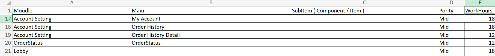

## 專案時程預估
大多工程師對於要剛開始如何老闆報告時程，困擾於及不知道怎麼溝通，在死線前做不完或項目超大，也不知道，如何解釋需要多少時間，最近我被問到這問題，我就順便整理了一下，我自身的經驗。  

在軟體開發的職業生涯中，能夠獨當領導一個專案，分析及時程預估是尤其重要的事，因為你一開始可以是預估一個人工作，到後面要帶著好幾一人一起工作，需要和上級討論，並去尋求他人的協助，才不會讓專案失去控制。

## 有趣的自然現象，隕石一直都在
從事軟體開發工作快滿10年，我們都想找間沒隕石的公司，其實工作久了，發現每間公司多多少少都會有些隕石，隕石其實就像是個真實世界自然現象，可能每天都在發生，而你不知道，正在某處發生著，且每間公司總會有更重要又臨時的商業目標，或是那個老闆又想插單，就會影響團隊的做事情的排序，但就看怎麼應對及克服，怎麼協調減少對團隊的衝擊，只要能從天天被隕石砸到，到兩週才被砸一次，這就算是種很大的進步。  

而大多公司的高層多半是業務出身，所以更在意專案帶來的商業效益，對於專案心裡的預期是越快越好，能夠將產品或功能越快的推上線，越快賺錢越好，對於大多業務出身的老闆思考的方式是，先定目標，在畫箭靶，所以更在意的是時程 (Time Table)。  

但因為看待問題的角度不同，對於工程師來說，我們得先了解需求要做什麼，拆解成工項，才能知道要做什麼，需要多久，因此工程師得先產出工作清單 (Work breakdown structure)，才能估大概估的時間。  

## 讓我們先回顧一下，軟體開發流程
教科書上定義的軟體開發流程如下，但礙於現今的市場對於軟體需求，變得越來越快，也不是每間公司都能夠這樣運行，很多 In house 的軟體工程師，可能需求訪談到系統分析及測試上線，可能都是一條龍。

* 需求訪談 > 此階段產出-需求資訊或需求確認書  
* 系統分析 > 此階段產出-需求資訊分析資料或系統分析書  
* 程式撰寫 > 此階段產出-程式地基、功能撰寫
* 測試 > 此階段產出-問題單或測試報告
* 上線
* 運維

## 首先，面對一個做不到的目標需求，或是不合理的 Deadline
先不急著去拒絕，而是先去了解規劃分析，回過頭在和使用者討論，能不能有其他折衷的做法，或是尋求上級獲得更多資源的幫助。

## 理解需求
先了解要這個專案在做什麼 ? 去確認你理解的需求是不是和未來要做一致，並去理解這個需求是要達成什麼目的 ?   

## 分析需求
充份理解需求後，並展開分析，怎麼做更好，或是有那些開源的資源可以加速開發，接著盤點可以用的資源，並找出需要誰的協助及需要幾個人或是去評估有沒有重大的技術難點，針對較複雜技術難點，可以在此階段做個POC。

### 拆解工作
從模組、頁面、元件把所有的工作項列出來，並評估工時

## 預估工時
雖然一天有8小時工作時間，但扣掉開會討論，上廁所，預留一些Buffer time ，一個人天，實務上，通常是算6小時，會比較精準。

## 測試
如果是大的專案，上線前預留兩週做測試。

### 如果上線的死線( Deadline ) 不能變
盤點可以用的資源
* 拆分階段 - 使用者的需求一定很多，但真正在意的就是某幾個，找出那些必要的功能，並拆分階段，評估先將主要功能完成，能不能如期。
* 補人 - 提出來需要更多的人手，補人不一定立刻有幫助，要適應熟悉專案適應，團隊也要段時間。(通常只能把較簡單的功能拆解給新人，這樣就不會變趕專案時邊帶人)。
* 加班 - 前提是公司有加班費，並且同仁有意願或是找機會和老闆談補班機制。

### 協商及討論
拿著你的前面準備好規劃好的工作清單及時程及解決方案，去和主管去討論。

### 最後
專案預估大多時候，不一定是精準的，但其實能在死線前交付使用者最在意的事，剩下的拆分階段，慢慢補完，並能夠解釋為什麼，盡力去做，好好溝通，其實大多使用者或主管，都能接受。

AI 的到來，有點像溫水煮青蛙，己拿走一些軟體開發的基礎的工作，減少了很多基層及中層的工作，但賦予每個工程師更多的生產力及效率，同時也帶來新的機會，在每個專案裡還有很多可以學的，底層邏輯，是不可以替代的，不要只會寫程式，不然等到工具取代你的工作時，而你還沒找到下條路。      
