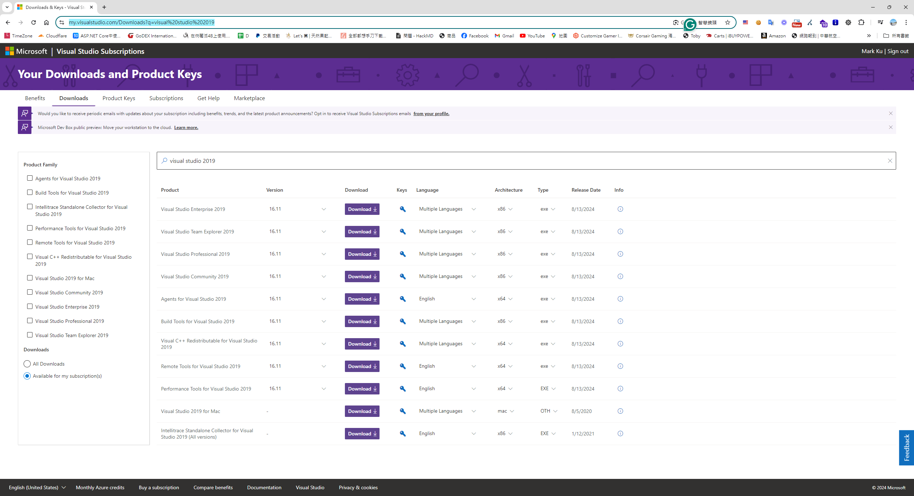
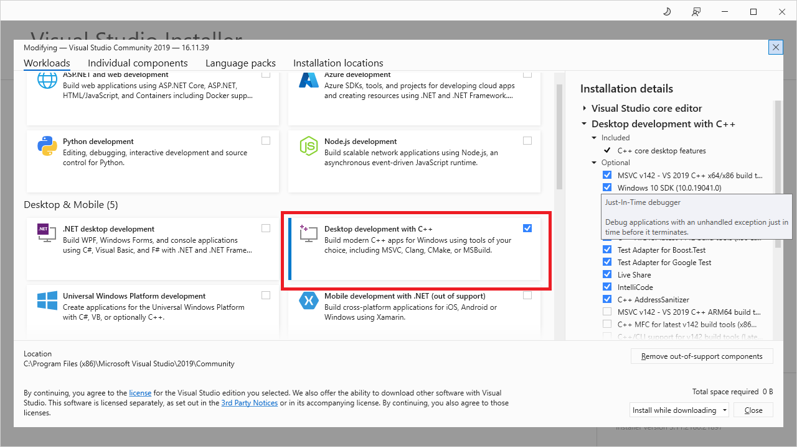
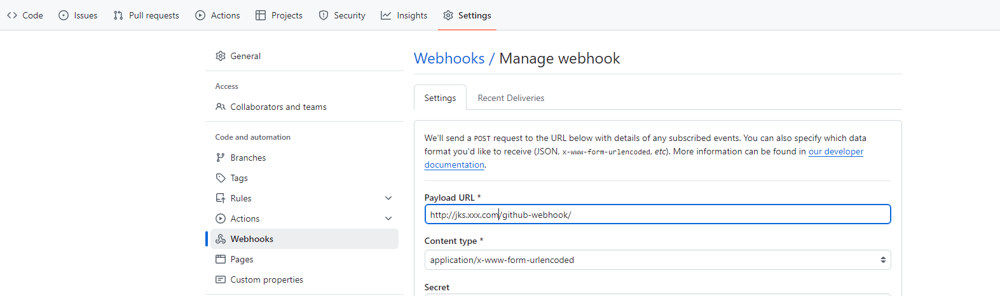
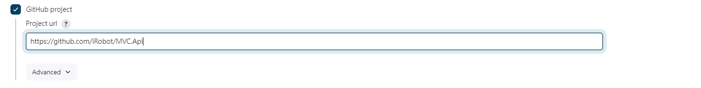
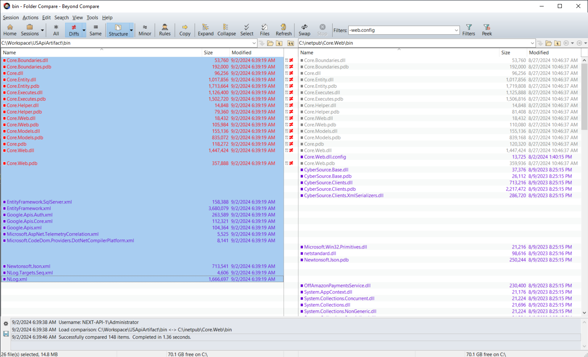

## 時空背景
目前公司內大部的系統都能夠容器化，但總有些舊網站，最舊也最大也最重錢，暫時無法做技術昇級，但人數一多手動佈版，都會遇到有人漏提交 Binary，因此想把自動建置的部份自動化，優化佈版流程，同時也減少錯誤帶來的影響。  

因為是舊系統及Net Mvc framework 的舊框架，無法容器化，全自動佈版，會有點風險，因此這邊佈署的部份，仍然還是採用手動。

## 目標
* 當有人 Push 任何code 到 Master 分支時，Jenkins 就會自動建置，並將建置完的 Binary，自動提交及推送到 Github。
* 生產環境寫一個腳本，透過 Git 將最新的準備佈署的Binary 拉下來，接著透過 Beyond compare 比較 binary 差異，最後交由人工手動佈版。

## 環境說明
因為是舊系統，Jenkins 安裝在 Windows server 上。

## 首先，找回 MS Build 
我們都知道NET MVC 的建置是透過Msbuild 這個工具，依據對照的 Visual Studio 2019 版本找到對照的版本是MSBuild 16 ，但在微軟的網頁，目前舊版 Msbuild tool 下載連結都找不太到下載連結，最後我從[MSDN 訂閱帳號](https://my.visualstudio.com/Downloads?q=visual%20studio%202019)，裡找回舊版的 Visual stdio 2019 下載連結。  


安裝記得勾選 Desktop development with c++



## 設定 Jenkins 的MS Build 路徑
MS Build 安裝路徑是
Visual studio 2019 一起安裝的MSBuild.exe 路徑是
C:\Program Files (x86)\Microsoft Visual Studio\2019\Community\MSBuild\Current\Bin

## 下載[nuget.exe ](https://www.nuget.org/downloads)

下載 Nuget.exe 至 C:\Program Files (x86)\Microsoft Visual Studio\2019\Community\MSBuild\Current\Bin 

## 下載並安裝 [.NET Framework 4.8 Developer Pack ](https://dotnet.microsoft.com/en-us/download/dotnet-framework/net48)

## 撰寫 Pipeline 
MS Build 安裝路徑

Visual studio 2019 一起安裝的MSBuild.exe 路徑是
C:\Program Files (x86)\Microsoft Visual Studio\2019\Community\MSBuild\Current\Bin

## 至 Github repo 設定webhook 當程式commit 時自動建置

```
http://jks.xxx.com/github-webhook/
```
## Jenkins 自動建置 pipeline
接著，建立Job ，選擇New Item > Pipeline，並設定 Github Project。



```
properties([pipelineTriggers([githubPush()])])

pipeline {
	agent any

	environment {		
	}
	
	options {
		buildDiscarder logRotator(artifactDaysToKeepStr: '', artifactNumToKeepStr: '3', daysToKeepStr: '', numToKeepStr: '3')
	}

	stages {
	    stage('Cleanup Directories') {
            steps {
                script {
                    // Delete the 'Api' and 'Artifact' directories
                    dir('Api') {
                        deleteDir()
                    }
                    dir('Artifact') {
                        deleteDir()
                    }
                    
                    dir('Publish') {
                        deleteDir()
                    }
                    echo "Deleted Api and Artifact directories."
                }
            }
        }
	
	    stage("GitHub Pull - Ｎet mvc api") {
            steps {
                dir('Api') {
                    git(
                        branch: 'master',
                        credentialsId: 'xxxx-xxxx-xxxx',
                        url: 'git@github.com:iRobot/MVC.Api.git'
                    )
                }
            }
        }
		
		 stage("GitHub Pull - Artifact") {
            steps {
                dir('Artifact') {
                    git(
                        branch: 'main',
                        credentialsId: 'xxxx-xxxx-xxxx',
                        url: 'git@github.com:iRobot/Artifact.git'
                    )
                }
            }
        }
        
    stage('Restore nuget') {
        steps {
        script {
            bat 'echo Current Directory: %CD%'
            bat 'echo Workspace Directory: %WORKSPACE%'
            bat '"C:\\Program Files (x86)\\Microsoft Visual Studio\\2019\\Community\\MSBuild\\Current\\Bin\\nuget.exe" restore ".\\Api\\IRobot.WebCore\\IBuyPower.WebCore.sln"'
        }
        }
    }
    
    stage('Build') {
            steps {
                script {
                    // Define the MSBuild path and solution file
                    def msBuildPath = '"C:\\Program Files (x86)\\Microsoft Visual Studio\\2019\\Community\\MSBuild\\Current\\Bin\\MSBuild.exe"'
                    def solutionPath = '".\\api\\IRobot.WebCore\\IRobot.WebCore.sln"'

                    // Build command with all necessary parameters
                    def buildCommand = "${msBuildPath} ${solutionPath} /t:Clean,Build /p:Configuration=enUSLive /p:DeployOnBuild=True /p:DeployDefaultTarget=WebPublish /p:WebPublishMethod=FileSystem /p:DeleteExistingFiles=True /p:OutDir=\"%WORKSPACE%\\Publish\" /p:ExcludeGeneratedDebugSymbol=True -verbosity:minimal"

                    // Execute the build command
                    bat script: buildCommand, returnStatus: true
                }
            }
    }
    
     stage("Copy to Artifact") {
            steps {
                script {
                    
                    def buildCommand =  "robocopy \"%WORKSPACE%\\Publish\\_PublishedWebsites\\Core.Web\" \"%WORKSPACE%\\Artifact\" /E /COPY:DAT /MT:100"

                    // Execute the build command
                    bat script: buildCommand, returnStatus: true
                }
            }
        
    }
    
    stage('Check for Changes and Commit') {
    steps {
        dir('Artifact') {
            script {
                // Set local git configuration for user identity
                bat "git config user.email \"jenkins@example.com\""
                bat "git config user.name \"Jenkins CI\""

                // Stage all changes
                bat "git add ."

                // Commit with a timestamp
                bat "git commit -m \"Automated commit at ${new Date().format('HH:mm:ss')} by Jenkins\""

                // Attempt to push changes to remote repository
                def pushResult = bat(script: "git push --set-upstream origin main", returnStdout: true, returnStatus: true)
                if (pushResult != 0) {
                    echo "Failed to push changes. Error Code: ${pushResult}"
                }
            }
        }
    }
}	
}
}
```	
	
## 手動佈版
因為是舊系統及Net Mvc的舊框架，無法容器化，全自動佈版，會有點風險，因此這邊佈署的部份，仍然還是採用手動。

### 再安裝 Beyond Compare
### 撰寫powerhsell  deploy.ps1
```
git pull 

$LOCAL = "C:\Workspace\USApiArtifact\bin"
$REMOTE = "C:\inetpub\Core.Web\bin"

$env:Path = "C:\Program Files\Beyond Compare 4\" 
$filters = "/filters=-web.config"
BCompare.exe /excludefilter="web.config"  "$LOCAL" "$REMOTE" $filters
```
## 最後，執行後就能透過，Beyond compare 去比較此次佈版的dll 是不是和所想的一樣，最後透過右鍵 Copy to Right 來佈署新版應用程式。



