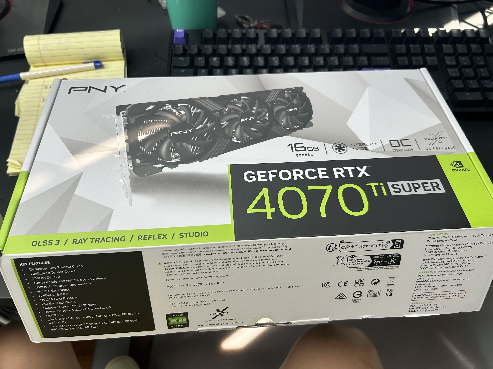
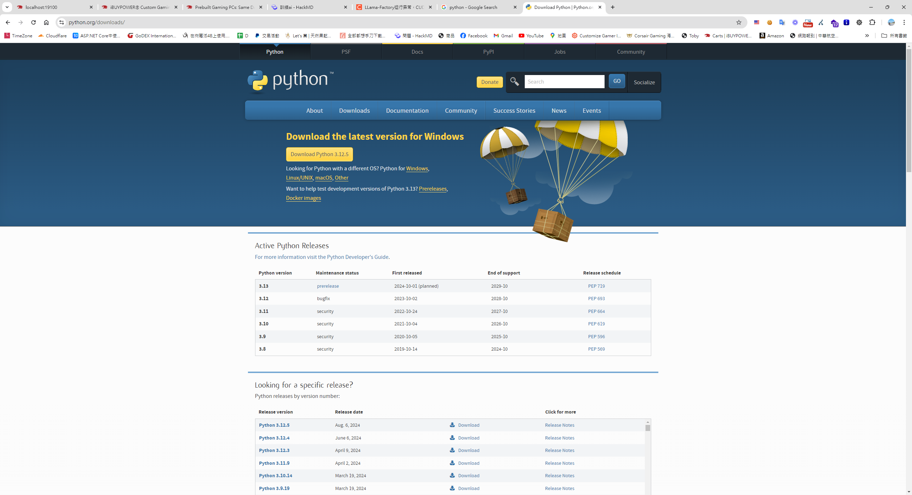
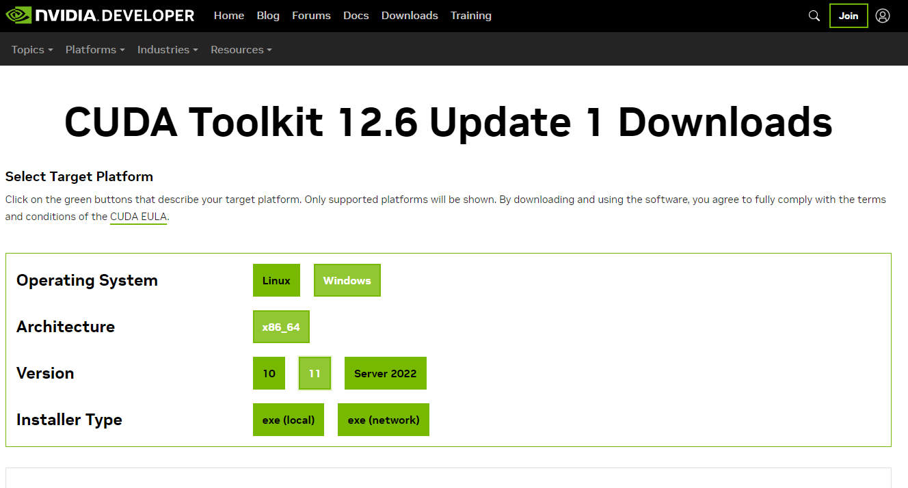
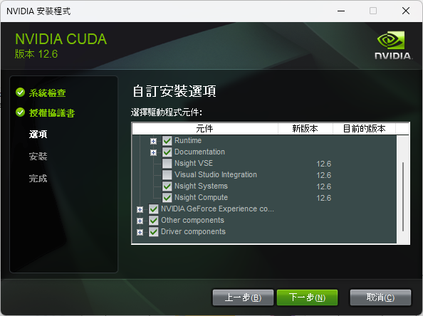
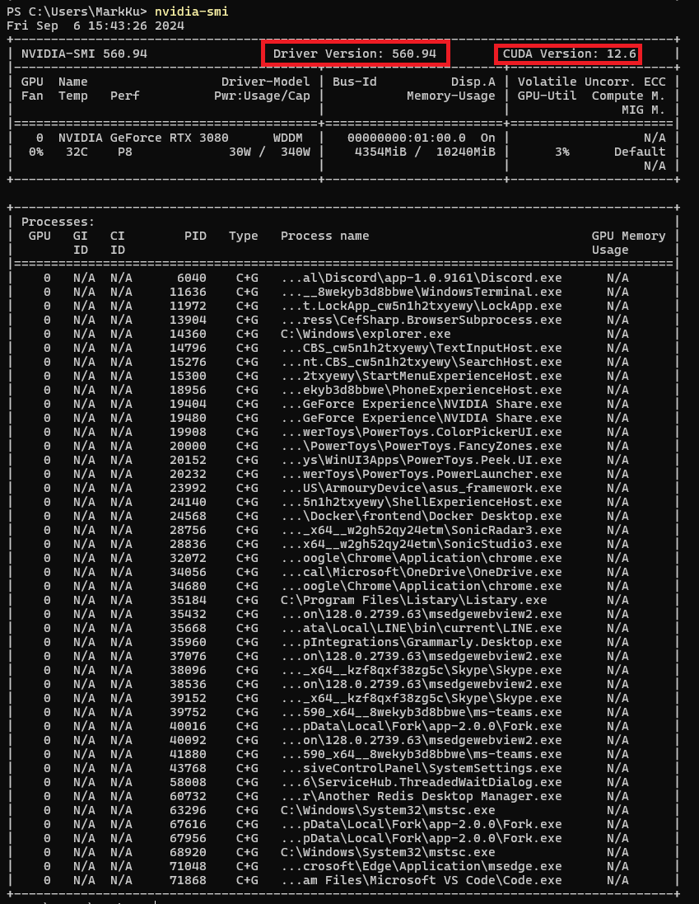
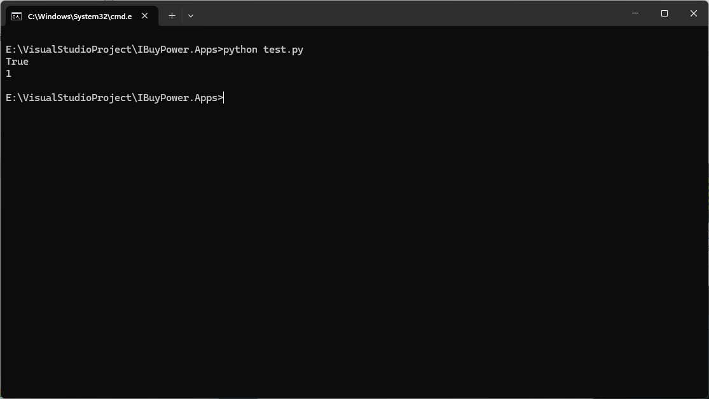
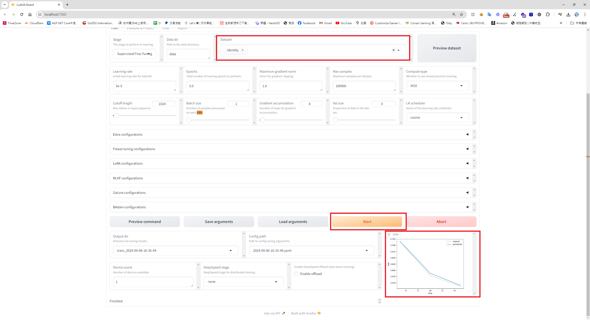
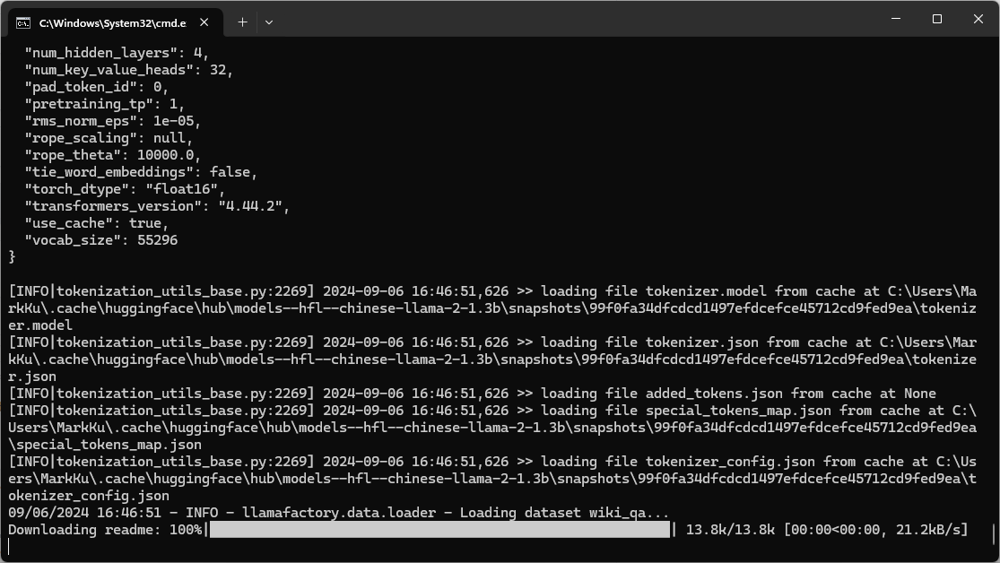

## 前言
LLAMA Facotry 都是很熱門的自己微調模型的框架，因為想打造自己的客服機器人，因此參考了資料，試著嘗試想拿一些開源AI模型來調整看看。

## 潛在的 AI 需求
* 客服 FAQ。
* 推薦套裝電腦的BOT。
* 機器人自己搭配零組件。

## 事先準備
### 一張 Nvidia 4070 ti super 顯示卡


## 需要安裝的東西
### Python - [裝最新版就好](https://www.python.org/downloads/)


## 首先，要先[下載安裝 Python](https://www.python.org/downloads/)，這邊裝相對穩定的版本 3.12
### 接著[下載安裝 CUDA](https://developer.nvidia.com/cuda-toolkit)，這邊需配合顯示卡版本 (驅動程式最好一起裝)


P.S. 如果在裝Drive 過程中，裝不起來，可以先將 Nsight VSE及 Visual studio Integration 先勾選掉，因為可能會因為你裝兩個版本的 Visual studio curd 會裝不起來。


### 查詢驅動版本及檢查可以裝的CUDA 版本

```
nvidia-smi 
```


### 查詢安裝的驅動及CUDA 版本
```
nvcc -V
```

### 安裝 [PyTorch](https://pytorch.org/) 
```
pip3 install torch torchvision torchaudio --index-url https://download.pytorch.org/whl/cu124
```
### 測試 Python 是不是能和 GPU 溝通 (test-gpu-test.py)
```
import torch
print(torch.cuda.is_available())  # 是否可以用gpu False不能，True可以
print(torch.cuda.device_count())  # gpu數量， 0就是沒有，1就是檢測到了
```


## 安裝LLAMA Factory 
### 首先，拉取程式碼
```
git clone --depth 1 https://github.com/hiyouga/LLaMA-Factory.git
```
### 進入程式碼目錄
```
cd LLaMA-Factory
```
### 安裝依賴
```
pip install -e ".[torch,metrics]"
```
### 檢查是不是安裝成功
```
llamafactory-cli version
```
### 啟動 
```
llamafactory-cli webui
```
### 選擇資料集後，就能開始訓練模型



### P.S. 補充 - 如果遇到 CUDA environment was not detected. 錯誤的話，應該是前面幾個步驟有漏裝到。
### 參考資料
* [參考資料1](https://medium.com/@anannannan0102/pytorch-%E6%83%B3%E7%94%A8gpu%E8%B7%91ml%E7%92%B0%E5%A2%83%E5%8D%BB%E8%A3%9D%E4%B8%8D%E5%A5%BD-%E7%9C%8B%E5%AE%8C%E9%80%99%E7%AF%87%E5%B8%B6%E4%BD%A0%E9%81%BF%E9%96%8B%E5%90%84%E7%A8%AE%E9%9B%B7-3bf259fc7396)
* [參考資料2](https://blog.csdn.net/lx15983596831/article/details/140466261)

