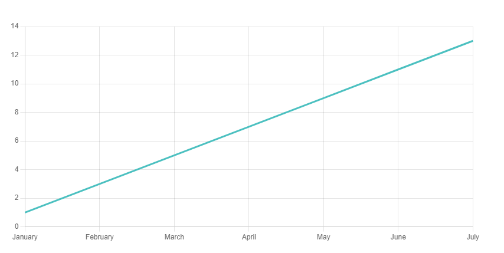
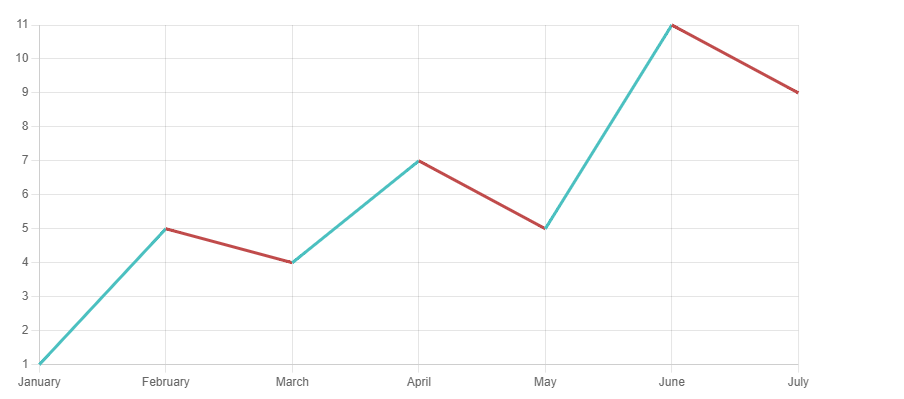

最近被年輕人問到職涯選擇的問題，就分享一下，我的經驗

在人生很多困難議題卡住時，面對需要二擇一時，往往是先前自己沒有超前準備，現在才得面對這二則一的選擇題，此刻必須認清楚，資源有限，不能兩項都要時，你得找出你最在意什麼，很多時候需要調整你的期待，捨去些什麼，再回過頭再去努力。  

我想大多人對未來的發展期待，往往是從左下到右上的持續成長曲線

但是真實的人生，往往不是這樣，很多的事不太可能預期，你無法避免失敗及意外，會遭遇許多磨難痛苦，就像是股票一樣，有上也有下  

像長期是待過大型組織的員工，或是獲得超額報酬，可能做的事情很單純，又待的很久，自己又沒意識到，讓自己處於長期處於很低的目標，當要離開組織求職時，往往就很容易會卡住，  

錢 ｏｒ 個人發展 二擇一  

離開後，往往卡在過去領多少的薪資，再找下份工作時也會期待要這樣的薪資就會卡住，  

因為分工很細，而自己的專業技能，只能服務於原單位，市場可能沒有符合的需求，或許本的薪資屬於補償性性，       

此時就得延後滿足你的需求，重上個節點來過，讓自己的技能和專業接近市場，慢慢達到自己的目標。  

我非常喜歡大人學的一句話:
就算選錯了，也不會怎麼樣，人生沒有真正的失敗，也沒有真正的成功，真正的成功是讓自己處在持續夠久穩定的狀態中。

## 參考
[大人學Podcast](https://podcasts.apple.com/tw/podcast/%E5%A4%A7%E4%BA%BA%E7%9A%84small-talk/id1452688611)

