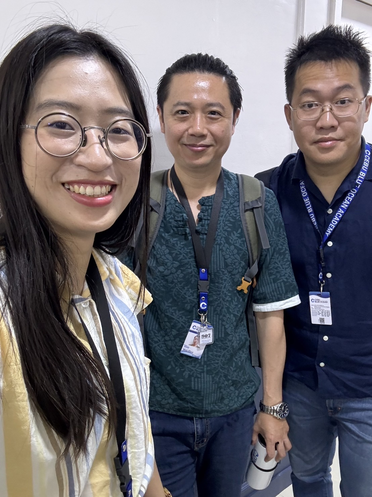
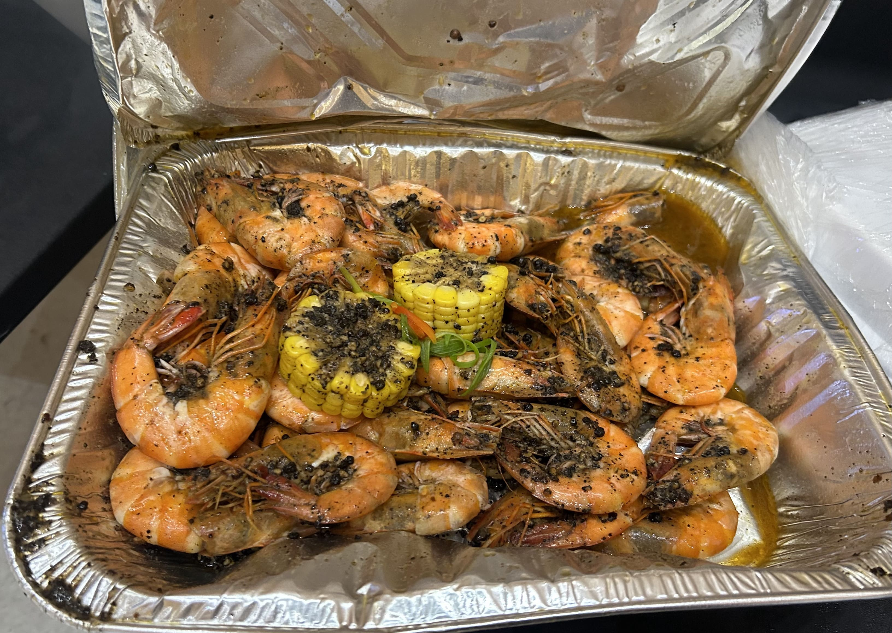

## 為什麼要去語言學校
英文一直不好，之前有試過補習班，或是AI學習，後來發現沒什麼用，因為沒機會用，這幾年就算待在外國公司，都練到的都是讀和寫信的技能。    

回想第一次出差時，剛進公司兩個月，在搞不清楚要去美國做什麼就被安排去了美國，當時是一句英文都說不出來，但概是單詞和單詞，最後靠著同步幫忙及畫流程圖完成，第一次的美國出差。  

今年本來就有在線上菲律賓老師家教，己經上了34堂(50分鐘)，因此口說比較有一點基礎，所以去到時，比較不會這麼怕說英文，但我的基礎不好，因此說出來的文法可能不是這麼正確。  

藉著特休及加班的假，去一個地方邊休假邊學習語言。  

## 為何選擇菲律賓
* 相較便宜
* 假日可以玩水
* 美、加拿大、歐 - 因為師資貴，大多是團課，很多時候，並不會管你有沒有學到，1對1的互動對於口說及聽力進步很有幫助。
* 泰國和菲律賓費用差不多，但並不像菲律賓是官方語言，在生活中也能應用英文，並不是每個人都會說英文。
* 很多人會覺得菲律賓口音很重，事實上，台灣人也有口音，總是m/n 分不清楚，日本人也有，但大多老師都有經過訓練過，我個人覺得是還好。

### 為何選CBOA 
因為去年及上半年，加班及工作量真的不小，想找個地方可以度假及學習，我本身喜歡游泳，CBOA 有三個游池，比較之下，能夠兼購度假及學習的，CBOA 是最適合，因此選擇了半斯巴達的學風，CBOA 也是當地老牌的語言學校，此外 CBOA 每天都有供三餐，常常中日韓料理混著做，應該贏過蠻多島上餐廳。

## 在宿霧一些小建議
* 計程車或吉普尼，很容易遇到會被亂減價的問題，可以先註冊好 Grab 來叫車，挷好信用卡就可以先不用找換匯所換披索

* 因為防止詐騙，菲律賓當地的網卡，都是得透過網路完成實名制，並必須在當地送出申請，最好先辦理漫游，以便在當地完成實名制登錄，建議買 Globe 會比較簡單，審核也比較快速，機場或學校免費 Wifi 很慢及不穩定，最好自己先準備。
* 當地的飲食不容易適應，路邊攤最好別吃，除非你腸胃很好，可以些泡麵過去，因為氣候關係，當地吃的白米是[旱稻](https://kmweb.moa.gov.tw/knowledge_view.php?id=2431)，不是水稻，吃起來乾乾硬硬的，加上習慣吃濕濕的飯，這邊待一陣子，會蠻懷念台灣的白米飯。
* 很容易感冒，請多準備一些常備藥 ( 感冒、胃藥 )
* 電費相校台灣蠻貴的，一度學校收10~15塊
* 帶面額100元的美金過去，這樣匯率會比較好，學校或是百貨都能夠換匯。

## 學費
* 學費 + 住宿 ( 單人/ 雙人 / 三人) = 40,000
* 學雜費 300 美金

機票 7000 + 學費 40000 + 學雜費 8000 + 一些生活開消 600 美，兩週，零零總總，大概花費台幣 7 萬左右，待越久越相對滑算。  

非凡遊游提供很方便 - [線上費用計算機](https://feifanstudy.com/schools/10-cboa)

## 第一天 -  收到代辦說 學校臨時通知，說菲律賓政府通知明天放假。

因此我們就去 Ayala mall / SM Sea Side 逛逛，空間很大，品牌不多，所以大家除了吃東西，幾乎都沒買什麼東西。

## 第二天 
### 分級考試
第天一早就會集合，輪流進行拍照及考試，一對一口說 - 兩位老師問幾個問題，拿幾個圖片，請你描述內容，會依據分數幫你進行級，下午大概就知道成績了，最後我被分到 Level 3，下午台灣經理就會介紹環境及告訴我們何時能領書。

### 校園環境

## 跳島
第一週的跳島，原本是要去歐斯陸及墨寶兩天一夜，但因為颱風尾攪亂，無奈被取消被取消。  

第二週，後來我去了，資深堂島吃海鮮及浮潛及海洋公園

來這座島，一定要殺價不然會被盤，如果不太會殺價可以加入大哥大姐的殺價團。

## 最後
整體來說 CBOA 的環境及師資，都還算是蠻不錯的。    

聽團課同學說，我的文法和口說有明顯的，但在聽力上，我還是需要自己持續加強。  

每個來宿霧的人，都有他的故事，聽了很多故事後，我也得繼續我的的故事。  

宿霧是個好地方，可以讓你/喘口氣，放空一下，想一下接下來該怎麼勇敢面對自己的課題及接下來屬於你的人生故事該如何發展。  

工作久了，很難再有這麼單純的友誼，講幹話，互相幫助，及有共同目標，每天上不完的課，還有很多嚴格的老師。  

認識很多日本同學，我們用很破的英文交談。  

還撿到一個長的像小丸子的妹妹，同年同月同日生，同個高中的同學，同一天抵達宿霧，常常 PUA 我們去幫他們超市搬水，妹妹，同年同月同日生，同個高中的同學，同一天抵達宿霧，常常PUA我們去幫他們超市搬水。  

還有最有趣的是，有個半夜不睡覺，會唱唱我愛CEBU的士官長室友，為了和日本同學拍照，還會被CUE 表演後空翻。  

最後，謝謝你/妳們 ，祝一切順利!  

## 附上 - 我最愛的餐廳 Mr. Crab Capitol

## 常用的句子
* pardon ( 聽不懂)
* I can't hear clearly. could you speak again ?
* could you speak again ?
* could you write it for me ?
* could you speak slowly ?