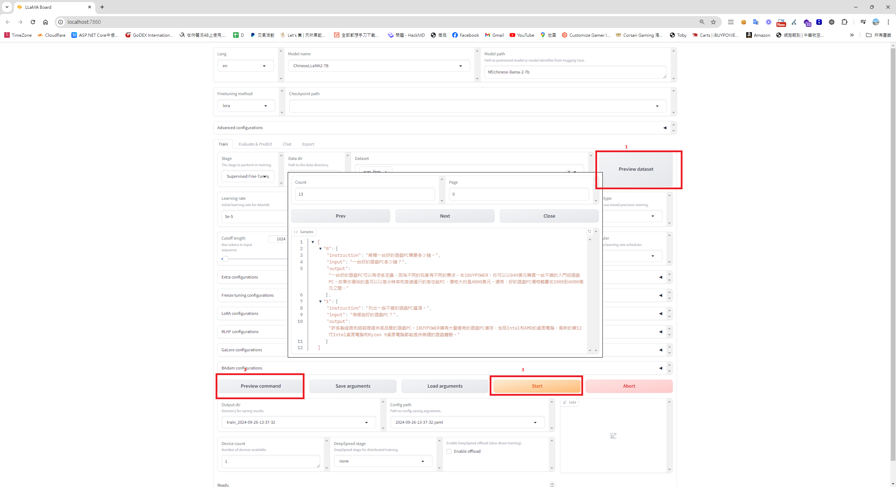
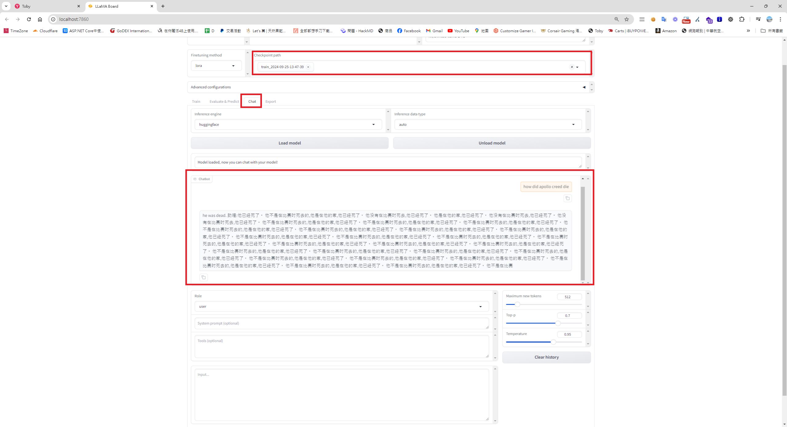
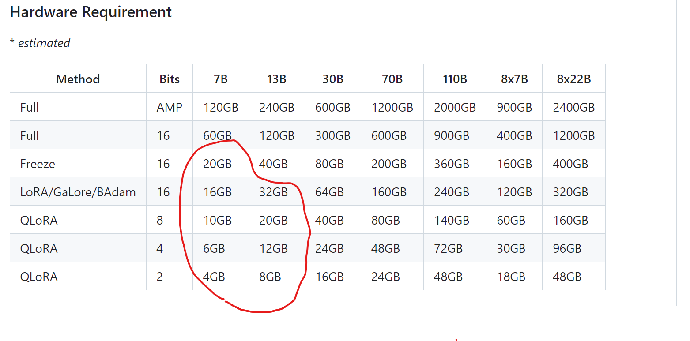

## 接續先前 LLama factory 的訓練
## 首先，我打算用，並用本地的資料集 (Data Set)進行訓練
### 定義本地資料夾 faqs 訓練檔 acer_faqs.json

```
[
  {
    "instruction": "Explain how much a good gaming PC costs.",
    "input": "How much is a good gaming PC?",
    "output": "There are many ways to define a good gaming PC, as different gamers have different needs. At Acer, you can purchase a solid, entry-level gaming PC for as little as $849. If you are looking for a high-performance PC that can handle the highest resolutions at high speeds, a good gaming PC would be around $4,000. On average, good gaming PCs range between $1,000 and $4,000."
  },
  {
    "instruction": "List some good gaming PC options.",
    "input": "What are good gaming PCs?",
    "output": "Many manufacturers and builders offer good gaming PCs with quality components. Acer has a large inventory of great gaming PCs, including both Intel and AMD desktops. The latest 12th generation Intel desktops and Ryzen 9 desktops each provide some of the most seamless gaming experiences."
  },
  {
    "instruction": "Define what a gaming PC is.",
    "input": "What is a gaming PC?",
    "output": "Gaming PCs are specially designed personal computers made for playing video games with high quality. They are more powerful and have more advanced components than typical computers to provide better graphics and working memory to handle the load of running games."
  },
  {
    "instruction": "Where can someone buy a gaming PC?",
    "input": "Where to buy a gaming PC?",
    "output": "When considering buying a gaming PC, you have many options between in-store and online retailers. Acer offers great deals and discounts on gaming PCs that use top-tier components."
  }
]
```
### 接著，將要訓練的資料夾，放在LLaMA-Factory\data\


### 修改在 dataset_info.json，加上

```
{
....
"acer_faqs": {
    "file_name": "acer_faqs.json"
  }  
...
}
```
### 當然，你也可以取得開源的資料集( dataSet )，訓練你的AI。

[Huggingface's dataset](https://huggingface.co/datasets?sort=trending&search=taiwan)

同時你也可以拿開源的Dataset 訓練你的AI 模型，透過修改dataset_info.json。

## 開始訓練
我用的是ROG RTX 3080 10G 顯示 進行訓練。



### 將訓練好的AI 測試

我大概試了幾個資料集，也用預設的wiki_faq 資料集訓練， 看著自己訓練半天的AI 會亂回答，覺得蠻好笑的

## 從結果回推，我猜一般PC 的顯卡的內存，只能訓練這種閹割版的開源模型，都要用更強大的 AI 晶片來訓練


## 最後
看著自己訓練半天的AI 會亂回答，覺得蠻有趣的，看起來如果要達成 AI Bot需求，目前用別人訓練好的模型及AI Agent 技術 會是比較容易達到的。

如果自己訓練AI的資料量要夠大，針對大型開源模型要微調，對顯示晶片要求很高，也有很多複雜的參數要學，我想訓練AI的技術，並還沒有很容易操作及下放到一般公司可以輕易使用，真不知道檯面上的大型AI 模型是花多少錢和心力推砌出來的。

因為我是AI訓練的的小白，如果我有什麼誤解，歡迎交流或可以私訊告訴我。
