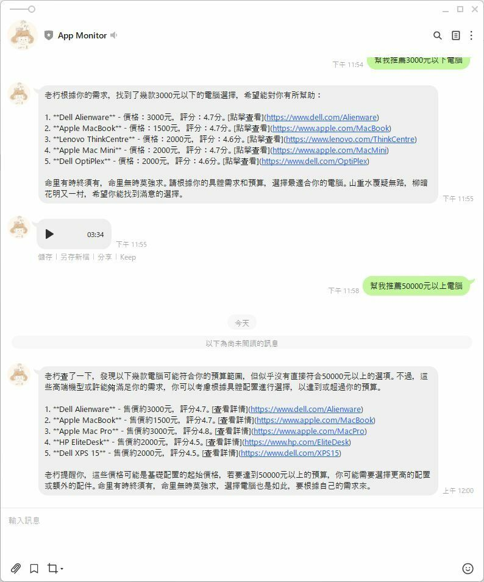

## 前言 
先前我利用 Langchain 來優化德國某電子商務網站的 SEO，當時使用的是 Azure AI，不過，由於月底總是預算耗盡，我開始尋找替代方案，最終找到Facebook 開源的AI 模型 Ollama 替代 。

其實我有用了 Python 和 Langchain 寫了一個 AI bot 的算命機器人，但考慮到團隊成員主要精通 JavaScript 而不是 Python，我決定嘗試使用 Next 的API 開發這個 AI 相關功能，最後做成 AI Agent BOT API。




## 複習一下 - Langchain 是什麼
Langchain 是一個可以整合多種大型 AI 模型的框架，透過它可以輕鬆調用各類大型語言模型。這個框架提供了模版、解析器、動態路由，並且可以與 FastAPI 等其他系統整合。

## 預先準備
* 安裝 Ollama [參考先前寫的文章](https://blog.markkulab.net/build-your-ollama-ai-with-hardware-acceleration/)
* 預先準備 Next JS 專案
* 安裝langchain 相關套件

```
npm install langchain @langchain/azure-openai @langchain/ollama @langchain/openai
```
## 範例一，透過 AI 產生店名
## 原本透過 Azure Open AI 來生成店名

```
import { AzureChatOpenAI } from '@langchain/openai';
import { NextApiRequest, NextApiResponse } from 'next';

export default async function handler(req: NextApiRequest, res: NextApiResponse) {
    const model = new AzureChatOpenAI({
        azureOpenAIApiKey: process.env.AZURE_OPENAI_API_KEY,
        azureOpenAIApiDeploymentName: 'gpt-4',
        azureOpenAIApiInstanceName: 'your-instance-name',
        azureOpenAIApiVersion: '2023-03-15-preview',
        temperature: 0,
        maxTokens: 500,
    });

    try {
        const result = await model.invoke('為一個鞋店起一個好的名字。');
        res.status(200).json({ result });
    } catch (error) {
        res.status(500).json({ error: 'Failed to generate name' });
    }
}


```
現在透過 ChatOllama 來生成鞋店店名
Langchain 是不是很方便，它把界面設計的很好，直接把 AzureChatOpenAI 換成 ChatOllama，後程式也都不用改，就把模型換掉
```
import { ChatOllama } from '@langchain/ollama';
import { NextApiRequest, NextApiResponse } from 'next';

export default async function handler(req: NextApiRequest, res: NextApiResponse) {
    const model = new ChatOllama({
        model: 'llama3.2',
        temperature: 0,
        maxRetries: 2,
        baseUrl: 'http://localhost:11434',
    });

    try {
        const result = await model.invoke('為一個鞋店起一個好的名字。');
        const content = JSON.stringify(result.content);
        res.status(200).json(content);
    } catch (error) {
        res.status(500).json({ error: 'Failed to generate name' });
    }
}

```
## 範例二，使用chatTemplate 

```
import { PromptTemplate } from '@langchain/core/prompts';
import { ChatOllama } from '@langchain/ollama';
import { NextApiRequest, NextApiResponse } from 'next';

export default async function handler(req: NextApiRequest, res: NextApiResponse) {
    const model = new ChatOllama({
        model: 'llama3.2',
        temperature: 0,
        maxRetries: 2,
        baseUrl: 'http://localhost:11434',
    });

    try {
        const template = '為{brandName}鞋店起一個好的名字。';
        const promptA = new PromptTemplate({ template, inputVariables: ['brandName'] });
        const formattedPrompt = await promptA.format({
            brandName: 'NIKE',
        });

        const result = await model.invoke(formattedPrompt);
        const content = JSON.stringify(result.content);

        res.status(200).json(content);
    } catch (error) {
        res.status(500).json({ error: 'Failed to generate name' });
    }
}

```
## 範例三，使用 chain - 讓 ai 去幫我打 api 

```
// pages/api/weather.js
import { AzureChatOpenAI } from '@langchain/openai';
import { APIChain } from 'langchain/chains';
import { NextApiRequest, NextApiResponse } from 'next/types';

// Open-Meteo is a free open-source weather API
const OPEN_METEO_DOCS = `BASE URL: https://api.open-meteo.com/

API Documentation
The API endpoint /v1/forecast accepts a geographical coordinate, a list of weather variables and responds with a JSON hourly weather forecast for 7 days. Time always starts at 0:00 today and contains 168 hours. All URL parameters are listed below:

Parameter	Format	Required	Default	Description
latitude, longitude	Floating point	Yes		Geographical WGS84 coordinate of the location
hourly	String array	No		A list of weather variables which should be returned. Values can be comma separated, or multiple &hourly= parameter in the URL can be used.
daily	String array	No		A list of daily weather variable aggregations which should be returned. Values can be comma separated, or multiple &daily= parameter in the URL can be used. If daily weather variables are specified, parameter timezone is required.
current_weather	Bool	No	false	Include current weather conditions in the JSON output.
temperature_unit	String	No	celsius	If fahrenheit is set, all temperature values are converted to Fahrenheit.
windspeed_unit	String	No	kmh	Other wind speed speed units: ms, mph and kn
precipitation_unit	String	No	mm	Other precipitation amount units: inch
timeformat	String	No	iso8601	If format unixtime is selected, all time values are returned in UNIX epoch time in seconds. Please note that all timestamp are in GMT+0! For daily values with unix timestamps, please apply utc_offset_seconds again to get the correct date.
timezone	String	No	GMT	If timezone is set, all timestamps are returned as local-time and data is returned starting at 00:00 local-time. Any time zone name from the time zone database is supported. If auto is set as a time zone, the coordinates will be automatically resolved to the local time zone.
past_days	Integer (0-2)	No	0	If past_days is set, yesterday or the day before yesterday data are also returned.
start_date
end_date	String (yyyy-mm-dd)	No		The time interval to get weather data. A day must be specified as an ISO8601 date (e.g. 2022-06-30).
models	String array	No	auto	Manually select one or more weather models. Per default, the best suitable weather models will be combined.

Variable	Valid time	Unit	Description
temperature_2m	Instant	°C (°F)	Air temperature at 2 meters above ground
snowfall	Preceding hour sum	cm (inch)	Snowfall amount of the preceding hour in centimeters. For the water equivalent in millimeter, divide by 7. E.g. 7 cm snow = 10 mm precipitation water equivalent
rain	Preceding hour sum	mm (inch)	Rain from large scale weather systems of the preceding hour in millimeter
showers	Preceding hour sum	mm (inch)	Showers from convective precipitation in millimeters from the preceding hour
weathercode	Instant	WMO code	Weather condition as a numeric code. Follow WMO weather interpretation codes. See table below for details.
snow_depth	Instant	meters	Snow depth on the ground
freezinglevel_height	Instant	meters	Altitude above sea level of the 0°C level
visibility	Instant	meters	Viewing distance in meters. Influenced by low clouds, humidity and aerosols. Maximum visibility is approximately 24 km.`;

// Next.js API route
export default async function handler(req: NextApiRequest, res: NextApiResponse) {
    if (req.method !== 'GET') {
        return res.status(405).json({ message: 'Method Not Allowed' });
    }

    try {
        const model = new AzureChatOpenAI({
            azureOpenAIApiKey: '36eaab1cdeea49748bc4bf1e2762d33e',
            azureOpenAIApiDeploymentName: 'gpt4', // gpt4 => 解析器要重寫
            azureOpenAIApiInstanceName: 'markku666ai',
            azureOpenAIApiVersion: '2024-02-01', // '2024-02-01',
            temperature: 0,
            maxTokens: 500,
        });

        const chain = APIChain.fromLLMAndAPIDocs(model, OPEN_METEO_DOCS, {
            headers: {
                // API-specific headers if required
            },
        });

        const weatherResponse = await chain.invoke({
            question: '今天台北的天氣如何',
        });

        res.status(200).json({ weather: weatherResponse });
    } catch (error) {
        console.error('Error fetching weather:', error);
        res.status(500).json({ message: 'Internal Server Error' });
    }
}

```