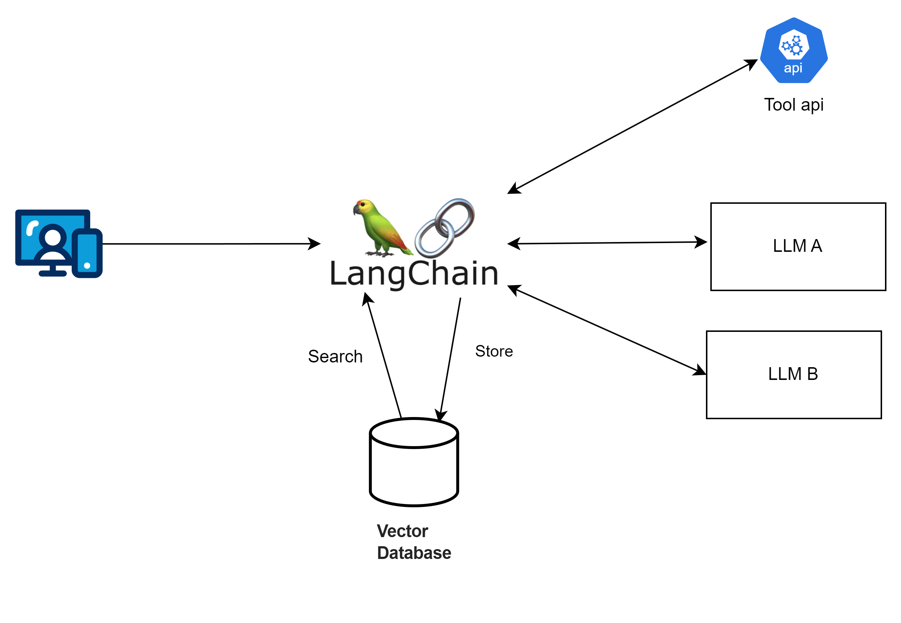

## 前言 
先前我利用[Langchain 來優化德國某電子商務網站的 SEO](https://blog.markkulab.net/generate-seo-metadata-by-azure-ai/)，當時使用的是 Azure AI，不過，由於月底總是預算耗盡，我開始尋找替代方案，最終找到Facebook 開源的AI 模型 llama 替代 。

其實我有用了 Python 和 Langchain 寫了一個 AI bot 的算命機器人，但考慮到團隊成員主要精通 JavaScript，而不是 Python，為了統一的技術棧，大家比較能相互備援，我決定嘗試使用 Next 的API 開發這個 AI 相關功能，最後做成 AI Agent BOT API。


## 複習一下 - Langchain 是什麼
Langchain 是一個可以整合多種大型 AI 模型的框架，透過它可以輕鬆調用各類大型語言模型。這個框架提供了模版、解析器、動態路由，並且可以與 Python 、node 、C# 後端語言整合。

## 為什麼應用程式要和AI互動?
我們都了解AI對文字非常擅長，因此應用程式和AI 互動，可以做到，很多的應用延伸，像是:
* 1. 檢查評論是否正面負面。
* 2. SEO 生成 / 翻譯 / 行銷文案 。
* 4. 產品諮詢 / 產品推薦 機器人。
* 5. Code reivew 工具 。
* 6. 檢查文件錯字 /  檢查金額的正確性。
* 8. 內部特定領域的回應機器人。HR 請假制度、產品設計流程。

## 那為什麼需要使用 Langchain
如果使用情境很單純，只需要與大型語言模型單純一問一答，那麼，我覺得可以不需要使用到langchain ，但如果你希望依據使用者輸入的語意讓 AI 決定要做什麼事，或是需要在一次使用請求中和大型模型語言交互多次，像是從自己的向量資料庫查不到相關資料，再與外部api 交換，那麼 langchain 這個使用情境，就非常適合。



## 預先準備
* 安裝 Ollama [參考先前寫的文章](https://blog.markkulab.net/build-your-ollama-ai-with-hardware-acceleration/)
* 預先準備 Next JS 專案
* 安裝langchain 相關套件 本系列文章都採用 (0.3)

```
npm install langchain @langchain/azure-openai @langchain/ollama @langchain/openai --save
```
## 範例一，透過 AI 產生店名
## 原本透過 Azure Open AI 來生成鞋店的店名

```
import { AzureChatOpenAI } from '@langchain/openai';
import { NextApiRequest, NextApiResponse } from 'next';

export default async function handler(req: NextApiRequest, res: NextApiResponse) {
    const model = new AzureChatOpenAI({
        azureOpenAIApiKey: process.env.AZURE_OPENAI_API_KEY,
        azureOpenAIApiDeploymentName: 'gpt-4',
        azureOpenAIApiInstanceName: 'your-instance-name',
        azureOpenAIApiVersion: '2023-03-15-preview',
        temperature: 0,
        maxTokens: 500,
    });

    try {
        const result = await model.invoke('為一個鞋店起一個好的名字。');
        res.status(200).json({ result });
    } catch (error) {
        res.status(500).json({ error: 'Failed to generate name' });
    }
}


```
現在透過 ChatOllama 來生成鞋店的店名
Langchain 是不是很方便，它把界面設計的很好，直接把 AzureChatOpenAI 換成 ChatOllama，後程式也都不用改，就把模型換掉
```
import { ChatOllama } from '@langchain/ollama';
import { NextApiRequest, NextApiResponse } from 'next';

export default async function handler(req: NextApiRequest, res: NextApiResponse) {
    const model = new ChatOllama({
        model: 'llama3.2',
        temperature: 0,
        maxRetries: 2,
        baseUrl: 'http://localhost:11434',
    });

    try {
        const result = await model.invoke('為一個鞋店起一個好的名字。');
        const content = JSON.stringify(result.content);
        res.status(200).json(content);
    } catch (error) {
        res.status(500).json({ error: 'Failed to generate name' });
    }
}

```
## 範例二，使用chatTemplate 

```
import { ChatOllama } from '@langchain/ollama';
import { NextApiRequest, NextApiResponse } from 'next';

export default async function handler(req: NextApiRequest, res: NextApiResponse) {
    const { brandName, modelVersion = 'llama3.2', temperature = 0 } = req.body;

    const model = new ChatOllama({
        model: modelVersion,
        temperature,
        maxRetries: 2,
        baseUrl: 'http://localhost:11434',
    });

    try {
        const result = await model.invoke(`為一個鞋店起一個好的名字：${brandName}`);
        const content = JSON.stringify(result.content);
        res.status(200).json(content);
    } catch (error) {
        res.status(500).json({ error: 'Failed to generate name' });
    }
}
```
## 範例三，使用 pipe 可以讓AI 多做幾件事

```
import { StringOutputParser } from '@langchain/core/output_parsers';
import { ChatPromptTemplate } from '@langchain/core/prompts';
import { ChatOllama } from '@langchain/ollama';
import { NextApiRequest, NextApiResponse } from 'next/types';

// 定義 API route
export default async function handler(req: NextApiRequest, res: NextApiResponse) {
    const { modelVersion = 'llama3.2', temperature = 0 } = req.body;

    try {
     const question = 'What is the weather in Taipei?';
        // 1. 初始化模型
        const model = new ChatOllama({
            model: modelVersion,
            temperature,
            maxRetries: 2,
            baseUrl: 'http://localhost:11434',
        });

        // 2. 定義一個處理步驟的 prompt
        const prompt = ChatPromptTemplate.fromMessages([['human', 'Ask the weather for {question}']]);

        // 2. 定義 output parser
        const outputParser = new StringOutputParser();

        // 3. 使用 pipe 來串聯步驟：prompt -> model -> parser
        const pipeChain = prompt.pipe(model).pipe(outputParser);

        // 4. 執行 chain 並取得結果
        const weatherResponse = await pipeChain.invoke({ question });

        // 5. 回應 API 結果
        res.status(200).json({ weather: weatherResponse });
    } catch (error) {
        
        res.status(500).json({ message: 'Internal Server Error' });
    }
}

```
## 範例四，使用 chain - 讓 AI 去幫我呼叫 api 

```
import { ChatOllama } from '@langchain/ollama';
import { APIChain } from 'langchain/chains';
import { NextApiRequest, NextApiResponse } from 'next/types';

const OPEN_METEO_DOCS = `api document ...`;

// Next.js API route
export default async function handler(req: NextApiRequest, res: NextApiResponse) {
    const { question, modelVersion = 'llama3.2', temperature = 0 } = req.body;

    try {
        const model = new ChatOllama({
            model: modelVersion,
            temperature,
            maxRetries: 2,
            baseUrl: 'http://localhost:11434',
        });

        const chain = APIChain.fromLLMAndAPIDocs(model, OPEN_METEO_DOCS, {
            headers: {
                // API-specific headers if required
            },
        });

        const weatherResponse = await chain.invoke({ question });

        res.status(200).json({ weather: weatherResponse });
    } catch (error) {	
        console.error('Error fetching weather:', error);
        res.status(500).json({ message: 'Internal Server Error' });
    }
}

```

## 此系列相關文章
* [使用 Langchain 和開源 Llama AI 在 Next.js 打造 AI Bot API Part 1 - 從了解 lanchain 開始](https://blog.markkulab.net/ai-bot-api-parts-1/)
* [使用 Langchain 和開源 Llama AI 在 Next.js 打造 AI Bot API Part 2 - 打造 AI 具有記憶功能的 AI Agent](https://blog.markkulab.net/ai-bot-api-parts-2/)
* [使用 Langchain 和開源 Llama AI 在 Next.js 打造 AI Bot API Part 3 - 加入向量資料庫，讓AI擁有額外的腦袋](https://blog.markkulab.net/ai-bot-api-parts-3/)
* [使用 Langchain 和開源 Llama AI 在 Next.js 打造 AI Bot API Part 4 - AI產品推薦 API](https://blog.markkulab.net/ai-bot-api-parts-4/)

