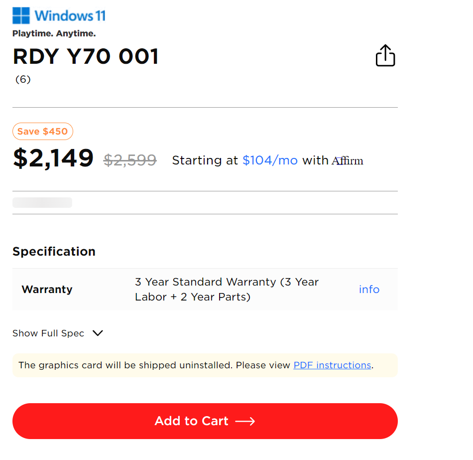

## 時空背景
兩年前，前總經理剛退休，台灣資訊部門過去總經理擋著，需求可以排優先順序做，但我來時，就沒人擋著，就變成每個需求又急又趕，系統剛上線，又一堆問題，前面也走了一批人，我就在這兵荒馬亂時期進入這公司。  

剛進來這公司時 NextJS 剛上線，那時採的是 Page route , 頁面一直拿到舊的，當時我也才來一個月左右，因為電商系統不穩定，被美國的使用者念了一小時，我也對NextJS沒到很熟, 且又因為美國的銷售檔期(Holiday season)也正要開始。

彙總當時解決的兩大難題

## 問題一、增量渲染的頁面(ISR)，一直拿到舊的頁面，就算超過 revalidate 時間，再訪問，頁面仍然沒重新渲染。
當時正因黑五銷售檔期，每日頁面流量都不小(超過2萬流量)，發現佈署一陣子的 docker 容器的大小，都會從 2GB 成長到 8GB，經過分析調查，發現我們user 的上傳原始圖檔過大，且都沒壓縮過，最大有10MB，猜測 node js 因為是單執行緒，又是後進先出，只透過 event loop 在調度事件，非同步處理完，同時又有大量新的任務，推測 NextJS 一邊在轉圖， 一邊在渲染頁面，的轉檔造成的主要效能瓶頸。

### 解決方案
在調查出發現 NextJS 本身為了讓圖片最佳化，依是不同的解析度給與不同的圖片，因此內建了Image loader ，但處理圖片需要大量的IO，但網站流量小可能不會遇到卡住的問題，網站流量一大就會遇到效能的瓶頸，
後來因為我發現我們有買 Cloudflare enterprise ，因此，我將圖片最佳化的服務移到 [Cloudflare image api](https://blog.markkulab.net/custom-nextjs-image-loader-with-cloudflare/)，總算解決了網站效能問題。

## 問題二、增量渲染頁面(ISR)，庫存不準的問題
為了讓使用者快速拿到渲染的頁面內容，我們當時採用的是增量渲染 ISR ，但面臨銷售檔期，很容易遇到 Sold out ，明明產品及明細頁都顯示有庫存，但加入購物車就會出現庫存不足。

### 短期解決方案 - 因為找不到根本的解決方案，我撰寫了一個 rebuild page api ，只要在網址加上 ?forceUpdate=true，就會叫此 api，並請後台工程師產品有更新時順便觸發此頁面。
```
import { LogLevel } from '@/lib/log/const-logging';
import { serverSideLog } from '@/lib/log/server-side-log';
import type { NextApiRequest, NextApiResponse } from 'next';

export default async function rebuild(req: NextApiRequest, res: NextApiResponse) {
    const secret = req.headers.$secret || req.query.secret; // req.headers.$secret => backoffice
    const refreshUrl: string = req?.query?.page?.toString()?.startsWith('/')
        ? req.query.page?.toString()
        : `/${req.query.page?.toString()}`;

    const serverUrl = req.headers?.host;
    const result: IReBuildResponse = { revalidated: true };
    const param = { revalidatedHost: serverUrl };

    if (secret && secret === $projects.secret) {
        try {
            serverSideLog(
                `[RebuildPage][Manual]Server rebuild is success! (${refreshUrl})`,
                LogLevel.Information,
                param
            );
            await res.revalidate(refreshUrl);
            return res.json(result);
        } catch (err) {
            serverSideLog(`[RebuildPage][Manual]Trigger rebuild is fail!(${refreshUrl})`, LogLevel.Error, param);
            return res.status(500).json({ message: JSON.stringify(err) });
        }
    }

    return res.status(503).json({ message: `Invalid token: ${$projects.secret}, ${secret}` });
}
```
### 長期解決方案
在更了解了領域知識後，分析庫存資訊，其實不能快取，使用者下加入購物車才發現沒庫存，體驗會糟，但頁面不取快，每次都走伺服器渲染，因為產品種類多，流量一大，頁面就很容易遇到阻塞，或一直拿到舊的頁面。   

因此頁面仍維持ISR，將庫存改到用戶端去要，就不會遇到沒庫存和畫面顯示不一致的問題，請後台的工程師協助將即時庫存寫入redis，但庫存部份則改成用戶端渲染時才去要庫存資料。

```
export default function ProductCardsSection({ productData = [], className = '' }: Readonly<IProductCardsSectionProps>) {
    const {
        data: stockData = {},
        isLoading,
        isError,
    } = useGetStockByModelIDsQuery(productData.map((product) => product.modelId));
	...
}
```



P.S. 在試的過程中發現，如果希望 NextJS 容器 image 如果要變小，可以透過 standalone 模式，在打包時會進行優化，只打包在運行時真正需要的文件和模塊，這樣可以減少包的體積和部署的覆雜性
P.S. 同時在docker file 指定過輕量版的alpine-node，Next.js 也可以Docker容器讓體積少30%


