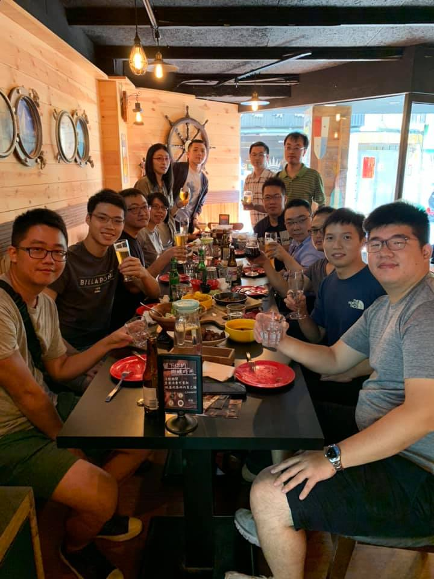

因為疫情，上次與資策會同學聚會已經是5年前的事了，  

但回想起十年前，我們還像是昨天才坐在同一間教室裡，  

大家一起學習編寫程式碼，努力成為一位合格的軟體工程師，  

我們也經歷了軟體需求成長的紅利時期，從大數據、雲端、大前端時代、APP，  

直到AI出現軟體工程師的需求才開始趨緩，  

十年後，每個人的人生際遇各不相同，  

有些同學已經進入婚姻生活，  

然而，大家的髮際線也普遍往上移了，(要開始保養頭髮了阿) 

有些人穩定地在同一份工作上堅守了十年，  

但大多數同學仍然在軟體業中打拼，  

還有同學透過保險和投資，提前享受退休的自由生活，  

其中兩位同學，更是分別進入美國及英國的 Google 工作，  

十年來，時間帶來了成長與改變，也帶來了不同的收穫，希望未來的我們能夠繼續保持聯繫，  

