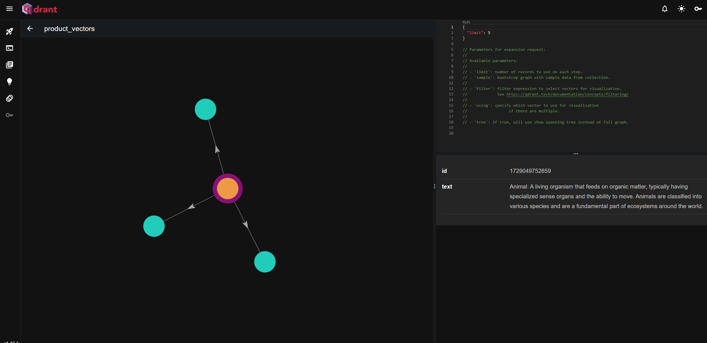
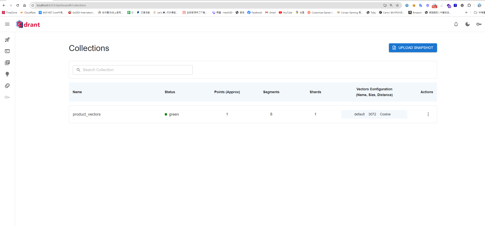
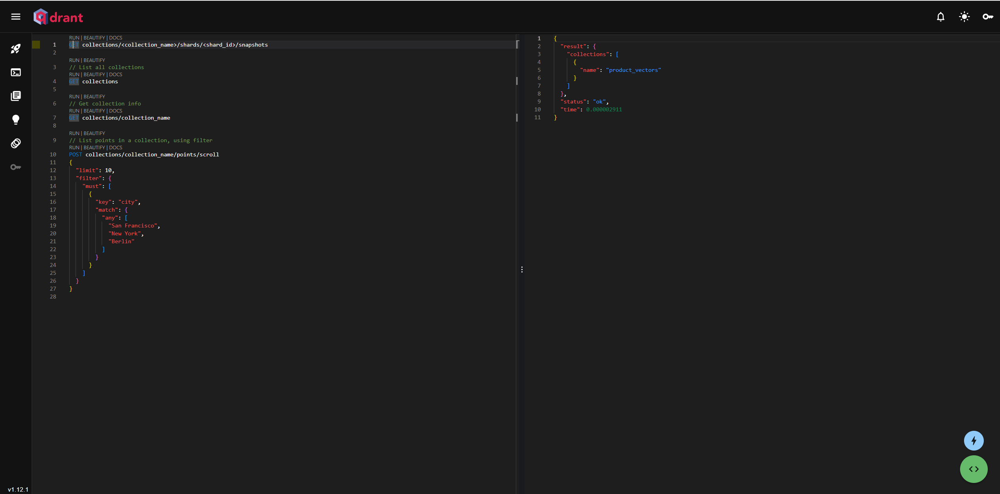

## 前言
因為想要做產品推薦機器人，透過自己訓練技術門檻及訓練成本太高，且訓練完後回答有一定層度的隨機性，因此打算用 AI Agent 技術，搭配別人己訓練好的大型語言模型。

為了避免 AI 胡亂生成，因此，此章節我們使用向量資料庫，讓AI擁有其他方面的知識，並可以提前告知告知大型語言模式，不知道就不要任意生成。

### 首先，我們了解什麼是向量資料庫
向量資料庫是用於存多維度的資料，由大型語言模型將其向量化，儲放在向量資料庫，就能依據資料與資料間的距離及其他權重，就能夠推算出相似度。  

簡單來說，它會把類似的資料，比如"狗"和"動物"，放得很近，這樣當你搜尋一張狗的圖片時，系統能快速找到跟它相似的圖片或資訊。



## 為什麼需要向量化 ? 
我們都知道數學運算及圖型運算是GPU 的強項，而向量化是把數據轉換成數字向量的過程，這樣能提高計算速度、方便機器學習處理，也讓不同類型的數據（如文字、圖片）變得可比較和操作，因此特性，所以其實非常適合推薦系統。

## 向量化的資料包含什麼 ?
在大一串向量數值中，資料中包含了關鍵特徵、維度、距離度量、權重分配、上下文的關聯。

### Langchin 如何操作 向量資料庫
取得各種資料來源(Source) > 加載到應用程式(Load)  > 轉換 (Transform)，切割擷取成比較小的段落  > Embed (向量化) > 儲存到向量資料 (Store) > 取回相似的資料(Retrieve)

## 將文字向量化 (Embedding)
### 安裝套件
```
npm i @langchain/ollama @langchain/core
```
### 首先，先在 NextJS 中撰寫 Embedding API (/api/lang-chain/ollama-embedding)
```
import { OllamaEmbeddings } from '@langchain/ollama';
import { MemoryVectorStore } from 'langchain/vectorstores/memory';
import { NextApiRequest, NextApiResponse } from 'next';

// 定義 Next.js API 處理器，處理 API 請求
export default async function handler(req: NextApiRequest, res: NextApiResponse) {
    try {
        const { text } = req.body;

        // 檢查是否有文本內容
        if (!text) {
            return res.status(400).json({ message: '文本內容為必填項' });
        }

        // 初始化 OllamaEmbeddings，設定模型和基礎 URL
        const embeddings = new OllamaEmbeddings({
            model: 'llama3.2', // 預設模型
            baseUrl: 'http://localhost:11434', // 預設的 API 基礎 URL
        });

        // 使用 OllamaEmbeddings 將文本轉換為向量並存入 MemoryVectorStore 中
        const vectorstore = await MemoryVectorStore.fromDocuments([{ pageContent: text, metadata: {} }], embeddings);

        // 將向量儲存庫作為檢索器，並設置返回單一文件
        const retriever = vectorstore.asRetriever(1);

        // 檢索最相似的文本，根據給定的查詢進行檢索
        const retrievedDocuments = await retriever.invoke('What is LangChain?');

        // 將文字（text）轉換為向量的方法。
        const singleVector = await embeddings.embedQuery(text);

        // 返回檢索結果
        res.status(200).json({ retrievedDocuments, singleVector });
    } catch (error) {
        // 捕捉錯誤並返回 500 狀態碼
        console.error('Error handling request:', error);
        res.status(500).json({ error: '處理請求時發生錯誤' });
    }
}
```
使用方法
```
curl -X POST http://localhost:3001/api/lang-chain/ollama-embedding \
  -H "Content-Type: application/json" \
  -d '{"text": "LangChain is the framework for building context-aware reasoning applications"}'
```
## 安裝及用程式操作向量資料庫
### 什麼是 [qdrant](https://qdrant.tech/)
Qdrant 是一個非常熱門的向量數據庫，用於儲存和檢索高維度向量資料，適合做相似度查詢，例如推薦系統和文字、圖像搜索，它有簡單易用的 RESTful API 和可視化儀表板來管理和查看向量數據。

### 啟動 qdrant 向量資料庫容器
```
docker run -d --name qdrant-container -p 6333:6333 qdrant/qdrant
```
### 訪問 Dashboard
```
http://localhost:6333/dashboard
```



### 也能透過 Restful api 操作向量資料庫
```
##  測試健康度
curl http://127.0.0.1:6333/healthz

## 取得所有的集合

curl -X GET "http://localhost:6333/collections"

```
### 安裝相關套件
```
npm install @qdrant/js-client-rest --save
```
### 接著，先寫一個NextJS API ，使用 Llama 去 Embedding 新增資料到 Collection 
```
import { OllamaEmbeddings } from '@langchain/ollama';
import { QdrantClient } from '@qdrant/js-client-rest'; // 引入 Qdrant 客戶端
import { NextApiRequest, NextApiResponse } from 'next';

// 初始化 Qdrant 客戶端
const qdrantClient = new QdrantClient({ url: 'http://localhost:6333' });

// 初始化 OllamaEmbeddings
const embeddings = new OllamaEmbeddings({
    model: 'llama3.2',
    baseUrl: 'http://localhost:11434',
});

// 定義集合名稱
const collectionName = 'product_vectors';

// 定義向量點的界面
interface VectorPoint {
    id: number | string;
    vector: number[];
    payload: { text: string };
}

// 定義 Next.js API 處理器
export default async function handler(req: NextApiRequest, res: NextApiResponse) {
    try {
        const { text } = req.body;

        // 檢查是否有文本內容;
        if (!text) {
            return res.status(400).json({ message: '文本內容為必填項' });
        }

        // 生成文本的嵌入向量
        const vector: number[] = await embeddings.embedQuery(text);

        // 定義要插入的點
        const points: VectorPoint[] = [
            {
                id: Date.now(), // 使用當前時間作為唯一 ID
                vector: vector, // 插入生成的向量
                payload: { text }, // 存放文本數據
            },
        ];

        // 檢查集合是否已存在，若不存在則創建
        try {
            const collectionExists = await qdrantClient.getCollection(collectionName);

            if (!collectionExists) {
                await qdrantClient.createCollection(collectionName, {
                    vectors: {
                        size: 1000, // 向量大小
                        distance: 'Cosine', // 距離度量使用 Cosine
                    },
                });
            }
        } catch (error) {
            console.log(`集合 ${collectionName} 不存在，正在創建...`);
            await qdrantClient.createCollection(collectionName, {
                vectors: {
                    size: vector.length,
                    distance: 'Cosine',
                },
            });
        }

        // 將向量插入 Qdrant
        await qdrantClient.upsert(collectionName, { points });

        res.status(200).json({ message: '向量已成功插入 Qdrant' });
    } catch (error) {
        console.error('插入向量時發生錯誤:', error);
        res.status(500).json({ message: '插入向量時發生錯誤', error: error });
    }
}

```
使用方法
```
curl -X POST http://localhost:3001/api/lang-chain/ollama-embedding \
  -H "Content-Type: application/json" \
  -d '{"text": "LangChain is the framework for building context-aware reasoning applications"}'

```

### 再寫一個NextJS API ，透過 Llama 去把相量資料庫，相似的東西取回來 (/api/lang-chain/query-vector-database)
```
import { OllamaEmbeddings } from '@langchain/ollama';
import { QdrantClient } from '@qdrant/js-client-rest'; // 引入 Qdrant 客戶端
import { NextApiRequest, NextApiResponse } from 'next';

// 初始化 qdrant 客戶端
const qdrantClient = new QdrantClient({ url: 'http://localhost:6333' });

// 初始化 OllamaEmbeddings
const embeddings = new OllamaEmbeddings({
    model: 'llama3.2',
    baseUrl: 'http://localhost:11434',
});

// 定義集合名稱
const collectionName = 'product_vectors';

// 定義 Next.js API 查詢處理器
export default async function handler(req: NextApiRequest, res: NextApiResponse) {
    try {
        const { text } = req.body;

        // 檢查是否有文本內容
        if (!text) {
            return res.status(400).json({ message: '文本內容為必填項' });
        }

        // 生成文本的嵌入向量
        const vector: number[] = await embeddings.embedQuery(text);

        // 使用生成的向量在 Qdrant 中查詢相似的向量
        const searchResults = await qdrantClient.search(collectionName, {
            vector: vector,
            limit: 5, // 查詢的最大結果數量
        });

        res.status(200).json({ results: searchResults });
    } catch (error) {
        console.error('查詢向量時發生錯誤:', error);
        res.status(500).json({ message: '查詢向量時發生錯誤', error: error });
    }
}
```
使用方法
```
curl -X POST http://localhost:3001/api/lang-chain/query-vector-database \
  -H "Content-Type: application/json" \
  -d '{"text": "What is LangChain"}'
```

回傳的結果
```
{
  "results": [
    {
      "id": 1728983487057,
      "version": 0,
      "score": 0.41997233, => 相似度
      "payload": {
        "text": "LangChain is the framework for building context-aware reasoning applications" => 回傳的資料
      }
    }
  ]
}
```

## 最近使用 AI 的心得
最近蠻有感的，AI 出現確實拿走了一些基礎工作，透過用ＡI，工程師可以做更多的事，學習效率也提昇;隨著各種知識學習門檻變得簡單，很多知識，可以透過和AI 聊天就學會，人們獲取知識也更容易，我們花更多時間擷取知識、洞察、規劃、驗證及下決策。

## 參考資料
* [Qdrant 向量資料庫基本練習](https://blog.darkthread.net/blog/qdrant-w-cs/)
* [使用Qdrant向量資料庫實作語意相似度比對](https://studyhost.blogspot.com/2024/04/qdrant.html)
* [使用Nodejs和Langchain开发大模型](https://blog.csdn.net/Aweii__/article/details/140316743?ops_request_misc=%257B%2522request%255Fid%2522%253A%25229492A1C1-E398-41F8-8F92-1D5B5E1E6D78%2522%252C%2522scm%2522%253A%252220140713.130102334.pc%255Fall.%2522%257D&request_id=9492A1C1-E398-41F8-8F92-1D5B5E1E6D78&biz_id=0&utm_medium=distribute.pc_search_result.none-task-blog-2~all~first_rank_ecpm_v1~rank_v31_ecpm-1-140316743-null-null.142^v100^pc_search_result_base5&utm_term=%E4%BD%BF%E7%94%A8Nodejs%E5%92%8CLangchain%E5%BC%80%E5%8F%91%E5%A4%A7%E6%A8%A1%E5%9E%8B&spm=1018.2226.3001.4187)
* [qdran官方網站](https://qdrant.tech/)