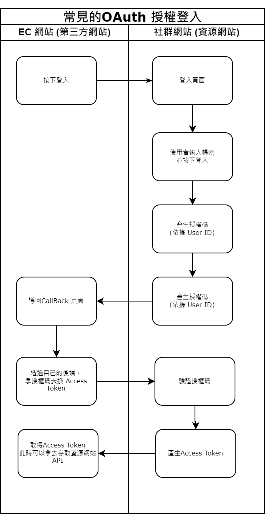

## 前言
做了簡易的 OAuth 練習，也順便學了 Nest JS，當成後端伺服器。

## 目的
一個網授權認證的標準，廣泛用於社群登入，第三方網站可以不用取得使用者帳密，就能存取資源服務器資源。

## 流程圖

## 流程說明
1.在主網站按下登入按鈕，會透過 URL 將 redirect_uri 傳遞至 OAuth 登入頁面。
2.使用者輸入帳號密碼完成登入後，系統會產生一個 code，並將其存入資料庫，然後將頁面重定向回電商網站的 callback 頁面，並將 code 透過 URL 傳遞過去。
3.在 callback 頁面，前端可以從 URL 中獲取 code，並將其傳送至後端，透過 OAuth API 使用該 code 換取 access token。
4.頁面會顯示獲取到的 access token，這時可以使用該 access token 去訪問資源伺服器，取得相關資訊，過期時則可以去換token。

可以做的更好的部份
* 資料庫密碼欄位應該要加嚴處理 (因為不是本次主題)
* 驗證過程可以加上 client id 及 secret ，更具安全性

## 此次採用的技術架構是
＊前端 - Next.JS(React) 
[程式碼](https://github.com/markku636/oauth.nextjs)

* 後端 ( Nest JS + Mysql + prisma + Swagger + 做資料驗證)
[程式碼](https://github.com/markku636/oauth.nest.api)

## 結果 
我是第一次用NestJS 撰寫網站，其實意外的蠻好寫的，有點像Angular 模塊化的方式注入，寫起來感覺也有點像 Net MVC ，Prisma 對資料庫的操作也很直觀，對於輕量化網站來說，開發起來蠻快速，也很容易達到模塊化及觀注點分離。

## 參考
* [參考資料1](https://docs.guandata.com/article/1/566167986377850880.html)
* [參考資料2](https://apifox.com/help/best-practices/how-to-test-oauth-2.0/)