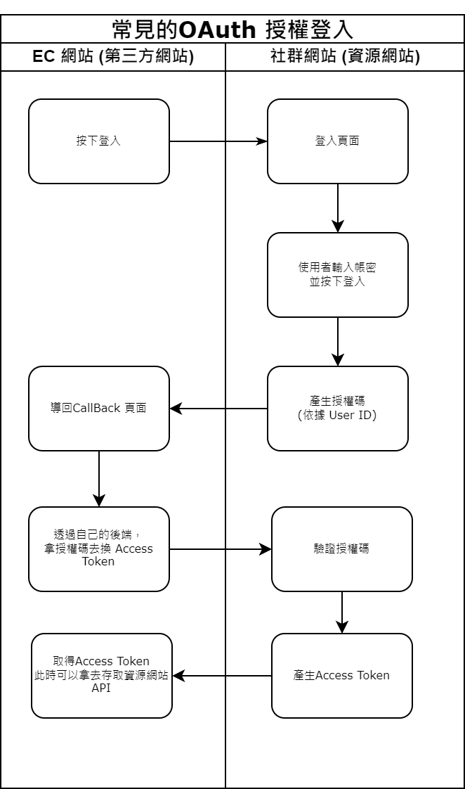

## 前言
做了簡易的 OAuth 練習，就順便學了 NestJS (Node)後端框及 Prisma (ORM) 。

## 目的
開放授權（OAuth）是一個開放授權標準，廣泛用於社群授權登入，讓第三方網站可以不用取得使用者帳密，就能存取資源服務器資源。

## 流程圖

## 流程說明
1.在主網站按下登入按鈕，會透過 URL 將 redirect_uri 傳遞至 OAuth 登入頁面。  
2.使用者輸入帳號密碼完成登入後，系統會產生一個 code，並將其存入資料庫，然後將頁面重定向回電商網站的 callback 頁面，並將 code 透過 URL 傳遞過去。  
3.在 callback 頁面，前端可以從 URL 中獲取 code，並將其傳送至後端，透過 OAuth API 使用該 code 換取 access token。  
4.頁面會取得到的 access token，此時可以使用該 access token 去訪問資源伺服器，取得相關資訊，過期時則可以去換token。  

## 此次採用的技術架構是
* 前端(電商網站) - (Next.JS、Eslint、Pritter、React、Redux toolkit) - [程式碼](https://github.com/markku636/oauth.nextjs)
* 後端(OAuth 服務) -( Nest JS、Mysql、Prisma 、 Swagger 、 class-validator做資料驗證、並用Guard 做JWT的API驗證) - [程式碼](https://github.com/markku636/oauth.nest.api)
* 資料庫 MYsql

## Demo 
* [EC site](https://oauth-nextjs.letgo.com.tw)
* [Auth service api](https://oauth-nestjs-api.letgo.com.tw)
* [Swagger Url](https://oauth-nestjs-api.letgo.com.tw/docs) -  admin / 123
* [Demo影片](https://www.loom.com/share/fdac0b89ace64bc3b3ad5a85098d0499)

佈署環境
* 使用Powerhsell 佈署到Nas 
* GCP 反向代理 + 個人 Nas 伺服器

測試
* Jest
* Rest Clinet 

## 心得 
這是我第一次使用 NestJS 撰寫網站，發現它的開發體驗非常友好，NestJS 的模組化設計讓我聯想到 Angular 的依賴注入方式，同時也有點像 .NET MVC 的分層結構，搭配 Prisma，資料庫操作變得非常直觀，對於輕量型網站，NestJS 不僅開發速度快，還能輕鬆實現模組化和關注點分離，讓開發過程更加高效。

## 補充: 
### 1. OAuth 有好幾種模式 (type) ，順便整理一下
* 授權碼模式 Code - 在這種模式下，授權碼用於交換訪問令牌，應用程式不會直接接觸到用戶帳密。
* 憑證式(Client Credentials Grant) - 客戶端憑證模式， 服務A想訪問服務B的API，服務A使用自己的客戶端憑證(服務B發放的)獲取訪問令牌。
* 隱藏式(Implicit Grant)  -  透過 Javascript ，但因為安全性問題逐漸被廢棄。
* 密码式(Resource Owner Password Credentials Grant) - :直接和用戶端要帳密，安全性較低現在比較沒在用。
### 2. OAuth 和 SSO的差異
* SSO：SSO 的目的是簡化多個應用程式之間的用戶登入流程，讓用戶只需一次登入，即可在多個應用程式中無縫使用同一個身份。SSO 主要專注於 身份驗證，即確認用戶是誰。
* OAuth：OAuth 則是一種授權協定，允許第三方應用程式代表用戶訪問受保護的資源，OAuth 的主要目的是 授權，讓應用程式能夠安全地獲取用戶的某些資源，而不需要直接存取用戶的憑證（如密碼）。

### 3. 新的議題，OpenID Connect (OIDC)
* OpenID Connect :是基於 OAuth 2.0 的身份驗證層，專門用於身份驗證並支援 SSO ，OIDC 是 SSO 和 OAuth 的一個混合應用，它同時解決了身份驗證和授權的需求。

### 4. 什麼是認證，什麼是授權
* 認證 - 你是誰? 識別來源身份是否有效
* 授權 - 目標的用戶能做什麼 ? 或能訪問什麼 ?

## 參考
* [參考資料1](https://docs.guandata.com/article/1/566167986377850880.html)
* [參考資料2](https://apifox.com/help/best-practices/how-to-test-oauth-2.0/)
* [參考資料3](https://www.youtube.com/watch?v=2rd_Ru7Bwkg&t=386s)
* [官方文件](https://oauth.net/2/)