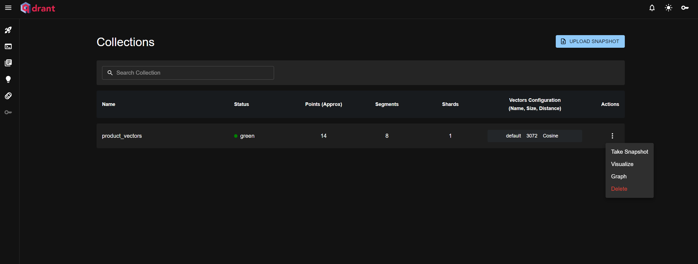
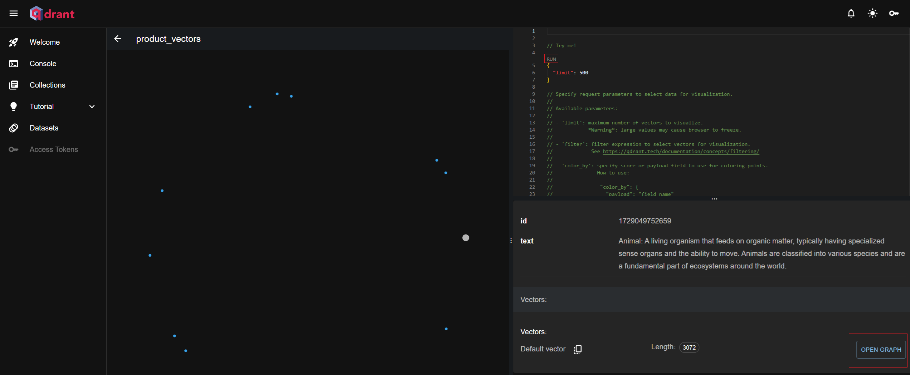
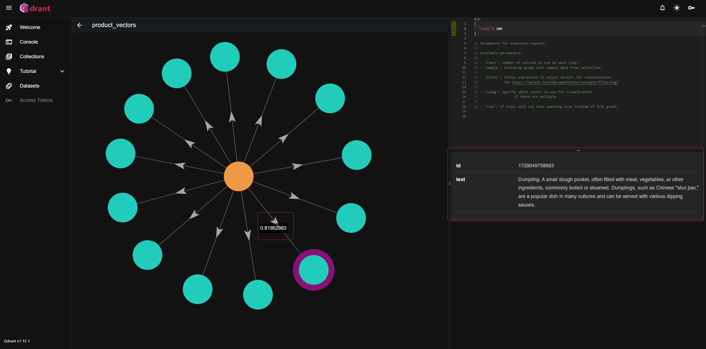

## 前言
上一篇，談到[透過向量資料庫，我們讓AI 擁有自己的知識庫](https://blog.markkulab.net/ai-bot-api-parts-3/)，這篇想要做產品推薦的API。

## 首先，我先透過程式，插入大量測試資料到我的向量資料庫，內容包含了
* 非結構性資料 - 貓狗、水餃的文字說明。
* 結構性資料 - 電腦、筆電、電腦週邊配備，將其規格屬性也寫入到向量資料庫。

### 接著， 回到向量資料庫(qdrant)的Dashboard > 點選 Visuallize
```
http://localhost:6333/dashboard
```


### 點選Run，之後，就能看見向量資料庫所裡資料，像資料宇宙般程現。


### 接著選取資料圓點後，點選OPEN GRAPH 按鈕，就能展開被選取資料的關係圖，並將滑鼠滑動到連接的線上，就能得知，資料與資料間的相似度。


發現有趣像現是的是動物和水餃相似度居然有 0.8，動物和HP筆電的相似度是0.06，難不成因為水餃是用動物做的嗎? XD   

###  提昇向量資料庫的搜尋精準度
有趣的是真實的世界裡，水餃和動物，並不太相關，資料間的相似度是模型透過特定演算法得出，且看起來是不能修改，因此，必須透過其他方式解決查詢精準度的問題，以下是我整理出可行的方式 :
 
#### 1. 寫入向量資料庫時，加入結構化的特徵，並利用篩選條件去查詢
```
 qdrantClient.filter({
    collection_name: 'products_collection',
    filter: {
        must: [
            { key: 'price', range: { gte: 50, lte: 150 } }, // 價格範圍查詢
            { key: 'category', match: { value: '筆記型電腦' } } // 分類查詢
        ]
    },
    limit: 5
});
```
### 2. 自定義相似度函數，增減語義權重

```
...
  async function adjustSimilarity(results) {
    for (let result of results) {
      if (result.payload.productName === "動物") {
        result.score *= 0.5;  // 調整「動物」的相似度
      }
    }
    return results;
  }

  // 進行相似度搜尋
  const query = "水餃";
  const topK = 10;
  const results = await client.search(query, {
    vector: queryEmbedding,
    limit: topK,
  });

  // 調整特定結果中的相似度
  const adjustedResults = await adjustSimilarity(results);

  // 打印調整後的結果
  console.log(adjustedResults);
... 
```
## 範例程式碼部份
### 首先，先撰寫插入大量產品資料 (/api/lang-chain/insert-products-vector-database)
```
import { OllamaEmbeddings } from '@langchain/ollama';
import { QdrantClient } from '@qdrant/js-client-rest'; // 引入 Qdrant 客戶端
import { NextApiRequest, NextApiResponse } from 'next';

// 初始化 Qdrant 客戶端
const qdrantClient = new QdrantClient({ url: 'http://localhost:6333' });

// 初始化 OllamaEmbeddings
const embeddings = new OllamaEmbeddings({
    model: 'llama3.2',
    baseUrl: 'http://localhost:11434',
});

// 定義集合名稱
const collectionName = 'product_vectors';

// 定義向量點的界面
interface VectorPoint {
    id: number | string;
    vector: number[];
    payload: { text: string; price: number; rating: number; reviews: number };
}

// 定義產品數據
const products = [
    {
        ProductID: 1,
        ProductName: 'Dell XPS 15',
        Category: '筆記型電腦',
        SalesUnits: 120,
        Revenue: 240000,
        Price: 2000,
        Rating: 4.5,
        Reviews: 300,
        SaleDate: '1/1/2024',
        LastRestockDate: '1/15/2024',
        StockLevel: 50,
        Supplier: 'Dell Inc.',
        URL: 'https://www.dell.com/XPS15',
    },
    {
        ProductID: 2,
        ProductName: 'Logitech MX Master 3',
        Category: '配件',
        SalesUnits: 200,
        Revenue: 180000,
        Price: 900,
        Rating: 4.8,
        Reviews: 500,
        SaleDate: '1/2/2024',
        LastRestockDate: '1/12/2024',
        StockLevel: 150,
        Supplier: 'Logitech',
        URL: 'https://www.logitech.com/MX3',
    },
    {
        ProductID: 3,
        ProductName: 'HP Spectre x360',
        Category: '筆記型電腦',
        SalesUnits: 180,
        Revenue: 270000,
        Price: 1500,
        Rating: 4.7,
        Reviews: 450,
        SaleDate: '1/3/2024',
        LastRestockDate: '1/14/2024',
        StockLevel: 80,
        Supplier: 'HP',
        URL: 'https://www.hp.com/SpectreX360',
    },
    {
        ProductID: 4,
        ProductName: 'Lenovo ThinkPad X1',
        Category: '筆記型電腦',
        SalesUnits: 130,
        Revenue: 195000,
        Price: 1500,
        Rating: 4.6,
        Reviews: 400,
        SaleDate: '1/4/2024',
        LastRestockDate: '1/13/2024',
        StockLevel: 70,
        Supplier: 'Lenovo',
        URL: 'https://www.lenovo.com/ThinkPadX1',
    },
    {
        ProductID: 5,
        ProductName: 'Apple MacBook Pro',
        Category: '筆記型電腦',
        SalesUnits: 250,
        Revenue: 500000,
        Price: 2000,
        Rating: 4.8,
        Reviews: 600,
        SaleDate: '1/5/2024',
        LastRestockDate: '1/10/2024',
        StockLevel: 100,
        Supplier: 'Apple',
        URL: 'https://www.apple.com/MacBookPro',
    },
    {
        ProductID: 6,
        ProductName: 'Asus ROG Strix',
        Category: '合式機',
        SalesUnits: 90,
        Revenue: 180000,
        Price: 2000,
        Rating: 4.5,
        Reviews: 350,
        SaleDate: '1/6/2024',
        LastRestockDate: '1/6/2024',
        StockLevel: 40,
        Supplier: 'Asus',
        URL: 'https://www.asus.com/ROGStrix',
    },
    {
        ProductID: 7,
        ProductName: 'Acer Predator Helios',
        Category: '筆記型電腦',
        SalesUnits: 75,
        Revenue: 150000,
        Price: 2000,
        Rating: 4.4,
        Reviews: 320,
        SaleDate: '1/7/2024',
        LastRestockDate: '1/9/2024',
        StockLevel: 40,
        Supplier: 'Acer',
        URL: 'https://www.acer.com/PredatorHelios',
    },
    {
        ProductID: 8,
        ProductName: 'Dell UltraSharp',
        Category: '顯示器',
        SalesUnits: 300,
        Revenue: 210000,
        Price: 700,
        Rating: 4.5,
        Reviews: 500,
        SaleDate: '1/8/2024',
        LastRestockDate: '1/20/2024',
        StockLevel: 200,
        Supplier: 'Dell Inc.',
        URL: 'https://www.dell.com/UltraSharp',
    },
    {
        ProductID: 9,
        ProductName: 'Logitech G Pro X',
        Category: '鍵盤',
        SalesUnits: 150,
        Revenue: 300000,
        Price: 200,
        Rating: 4.7,
        Reviews: 450,
        SaleDate: '1/9/2024',
        LastRestockDate: '1/12/2024',
        StockLevel: 50,
        Supplier: 'Logitech',
        URL: 'https://www.logitech.com/GProX',
    },
    {
        ProductID: 10,
        ProductName: 'HP Omen',
        Category: '筆記型電腦',
        SalesUnits: 100,
        Revenue: 150000,
        Price: 1500,
        Rating: 4.5,
        Reviews: 370,
        SaleDate: '1/10/2024',
        LastRestockDate: '1/11/2024',
        StockLevel: 60,
        Supplier: 'HP',
        URL: 'https://www.hp.com/Omen',
    },
];

// 定義 Next.js API 處理器 
export default async function handler(req: NextApiRequest, res: NextApiResponse) {
    try {
        // 遍歷產品，將每個產品插入 Qdrant
        for (const product of products) {
            const text = `${product.ProductName} - ${product.Category}`;

            // 生成文本的嵌入向量
            const vector: number[] = await embeddings.embedQuery(text);

            // 定義要插入的點
            const points: VectorPoint[] = [
                {
                    id: Date.now(), // 使用當前時間作為唯一 ID
                    vector: vector, // 插入生成的向量
                    payload: {
                        text, // 存放文本數據
                        price: product.Price,
                        rating: product.Rating,
                        reviews: product.Reviews,
                    },
                },
            ];

            // 檢查集合是否已存在，若不存在則創建
            try {
                const collectionExists = await qdrantClient.getCollection(collectionName);

                if (!collectionExists) {
                    await qdrantClient.createCollection(collectionName, {
                        vectors: {
                            size: 1000, // 向量大小
                            distance: 'Cosine', // 距離度量使用 Cosine
                        },
                    });
                }
            } catch (error) {
                console.log(`集合 ${collectionName} 不存在，正在創建...`);
                await qdrantClient.createCollection(collectionName, {
                    vectors: {
                        size: vector.length,
                        distance: 'Cosine',
                    },
                });
            }

            // 將向量插入 Qdrant
            await qdrantClient.upsert(collectionName, { points });
        }

        res.status(200).json({ message: '所有產品向量已成功插入 Qdrant' });
    } catch (error) {
        console.error('插入向量時發生錯誤:', error);
        res.status(500).json({ message: '插入向量時發生錯誤', error: error });
    }
}

```
API 執行
```
curl -X GET http://localhost:3001/api/lang-chain/insert-products-vector-database 
```

### 接著，撰寫查詢產品資料的API (/api/lang-chain/query-products-vector-database)
```
import { OllamaEmbeddings } from '@langchain/ollama';
import { QdrantClient } from '@qdrant/js-client-rest'; // 引入 Qdrant 客戶端
import { NextApiRequest, NextApiResponse } from 'next';

// 初始化 Qdrant 客戶端
const qdrantClient = new QdrantClient({ url: 'http://localhost:6333' });

// 初始化 OllamaEmbeddings
const embeddings = new OllamaEmbeddings({
    model: 'llama3.2',
    baseUrl: 'http://localhost:11434',
});

// 定義集合名稱
const collectionName = 'product_vectors';

// 定義 Next.js API 查詢處理器
export default async function handler(req: NextApiRequest, res: NextApiResponse) {
    try {
        const { text, category } = req.body;

        // 檢查是否有文本內容
        if (!text) {
            return res.status(400).json({ message: '文本內容為必填項' });
        }

        // 生成文本的嵌入向量
        const vector: number[] = await embeddings.embedQuery(text);

        // 構建搜索參數
        const searchParams: any = {
            vector: vector,
            limit: 5, // 查詢的最大結果數量
        };

        // 如果提供了 category，則添加過濾條件
        if (category) {
            searchParams.filter = {
                must: [
                    {
                        key: 'category',
                        match: { value: category }, // 動態應用類別過濾
                    },
                ],
            };
        }

        // 使用生成的向量在 Qdrant 中查詢相似的向量
        const searchResults = await qdrantClient.search(collectionName, searchParams);

        // 格式化查詢結果，返回產品詳細信息
        const formattedResults = searchResults.map((result: any) => {
            const { payload, score } = result;

            return {
                productName: payload.text, // 使用生成時的產品名稱
                price: payload.price, // 產品價格
                rating: payload.rating, // 產品評分
                reviews: payload.reviews, // 產品評論數量
                similarityScore: score, // 相似度分數
            };
        });

        res.status(200).json({ results: formattedResults });
    } catch (error) {
        console.error('查詢向量時發生錯誤:', error);
        res.status(500).json({ message: '查詢向量時發生錯誤', error: error });
    }
}
```
### 執行API
```
curl -X POST http://localhost:3001/api/lang-chain/query-products-vector-database \
  -H "Content-Type: application/json" \
  -d '{
  "text": "幫我推薦一台筆電",
  "category": "筆記型電腦"
  }'
```

## 加查詢條件後，執行的結果，就變的相當的精準
```
{
  "results": [
    {
      "productName": "Acer Predator Helios - 筆記型電腦",
      "price": 2000,
      "rating": 4.4,
      "reviews": 320,
      "similarityScore": 0.7771975
    },
    {
      "productName": "HP Spectre x360 - 筆記型電腦",
      "price": 1500,
      "rating": 4.7,
      "reviews": 450,
      "similarityScore": 0.7680249
    },
    {
      "productName": "Dell XPS 15 - 筆記型電腦",
      "price": 2000,
      "rating": 4.5,
      "reviews": 300,
      "similarityScore": 0.7658051
    },
    {
      "productName": "HP Omen - 筆記型電腦",
      "price": 1500,
      "rating": 4.5,
      "reviews": 370,
      "similarityScore": 0.7594989
    },
    {
      "productName": "Apple MacBook Pro - 筆記型電腦",
      "price": 2000,
      "rating": 4.8,
      "reviews": 600,
      "similarityScore": 0.73970205
    }
  ]
}
```
## 心得
透過前面幾篇的實驗，因此我們得出，如何用Langchain 打造更精準的產品推薦的AI代理機器人。  

* 代理 (Agent) 
使用者輸入 > AI解析用戶的意圖，依據動態路由，AI決定採用什麼工具 > 執行自訂工具(產品推薦) >  回傳結果給最終用戶。  

* 客製產品推薦工具 (Custom Tool) 
產品推薦工具的實作，則可以讓AI依據使用者輸入，解析成產品分類、產品價錢、品牌的查詢條件，最後查詢向量資料庫。

## 此系列相關文章
* [使用 Langchain 和開源 Llama AI 在 Next.js 打造 AI Bot API Part 1 - 從了解 lanchain 開始](https://blog.markkulab.net/ai-bot-api-parts-1/)
* [使用 Langchain 和開源 Llama AI 在 Next.js 打造 AI Bot API Part 2 - 打造 AI 具有記憶功能的 AI Agent](https://blog.markkulab.net/ai-bot-api-parts-2/)
* [使用 Langchain 和開源 Llama AI 在 Next.js 打造 AI Bot API Part 3 - 加入向量資料庫，讓AI擁有額外的腦袋](https://blog.markkulab.net/ai-bot-api-parts-3/)
* [使用 Langchain 和開源 Llama AI 在 Next.js 打造 AI Bot API Part 4 - AI產品推薦 API](https://blog.markkulab.net/ai-bot-api-parts-4/)
