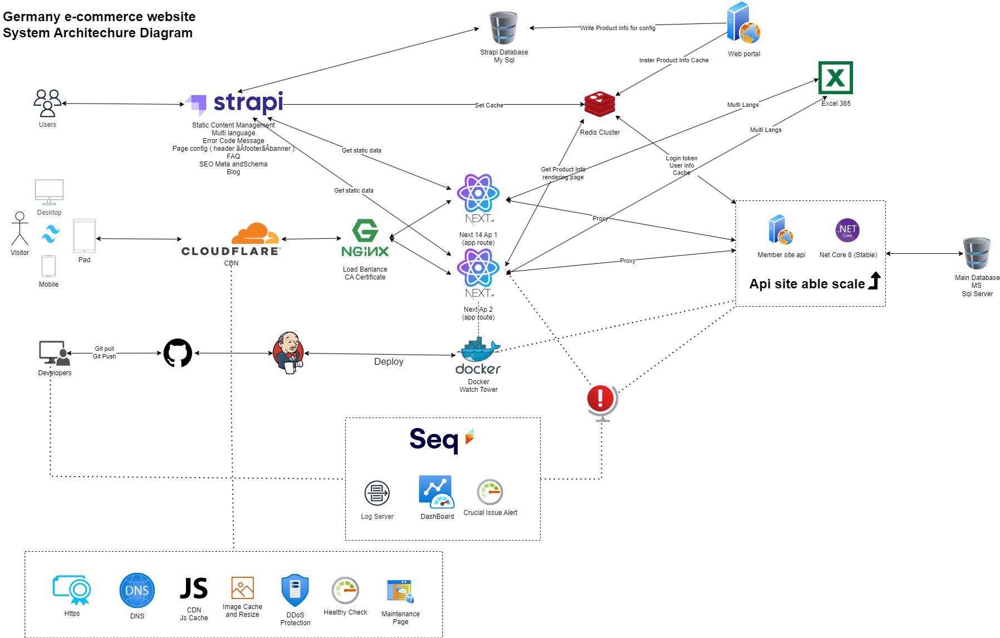
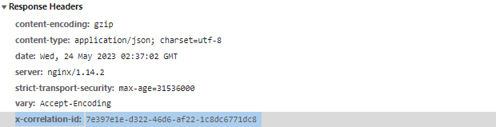
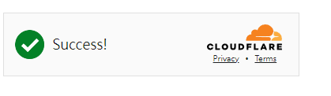
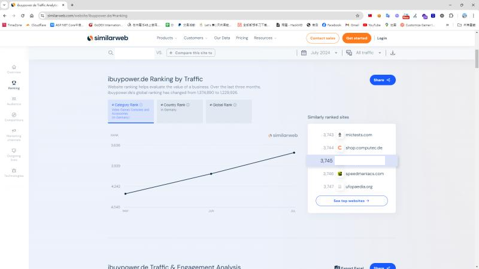
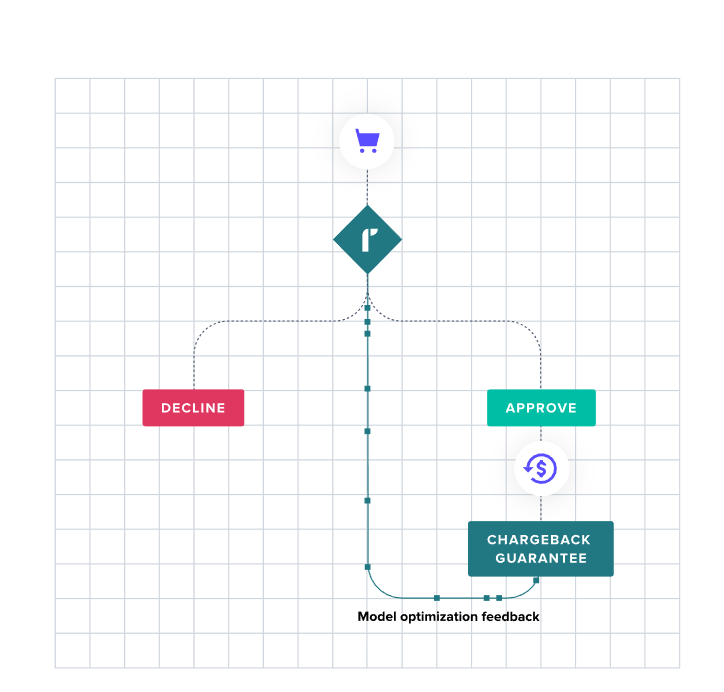

## 系統目標 
此系統改版主要目標是對德國網站進行優化及重寫，透過這次的改版，不僅改進了舊有的系統架構上無法克服的問題及程式碼不易維護擴充的問題，進而提升德國網站的銷售業績。

### 系統當時的狀況
* 系統老舊、程式碼遺失，沒有人可以在本地執行。
* 使用者不易維護原有的資料
* 舊的 API 系統架構，缺乏彈性無法擴充，無法容器化，目前仍要手動佈署。
* 舊的系統架構及擴充，也不利於 SEO 的優化。
* 舊的網站無法銷售套裝電腦及配件，目前全塞在電腦選配裡銷售。
* 舊的網站三不五時要手動，手動將暫存訂單轉成訂單。

## 德國的市場
德國因為是歐盟成員，也位於歐洲的中間，採用歐元即可，即可做到 27 個成員國的市場，歐盟官方語言24種，但英語在歐盟廣泛被使用。

經過二戰過後，德國通膨太嚴重，歷史的因素，納粹時代被監控太嚴重，習慣保有現金，視同保有自由，所以習慣用現金支付及轉帳及比較保守，且重視隱私，怕留下記錄，但應該會慢慢開放，在2002年後不再使用馬克做貨幣，完全採用歐元。  

### 經濟
社會福利完善，讀書不太需要花錢，無撫養子女之受薪階級（Single worker, no children）平均租稅負擔達到所得之47.8%，消費稅19%。  
德國人均收入約5萬美元，人均GDP 約5萬美元  
台灣人均GDP約7萬美元，人均平均收入約2萬美元  

因為在歐洲國家很重視個資及隱私，甚至有GRPR的法規限制，不能隨意的拿個資進行行銷，所在SEO方面尤其重要。

### 時區
德國的時區為 +1
P.S. 2023年中歐地區夏令日光節約時間將起於3月26日凌晨2時，將時鐘撥快1小時，以配合夏季晝長夜短的現象，令白天時間提早發生，以達到節約能源的目的
### 日期格式
TT.MM.JJJJ => dd.MM.YYYY

### 貨幣格式
千分位和小數點相反
### 稅率問題
德國的消費增值稅(VAT)為19%，但B2C電商大多國家都是以有沒有成立據點，就是消費者自主納稅，或是海關查到才打稅，但因為屬於歐盟會員國，會受歐盟限制，許多國家超過一個阈值，則需向奧地利繳納增值稅，則否可能會被罰款。

## 挑戰與困難
原本招募我進來的目的是規劃及重新打造德國網站，但因為美國網站[一直有問題](https://blog.markkulab.net/nextjs-performance-issues-in-e-commerce/)，及有更急的專案，在經歷了充滿挑戰的第一年半年，美國網站的趨近於穩定。

想說終於可以開始做德國網站，但好幾個老闆們，有不同的大目標，礙於我們開發資源不夠，好幾個專案，全部一起執行會變慢，大家切來切去大家也很痛苦。  

我知道好幾個同時進行會變慢，因此我來來回回去溝通幾次，最終德國網站因為是大老闆要的，一級主管們又被加到同個群組裡，最終能夠專注在一個項目上開發。

## 德國電商網站 - 架構圖


採用的技術是 NextJS App routing + Dotnet core 8 ，我主要負責分析需求、規劃架構、拆解工作清單，也參與開發，並獨立建置整套佈署開發環境及正式佈署開發環境。

## 接著，我們來回顧德國電商的技術細節，做了那些設計
### 前端網站( NextJS )
#### 選擇 App routing 還是 page routing ?
當時的時空背景下，NextJS 的版更很快，每個月變動也不小，且App routing 剛stable 我，因此還想了好一陣子，在考量Server sdie componet 的好處，可以讓不需要互動的JS 更小，我試著將購買的專案模板，[從Page routing 昇級到 App routing](https://blog.markkulab.net/nextjs-upgrade-app-route/)，發現新做的專案Side effect , 應該沒這麼大，且之後做完要昇級，可能更痛。

#### 為了加速開發，導入了Headless CMS - [Strapi](https://blog.markkulab.net/headless-cms-strapi/)
在過去，我們將網站設定、SEO、多語系等參數儲存在後台，透過 JSON 資料進行操作。這種維護方式確實讓我們可以快速開發，但對使用者來說卻不夠友善。沒有學過程式的人，會對這些JSON設定的作用感到困惑，上傳圖片及設定還要分開來設定。  

原本是想採用自己打造的 [Low code cms](https://blog.markkulab.net/build-your-own-low-code-cms/)，來做德國網站，但礙於不夠成熟，此次礙於上線時間及資源，採用了Strapi cms.

#### 多語系
多語系原本是放在Strapi ，發現在開發階段時發現，覺得使用者在Strapi新增多語系很繁瑣，後來全部將其維護功能，移到 Office 365 使用者可以更輕鬆快速一次維護多個語系。

#### Proxy api (/api/proxy/[...path].ts)
在過去使用 Next.js 時，每當需要呼叫 C# API，我們都得在 NextJS 裡額外實作一個 API，現在透過使用 http-proxy-middleware 套件客製的代理伺服器 (proxy)，我們不再需要費時維護 NextJS 額外的 API，大幅節省了開發時間及跨域存取(CORS)的問題。
```
import { CookieKeys } from '@/const/keys';
import { clientSideLog } from '@utils/log/client-side-log';
import { LogLevel } from '@utils/log/const-logging';
import { createProxyMiddleware } from 'http-proxy-middleware';

// ** The config is for set up Next.js default behavior **
export const config = {
    api: {
        externalResolver: true, // true, means not use the default settings of Next.js
        bodyParser: false, // false, means not use Next.js bodyParser(same as express)
    },
};

const proxy: any = createProxyMiddleware({
    target: process.env.NEXT_PUBLIC_API,
    changeOrigin: true, // change `request domain` to `target`
    pathRewrite: { '^/api/proxy': '' }, // remove `/api/proxy` prefix
    onProxyReq: relayRequestHeaders,
    onError: (err: any, req: any) => {
        clientSideLog(
            `[Proxy] Error for ${req.method} '${req.url}' to '${process.env.NEXT_PUBLIC_API}': ${err.message}`,
            LogLevel.Error
        );
    },
});

// 型別暫時給 any
function proxyServer(req: any, res: any) {
    proxy(req, res, (err: any) => {
        if (err) {
            throw err;
        }

        throw new Error(`Request '${req.url}' is not proxied! We should never reach here!`);
    });
}

export default proxyServer;

function relayRequestHeaders(proxyReq: any, req: any, res: any) {
    let cookie = req.headers.cookie;

    if (cookie) {
        proxyReq.setHeader('cookie', cookie);
    }
}

```

### 解決過去NEXT JS Redis Connect pool 釋放不掉的問題
頁面的渲染我們用到了大量的Redis ，原本用 node-redis，因為 Connect pool 釋放不掉，Redis 三不五時就需要手動重啟Redis，做了幾個測試後，後來換成 IO redis 套件就沒這個問題了。

### 後端 (Dotnet core)
#### C# 非同步延申的問題
為了讓 CPU 和 IO 中達到最高的利用率，讓需要等待的執行緖，先去做其他事情，因此我們此後端API，全部採非同步的方式撰寫。  

然而，後端在非同步處理，導致在查詢日誌檔的線程時可能出現混亂，變得不好追蹤。  

為了解決這個問題，我們使用了 CorrelationId 這個套件，每次請求都會產生一個CorrelationId，並顯示在Response Headers。通過這個 [CorrelationId 套件](https://github.com/stevejgordon/CorrelationId)，並在nlog 設定後，就有利於讓我們將相關的Log 串聯起來，以便於追蹤生產環境發生的緊急問題。


### Token base authority - JWT Token
過去採用的Session，其實就不易做到橫向擴展，為了能讓後端API，未來伺服器能橫向擴展，降低api 偶合度，我們這次導入了，Token base（JWT）為辨別用戶身份的方式。  

#### 模組化串接金流
自動讀取 Config 注入相關的金流Service , 並透過界面將定義所有金流需要的界口，並透過 Autofac 將金流解析，達到控制反轉及容易擴充解耦合，傳入payment code 就能自動抽換不同的金流邏輯。
```
   var generalPaymentConfigs = AppSettingsHelper.GetSection<List<GeneralPaymentConfig>>("Payment", "PaymentOptions").Where(x => !x.Disable).ToList();

   foreach (var item in generalPaymentConfigs)
   {
      var serviceTypeName = item.PaymentCode;
      Type serviceType = assembly.GetType($"MemberSite.Services.{serviceTypeName}Service");

      if (serviceType == null)
      {
         throw new Exception($"Payment {serviceType} service not found");
      }

      builder.RegisterType(serviceType)
         .WithProperty("GeneralPaymentConfig", item)
         .WithParameter(new ResolvedParameter(
         (pi, ctx) => pi.ParameterType == typeof(IUnitOfWork),
         (pi, ctx) => ctx.Resolve<IUnitOfWork>()))

         .PropertiesAutowired() // 啟用屬性自動注入               
         .Named<IPaymentOptionService>(item.PaymentCode);
   }
```
當金流解析時
```
var params = new Dictionary<string,string>();
var paymentService = _context.ResolveNamed<IPaymentOptionService>(checkout.PaymentTypeCode);
paymentService.pay(params);
```
#### 暫存訂單 ( 抽像 abstract class 及 這邊用了自動注入，命名解析 )
因為外國的金流，有些導來導去，很機會會發生交易失敗，過去的暫存訂單，會在結帳前暫存，直到真正結帳，才會寫入真的訂單，這就會有兩段類似的邏輯，且因為暫存訂單和訂單的關係，欄位相同。

我們都知道，抽像類別是用來讓一系列類別有共用的實作，抽出來，透過抽像類別把原本兩份程式，透過抽像類別及繼承關係，變成只需要一份程式，讓程式碼開發維護起來更輕鬆。

#### Https Secure Distribution with ngnix  
我來的時候公司的伺服器架構是巢狀Hyper-V，但我們都知道一台電腦只有一個 Https (443) 埠，因此每次需要這架構在擴展Web應用服務都得開一個虛擬器 ( Virtual Machine )，這非常的沒有效率，且又浪費伺服器資源(CPU 、記憶體、硬碟、外部IP)，而如今這個時代，只要透過 Docker 一行指令，就能輕鬆架起一堆服務也不需要像過去安裝OS，設定很多的環境，才能佈署，因為短時間我們也暫時還無法走到K8S，先透過 Nginx 簡化這個伺服器架構。  

#### 程式產生器
為了加速開發，後端底層是採用開源的框架，自己整理過，並透過 [程式產生器](https://www.donet5.com/Doc/33) ，建立模型及資料存取層，加速後端的開發。

#### 解決SFTP不穩定的問題
舊有的FTP Server 連線進去常常會斷線，因此我一套全新的FTP Server，試了幾套 Docker FTP後，終於找到擁有 Web UI 管理界面，且開源 [SFTP Server - sftpgo。](https://blog.markkulab.net/docker-web-ui-ftp-server-sftpgo/)

#### Google CAPTCHA 換成 Cloudflare Turnstile  
在防止機器人攻擊方面，在登入或是查詢訂單頁面，我們將原本的Google CAPTCHA 替換了 [Cloudflare Turnstile](https://blog.markkulab.net/protect-your-website-with-cloudflare-turnstile/)，一來可以省錢(免費)，串接也更泂易，且對使用者體驗更好，且比Google CAPTCHA V3又更少誤判。  


### SEO 的部份
* 提交網站目錄 Sitemap ( Google and Bing )。
* 提供 Metadata Tag，更有利益爬蟲建立索引。
* 提供非結構化的資料( Google schema)給爬蟲，有機會獲得額外的版面。
* 修正Google search console 或是 Bring Webmaster 的建議及錯誤, 調整Html，讓其友善於爬蟲 ( title 字數 、alt 、h1 只能有一個 ... )
* 產品頁，使用[Azure AI 優化 SEO Meta Tag](https://blog.markkulab.net/generate-seo-metadata-by-azure-ai/) 資料。
* 在頁面變更時，使用了 Bing的Index API Now ，可以讓爬蟲更快爬到我們的網站
```
curl -X POST https://www.bing.com/indexnow \
-H "Content-Type: application/json; charset=utf-8" \
-d '{
  "host": "www.ibuypower.de",
  "key": "your-key",
  "keyLocation": "https://www.ibuypower.de/your-key.txt",
  "urlList": [
    "https://www.abc.de/de",
    "https://www.abc.de/en",
  ]
}'
```
網站排名，剛上線時 4350 到 3745 名

### 單元測試 
避免未來改功能時改壞，此次針對結帳金額或算計算運費，前後後端都有寫測試，並依據3A原則撰寫測試。  
* Arrange: 初始化目標物件、相依物件、方法參數。
* Act: 呼叫目標物件的方法。
* Assert: 驗證是否符合預期，
 
### 功能面
#### 客服軟體
因為德國網站很小，過去沒有客服軟體，看了歐洲的通訊軟體市佔率後，我建議德國公司用了What's app 當客服軟體，增加和使用者互動的機會。

### 導入Stripe 金流
Stripe 的金流串接相當容易，只要串好一個就能透過後台開啟10幾種歐洲的金流，因此在上線後兩週就能很快速的擴充新金流，且可以啟用(3DS)簡訊驗證，讓交易更安全。

#### 避免詐欺
歐洲及美國，網路詐欺嚴重，過去也因為刷退容易太容易，將 Paypal 關閉，但因為美國擁有可以透過詐欺保險服務來避免，但不服務於歐洲市場，因此我透過電商朋友的朋友問到，Riskfield，但因為每月要付 3000 歐元基本費，費用有點高，每筆還要額外抽%，因此 先不考慮。  


## DevOps 遇到的一些比較特別問題
[因為遇到的問題比較多，因此額外寫了一篇Blog](https://blog.markkulab.net/germany-website-go-live-encountered-special-technical-problems/)

## 結論
真的很不容易，最終德國網站終於順上線，也不是我一個人能做到，過程中感謝很多人的幫助，在這過程我也學到很多，很多資源的限制下，一邊要處理事，一邊又要到處找人協商，因為一直找不到PM，PM 又是設計主管和技術主管兼任下，能達成這個目標, 真的己經很不容易了。


