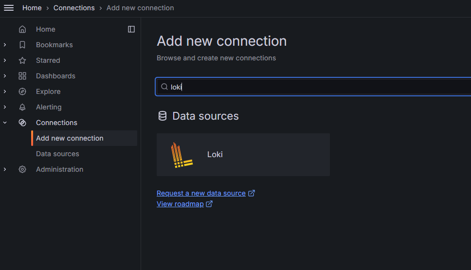
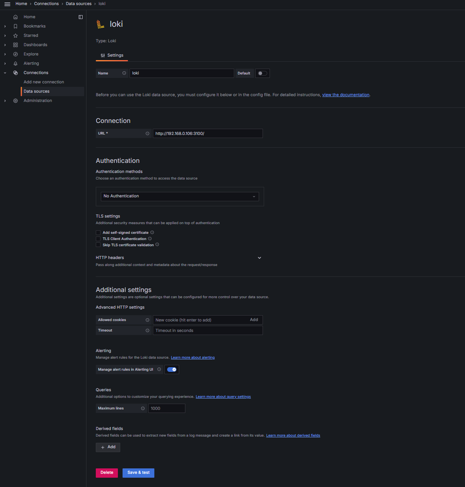
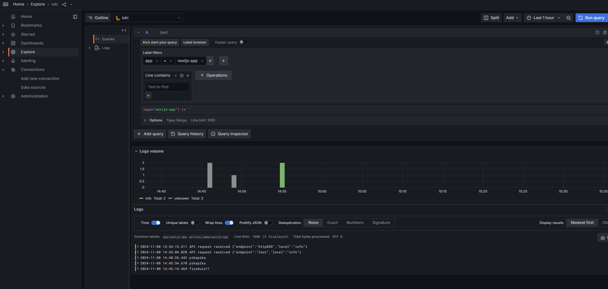
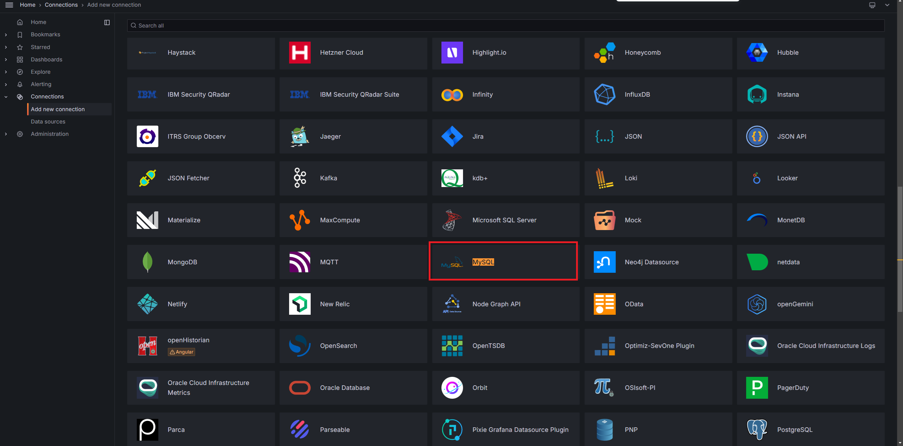

## 前言
因為有多個國家的網站，原本使用 Seq 作為 log server，但因為同時間只能有一個人登入，每個國家都需要各自的容器服務，為了簡化運維，打算將 log server 換成 Grafana，並在學習 K8s 時發現 Grafana、Loki 和 Prometheus 成為常見的標配。

## 首先，讓我們解一下什麼是 Grafana 
Grafana 是一款開源的資料視覺化和監控平台，讓你可以輕鬆建立互動式儀表板，從多種數據來源即時監控系統狀態，主要是由以下三大服務組成。

* **Grafana**：這是一個視覺化平台，可以整合各種來源（像是 Loki 和 Prometheus）的數據，並製作圖表和儀表板，方便監控。
* **Loki**：專門用來收集和管理日誌數據，跟 Grafana 整合後，可以在同一平台上分析日誌和監控數據，快速找出問題。
* **Prometheus**：主要負責收集和儲存系統監控指標數據，提供系統健康狀況的監控依據。

## 接著，部署 Loki 日誌系統
```
docker run -d --name=loki -p 3100:3100 grafana/loki:latest
```
## Loki 支援 RESTful API，因此我們可以透過 Curl 操作。
### 新增日誌 
```
# const createdAt = Date.now() * 1_000_000; // js 將計算後的結果貼到這裡 createdAt
@createdAt = 1693022700000000  


POST http://localhost:3100/loki/api/v1/push
Content-Type: application/json

{
    "streams": [
        {
            "stream": {
              "app":"nextjs-app"
            },
            "values": [
                ["{{createdAt}}", "your logs"]
            ]
        }
    ]
}
```
### 查詢日誌
 
```
GET http://localhost:3100/loki/api/v1/query?query={app="nextjs-app"}&limit=10
```

## 接著，我們安裝 Grafana
### 運行 Grafana 容器服務
```
docker run -d --name=grafana -p 7777:3000 grafana/grafana
```
### [訪問及登入](http://localhost:7777)，預設帳號密碼：admin/admin

### 接著[訪問 Gafana 的後台] > Connection > [Add new connection](http://localhost:7777/connections/add-new-connection)> 選擇先前建立 Loki 服務



### 此時就能透過後台的Explore功能去查詢剛剛寫入的日誌，但至少要有一個篩選條件，不然會查不到。 


### 補充: 其實 Gafana 支援很多資料庫或服務當成資料來源，像是Mysql、Jira，可以很輕易去讀取這些資料做成圖表。


## 程式界接 
### 在 Next.js 中整合 Loki
接下來，在 Next.js 後端安裝所需的套件：
```
npm install winston winston-loki --save
```

### 撰寫一個 logger.ts
```
import winston from 'winston';
import LokiTransport from 'winston-loki';

const logger = winston.createLogger({
  transports: [
    new LokiTransport({
      host: 'http://localhost:3100',
      labels: { app: 'nextjs-app' },
      json: true,
    }),
  ],
});

export default logger;
```
在頁面中使用時：
```
import logger from '@/lib/log/loki-log';
logger.info('API request received', { endpoint: 'https://www.abc.com' });
```

### 前端應用：透過 fetch 寫入日誌

```
const LogLevel = {
  Information: "info",
  Debug: "debug",
  Warning: "warn",
  Error: "error",
};

async function clientLog(message, level = LogLevel.Information, extraLabels = {}) {
  if (!message) return;

  const timestamp = `${Date.now()}000000`; // 將毫秒級時間轉為納秒級
  const logData = {
    streams: [
      {
        stream: {
          app: "frontend-app",
          level: level,
          ...extraLabels, // 額外的標籤，例如用於區分不同頁面或功能
        },
        values: [
          [timestamp, message]
        ]
      }
    ]
  };

  try {
    const response = await fetch(LOKI_URL, {
      method: "POST",
      headers: {
        "Content-Type": "application/json",
        // "Authorization": "Bearer YOUR_TOKEN" // 如果 Loki 設置了 Token 驗證，啟用此行
      },
      body: JSON.stringify(logData),
    });

    if (!response.ok) {
      console.error("Failed to send log to Loki:", response.statusText);
    }
  } catch (error) {
    console.error("Error sending log to Loki:", error);
  }
}
```

```
// 發送信息級別的日誌
clientLog("This is an informational message", LogLevel.Information, { page: "home" });

// 發送錯誤級別的日誌
clientLog("An error occurred", LogLevel.Error, { page: "checkout", userId: 12345 });

```
## 補充: Loki 如果要加上令牌，最簡單的方式是透過 nginx 轉發請求時，加上請求令牌驗證
```
server {
    listen 80;
    location /loki/ {
        proxy_pass http://localhost:3100; # Loki Url
        proxy_set_header Authorization "Bearer YOUR_TOKEN"; # 令牌
        # 可根据需求限制访问的 IP、路径等
        if ($http_authorization != "Bearer YOUR_TOKEN") {
            return 403; # 拒绝访问
        }
    }
}
```
## 參考
* [官方網站](https://grafana.com/docs/)
* [參考資料1](https://yiichenhi.medium.com/grafana-%E5%B0%87%E8%B3%87%E6%96%99%E8%A6%96%E8%A6%BA%E5%8C%96-%E7%B0%A1%E6%98%93%E7%9A%84%E4%BB%8B%E7%B4%B9%E8%88%87%E6%93%8D%E4%BD%9C-4af05a0f4d8c)