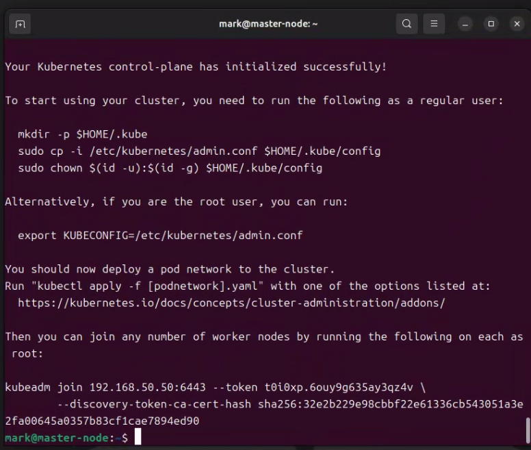
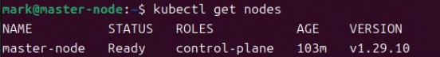
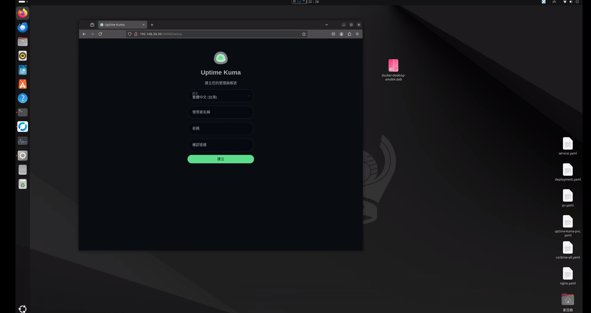

## 前言
先前在[Windows Docker Desktop 啟用了 Kubernetes](https://blog.markkulab.net/jenkins-deploy-kubernetes-with-docker-for-windows/) , 但因為Windows Kubernetes 只能有單節點，且不是這麼穩定又耗效能，因此，在家搭建一套主流大家在用Linux 版的Kubernetes。

## 環境說明
* Ubuntu 22.04
* [預先安裝完 Docker ](https://blog.markkulab.net/enable-docker-2375-port-in-ubuntu22/)

## 安裝必要軟體


執行以下指令進行系統更新與安裝：
```bash
sudo apt-get update
sudo apt-get upgrade
sudo apt-get install -y net-tools git
```

- 設定時間同步至 `asia.pool.ntp.org`
- 關閉防火牆：
```bash
  # 允許 Kubernetes API server 通信
  sudo ufw allow 6443/tcp   # Kubernetes API server

  # etcd 集群通訊
  sudo ufw allow 2379/tcp   # etcd client communication
  sudo ufw allow 2380/tcp   # etcd server-to-server communication

  # kubelet API
  sudo ufw allow 10250/tcp  # Kubelet API
  sudo ufw allow 10255/tcp  # Read-only Kubelet API (可選)
  sudo ufw allow 10248

  # Controller manager 和 scheduler
  sudo ufw allow 10251/tcp  # kube-scheduler
  sudo ufw allow 10252/tcp  # kube-controller-manager

  # Kubernetes DNS (CoreDNS)
  sudo ufw allow 53/tcp     # DNS TCP
  sudo ufw allow 53/udp     # DNS UDP

  # NodePort services (範圍可自定義，預設 30000-32767)
  sudo ufw allow 30000  # NodePort services

  # 啟用防火牆
  sudo ufw enable
  sudo ufw status verbose
```

- 關閉 OS 的 Swap，避免記憶體不足時關閉容器：
```bash
sudo swapoff -a
cat /etc/fstab
```

## 安裝 Kubernetes 主程式
### 新增核心參數
```bash
sudo tee /etc/modules-load.d/containerd.conf <<EOF
overlay
br_netfilter
EOF
```
```bash
sudo modprobe overlay
sudo modprobe br_netfilter
```
```bash
sudo tee /etc/sysctl.d/kubernetes.conf <<EOF
net.bridge.bridge-nf-call-ip6tables = 1
net.bridge.bridge-nf-call-iptables = 1
net.ipv4.ip_forward = 1
EOF
```
載入配置變更：
```bash
sudo sysctl --system
```

## 安裝 Containerd 運行環境
Containerd 是一個輕量級的容器運行環境，管理容器的啟動、停止等基本功能。
```bash
sudo apt install -y curl gnupg2 software-properties-common apt-transport-https ca-certificates

sudo curl -fsSL https://download.docker.com/linux/ubuntu/gpg | sudo gpg --dearmour -o /etc/apt/trusted.gpg.d/docker.gpg
sudo add-apt-repository "deb [arch=amd64] https://download.docker.com/linux/ubuntu $(lsb_release -cs) stable"

sudo apt update
sudo apt install -y containerd.io

containerd config default | sudo tee /etc/containerd/config.toml >/dev/null 2>&1
sudo sed -i 's/SystemdCgroup \= false/SystemdCgroup \= true/g' /etc/containerd/config.toml

sudo systemctl restart containerd
sudo systemctl enable containerd
```

## 安裝 Kubernetes 元件
```bash
sudo apt-get update
sudo apt-get install -y apt-transport-https ca-certificates curl gpg

curl -fsSL https://pkgs.k8s.io/core:/stable:/v1.29/deb/Release.key | sudo gpg --dearmor -o /etc/apt/keyrings/kubernetes-apt-keyring.gpg

echo 'deb [signed-by=/etc/apt/keyrings/kubernetes-apt-keyring.gpg] https://pkgs.k8s.io/core:/stable:/v1.29/deb/ /' | sudo tee /etc/apt/sources.list.d/kubernetes.list

sudo apt-get update
sudo apt-get install -y kubelet kubeadm kubectl
sudo apt-mark hold kubelet kubeadm kubectl
```

## 初始化 Kubernetes Master 節點
編輯 kubelet 設定檔：
```bash
sudo vim /etc/default/kubelet
```
添加以下參數：
```bash
KUBELET_EXTRA_ARGS="--cgroup-driver=cgroupfs"
```
重新載入：
```bash
sudo systemctl daemon-reload && sudo systemctl restart kubelet
```

編輯 Docker 設定檔：
```
sudo vim /etc/docker/daemon.json
```
添加以下內容：
```json
{
  "exec-opts": ["native.cgroupdriver=systemd"],
  "log-driver": "json-file",
  "log-opts": {
    "max-size": "100m"
  },
  "storage-driver": "overlay2"
}
```
重啟 Docker：
```
sudo systemctl daemon-reload && sudo systemctl restart docker
```

## 初始化 kubeadm
```bash
sudo kubeadm init
```

初始化成功後，依提提示，複製kubectl設定到使用者：
```bash
mkdir -p $HOME/.kube
sudo cp -i /etc/kubernetes/admin.conf $HOME/.kube/config
sudo chown $(id -u):$(id -g) $HOME/.kube/config
```


## 安裝 Pod 網路
```bash
kubectl apply -f https://raw.githubusercontent.com/projectcalico/calico/v3.25.0/manifests/calico.yaml
```

## 加入 Worker 節點
在 Worker 節點上執行：
```bash
kubeadm join 192.168.50.50:6443 --token <TOKEN> --discovery-token-ca-cert-hash sha256:<HASH>
```

## 確認集群狀態
```bash
kubectl get nodes
```


## 建立第一個 Kubernetes 容器
準備 Persistent Volume 路徑：
```bash
mkdir /var/docker-pvc
sudo chmod 777 /var/docker-pvc
```

### 部署配置檔 `deployment.yaml`
```yaml
apiVersion: v1
kind: PersistentVolume
metadata:
  name: uptime-kuma-pv
spec:
  capacity:
    storage: 1Gi
  accessModes:
    - ReadWriteOnce
  hostPath:
    path: /var/docker-pvc

---

apiVersion: v1
kind: PersistentVolumeClaim
metadata:
  name: uptime-kuma-pvc
spec:
  accessModes:
    - ReadWriteOnce
  resources:
    requests:
      storage: 1Gi
  volumeName: uptime-kuma-pv

---

apiVersion: apps/v1
kind: Deployment
metadata:
  name: uptime-kuma-deployment
spec:
  replicas: 1
  selector:
    matchLabels:
      app: uptime-kuma
  template:
    metadata:
      labels:
        app: uptime-kuma
    spec:
      containers:
      - name: uptime-kuma
        image: louislam/uptime-kuma:1
        ports:
        - containerPort: 3001
        volumeMounts:
        - name: uptime-kuma-volume
          mountPath: /app/data
      volumes:
      - name: uptime-kuma-volume
        persistentVolumeClaim:
          claimName: uptime-kuma-pvc

---

apiVersion: v1
kind: Service
metadata:
  name: uptime-kuma-service
spec:
  type: NodePort
  selector:
    app: uptime-kuma
  ports:
  - port: 3001
    targetPort: 3001
    nodePort: 30000
```
## 移除控制平面污點 (單節點環境) 
```
kubectl taint nodes --all node-role.kubernetes.io/control-plane-
```
## Final Result 
此時訪問localhost:30000，就能看到這畫面


## 補充 - 如果服務安裝失敗或重新安裝 Kubernetes
```bash
sudo kubeadm reset -f
sudo rm -rf ~/.kube
sudo rm -rf /etc/kubernetes /var/lib/etcd /var/lib/kubelet /var/lib/kubeadm /etc/cni /opt/cni
sudo systemctl status docker
sudo systemctl status containerd
sudo apt-get remove --purge -y kubeadm kubectl kubelet kubernetes-cni cri-tools
sudo apt-get autoremove -y
sudo dpkg --purge kubectl kubeadm kubelet
sudo apt-get autoremove --purge -y
sudo rm -rf /etc/kubernetes /var/lib/etcd /var/lib/kubelet /etc/cni /opt/cni ~/.kube
sudo rm /etc/apt/sources.list.d/kubernetes.list
sudo apt-get update
```

## 參考資料
* [Complete Guide to Kubernetes Cluster Setup on Ubuntu 22.04 LTS : A Step-by-Step Tutorial for DevOps](https://medium.com/@kvihanga/how-to-set-up-a-kubernetes-cluster-on-ubuntu-22-04-lts-433548d9a7d0)
* [教你5分鐘在Ubuntu 22.04架設Kubernetes Cluster](https://blog.kkbruce.net/2023/08/5min-ubuntu-2204-kubernetes-cluster.html)
* [How to Install Kubernetes on Ubuntu 22.04](https://phoenixnap.com/kb/install-kubernetes-on-ubuntu)
* [创建master+node节点（node NotReady解决思路）](https://blog.csdn.net/nmjhehe/article/details/99191632)