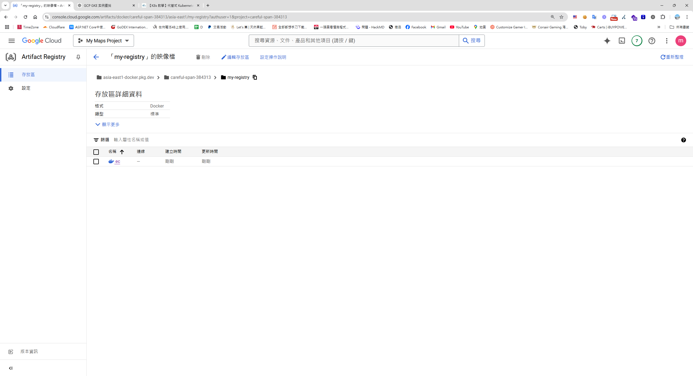

### 前言
本身對於自架伺服器特別有興趣，而我過去的經驗，大多都在地端，從自架Windows Server 到Linux Server，從Hyper V到Vsphere ，Windows Contianer 到 Linux Container，但隨著容器技術的發展和雲端的便利性提升，也越來越多大型企業採用雲端的伺服器，讓我好奇進一步探索雲端部署的可能性。

### 佈署流程

* **過去地端佈署流程**  
  Docker Build → Push Private Registry → Docker Run

* **雲端佈署流程**  
  Docker Build → Push Google Artifact Registry → Google Cloud Run

### 環境說明
- 作業系統：Windows 11，並在本地端安裝好 Docker Desktop
- 可容器化的專案，並事先建立好 Dockerfile
- GCP 專案 ID：gcr-my-project01 [連結](https://console.cloud.google.com/welcome/new?cloudshell=true)
- Google Artifact Registry 主機位置：asia-east1-docker.pkg.dev(Artifact Registry > 選勾 Registry > 設定操作說明)

### 安裝 Google Cloud CLI

1. 下載並安裝 [Google Cloud CLI](https://cloud.google.com/sdk/docs/install-sdk)

```powershell
(New-Object Net.WebClient).DownloadFile("https://dl.google.com/dl/cloudsdk/channels/rapid/GoogleCloudSDKInstaller.exe", "$env:Temp\GoogleCloudSDKInstaller.exe")
& $env:Temp\GoogleCloudSDKInstaller.exe
```
2. Windows 安裝過程，會跳出安裝視窮，依據提示，下一步到底即可   

3. 安裝完成後會詢問是否登入（同等於 `gcloud auth login`）
   

### 建立 Artifact Registry

進入 Artifact Registry，並取得 Registry 的 URL。

1. 建立存放區
   

2. 依照預設配置建立
   

3. 設定並取得配置
   
   **注意：** Windows 使用者請移除 `\`，使指令變為單行。

4. 在本地端配置 Google Artifact Registry：

```powershell
gcloud auth configure-docker asia-east1-docker.pkg.dev
```
   
   

### 建置與驗證 Docker 映像檔
首先，用指令切換到可容器化的專案，並事先建立好 Dockerfile
1. 使用以下指令建置 Docker 映像檔：

```powerhsell
docker build -t asia-east1-docker.pkg.dev/gcr-my-project01/my-registry/ec:v2 .
```

2. 運行映像檔進行本地端測試：

```powerhsell
docker run -d -p 8888:80 asia-east1-docker.pkg.dev/gcr-my-project01/my-registry/ec:v2
```
3. 訪問 localhost:8888 測試容器服務，有沒有異常      


### 推送映像到 Artifact Registry

   ```powerhsell
   docker push asia-east1-docker.pkg.dev/gcr-my-project01/my-registry/ec:v2
   ```
此時就能在你的registry 看到你剛推送的docker image


### Google Cloud Run 部署

#### 手動部署

1. 在 Cloud Run 中選擇「+Deploy Container」


2. 依照畫面指示完成配置


3. 進入 Cloud Run，配置 Container(s)、Volumes、Networking、Security 等參數，並設定 Container port 為 80。


#### 自動化部署

使用下列指令自動部署至 Cloud Run：

```bash
gcloud run deploy my-service --image=asia-east1-docker.pkg.dev/gcr-my-project01/my-registry/ec:v2 --platform managed --allow-unauthenticated --region=asia-east1 --port=80
```

* 補充- [Gcloud run deploy 參數文件](https://cloud.google.com/sdk/gcloud/reference/run/deploy)


此時，訪問這Url，檢查你的容器應用，並可以從Google Cloud Run 看到這個服務的狀態。

### 補充資源

- [GCP Cloud Run 綁定自訂網域](https://medium.com/@yuijzeon/%E9%9A%A8%E6%89%8B%E8%A8%98-gcp-cloud-run-%E6%9C%8D%E5%8B%99%E7%B6%81%E5%AE%9A%E5%88%B0%E8%87%AA%E5%B7%B1%E7%9A%84%E7%B6%B2%E5%9D%80-f316028a0c0e)
- [使用 Jenkins 升級 Cloud Run 的 CI/CD](https://manel-lemin.medium.com/upgrading-your-cloud-run-ci-cd-with-jenkins-92a3717e9f1c)
