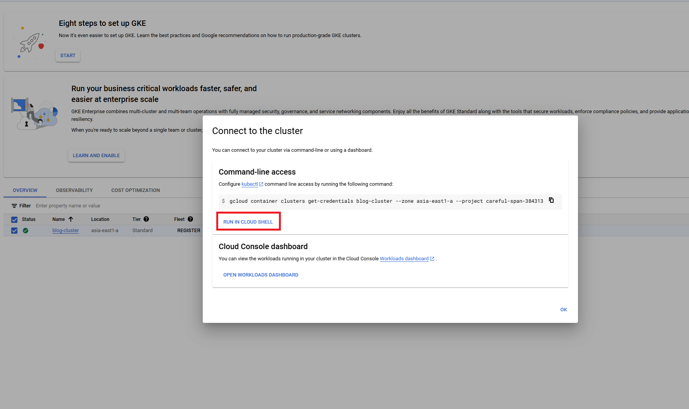
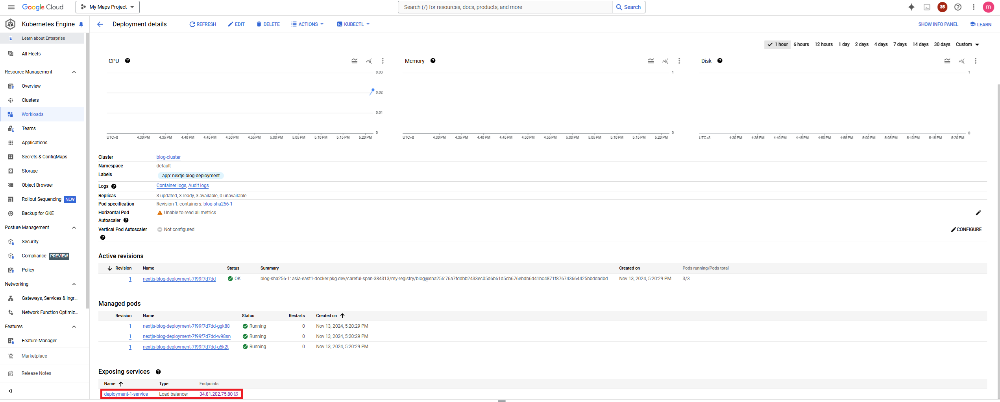

## 前言
先前[有透過 Cloud Run 運行容器應用](https://blog.markkulab.net/on-prem-to-cloud-gcp-docker-deployment-artifact-registry-cloud-run/)，也有[試著在地端架了Kubernetes](https://blog.markkulab.net/intsll-kubernetes-in-ubuntu/)，這篇來談 GKS (google kubernetes engine)，目前市面上的雲服務，都是基於 Kubernetes 的雲端架構服務，如:AWS、AKS、GKE，因此 Kubernetes的基礎知識就顯得很重要，但Kubernetes 的官方文件也真的很多東西，只好邊實作邊學習。

## 順便比較一下 Cloud Run vs Google Kubernetes Engine 
- **Google Cloud Run**：適合單一容器應用，簡單快速部署，適合小型應用、API、微服務等。
- **Google Kubernetes Engine**：提供叢集和高可用性支持，適合需要多容器協作、具備自動擴展和高容錯的應用場景。

## 預先準備
1. 確保本地已安裝 Docker 和 Google Cloud CLI。
2. 啟用 GCP 的 Kubernetes API。
   
3. 在 GCP 中建立 Google Artifact Registry。
4. Google Cloud CLI 登入及設定好專案。
```
gcloud projects list
gcloud config set project [PROJECT_ID]
```
5. gcloud 安裝 kubectl 元件
```
gcloud components install kubectl  gke-gcloud-auth-plugin
gcloud components update
```

## 首先，初始化 Next.js 專案
```bash
npx create-next-app@latest nextjs-blog --use-npm --example "https://github.com/vercel/next-learn/tree/main/basics/learn-starter"
cd nextjs-blog
```

接著，[複製官方範例的 Dockerfile 和 next.config.js 到專案根目錄](https://github.com/vercel/next.js/tree/canary/examples/with-docker)。

### 建置與推送 Docker 映像檔到 Google Artifact Registry
```powershell
docker build -t asia-east1-docker.pkg.dev/gcr-my-project01/my-registry/blog:v2 .
docker run -d -p 8888:80 asia-east1-docker.pkg.dev/gcr-my-project01/my-registry/blog:v2
docker push asia-east1-docker.pkg.dev/gcr-my-project01/my-registry/blog:v2
```

## 建立 Kubernetes Clusters
Google 的 Clusters 有兩種模式
- **Standard Cluster：**  
  - 需手動設定節點資源和管理叢集，提供更高的靈活性。
  - 使用者可進行更深入的自訂控制，但管理負擔較高。
  - 適合需要細節控制和自訂設定的使用者。  

- **Autopilot Cluster：**  
  - 自動管理基礎設施，使用者只需專注於應用部署和工作負載。
  - 系統會根據需求自動調整資源，並按使用量計費。
  - 適合希望簡化管理的工作，無需手動設定節點。

可以使用網頁或腳本指令建立 Kubernetes clusters。
### Kubernetes Engine > Cluster > Create


### 使用腳本指令建立Cluster
** 標準叢集 (Standard Cluster)**
```bash
gcloud container clusters create blog-cluster --num-nodes 2 --machine-type n1-standard-1 --zone asia-east1-a
```

** 自動叢集(Autopilot Cluster)**
```bash
gcloud container clusters create-auto blog-autopilot-cluster --region asia-east1
```
## 部署應用
### 使用網頁部署容器
1. 回到 GCP 後台，選擇 Kubernetes Engine > Workloads > Deploy。
2. 設定伺服器節點與部署名稱。
   
3. 選擇先前上傳的 Google Artifact Registry 映像檔。
   
4. 設定內外部連接埠。
   
5. 可以查看 YAML 設定，Close 後，點擊 Deploy。
   

### 使用腳本指令部署
**連線至叢集**：從 Cloud Shell 使用 kubectl 操作。


可從 CloudShell 執行kubectl腳本指令，或複製連線指令到地端執行這個連線

```bash
kubectl get nodes
```


**建立 Deployment**
```bash
vim nextjs-blog-deployment.yaml
```

```yaml
apiVersion: apps/v1
kind: Deployment
metadata:
  name: nextjs-blog
  labels:
    app: nextjs-blog
spec:
  selector:
    matchLabels:
      app: nextjs-blog
      tier: web
  template:
    metadata:
      labels:
        app: nextjs-blog
        tier: web
    spec:
      containers:
      - name: nextjs-blog-app
        image: asia-east1-docker.pkg.dev/gcr-my-project01/my-registry/blog:v2
        ports:
        - containerPort: 3000
```

運行應用：
```bash
kubectl apply -f nextjs-blog-deployment.yaml
kubectl get deploy nextjs-blog
```

**網路設定 - Load Balancer**
* 自動建立外部服務、 Load Balancer 設定、挷定外部 IP 
```bash
kubectl expose deployment nextjs-blog-deployment --type="LoadBalancer"
```
* 或也可以指定連接埠的方式建立*
```bash
kubectl expose deployment nextjs-blog-deployment --name=nextjs-blog-service --port=80 --target-port=3000 --type=LoadBalancer
```
[指定連接埠相關文件](https://kubernetes.io/docs/tasks/access-application-cluster/create-external-load-balancer/)

#### 部署完成後訪問服務
點選服務進行訪問。

訪問 Next.js 網站：


#### 若需要額外的連接埠映射，也可使用下方Expose 按鈕：


## 補充 - 在 Kubernetes 中，要更新的映像檔，通常可以使用以下幾種方法
### 1. 使用 `kubectl set image` 更新映像檔
這種方式適合快速更新映像檔版本：
```bash
kubectl set image deployment/<deployment-name> <container-name>=<new-image>:<new-tag>
```
例如：
```bash
kubectl set image deployment/my-app my-container=my-app-image:v2
```

### 2. 更新 Deployment YAML 文件並重新應用
如果管理配置是基於 YAML 文件，您可以更新文件中的映像檔標籤，然後重新應用該文件：
```yaml
# my-app-deployment.yaml
apiVersion: apps/v1
kind: Deployment
metadata:
  name: my-app
spec:
  replicas: 3
  template:
    spec:
      containers:
      - name: my-container
        image: my-app-image:v2  # 更新映像檔標籤
```
重新應用更新過的 YAML 文件：
```bash
kubectl apply -f my-app-deployment.yaml
```

### 3. 使用 `kubectl rollout restart` 重新啟動 Deployment
如果映像檔標籤已經更新（例如，如果您用相同標籤推送了一個新版本），可以使用重新啟動來強制刷新：
```bash
kubectl rollout restart deployment/<deployment-name>
```

### 4. 使用 `kubectl patch` 更新映像檔
這種方式可以直接通過命令行進行部分更新：
```bash
kubectl patch deployment <deployment-name> -p '{"spec":{"template":{"spec":{"containers":[{"name":"<container-name>","image":"<new-image>:<new-tag>"}]}}}}'
```
例如：
```bash
kubectl patch deployment my-app -p '{"spec":{"template":{"spec":{"containers":[{"name":"my-container","image":"my-app-image:v2"}]}}}}'
```
### 驗證更新
無論採用哪種方法，可以使用以下命令來檢查更新是否成功：
```bash
kubectl rollout status deployment/<deployment-name>
```
這些方法都會觸發滾動更新，以保持服務不中斷的情況下逐步替換舊版本的容器。

## 參考資料
[How to deploy NextJS app to Kubernetes Cluster in GCP with Custom Domain?](https://walkthrough.so/pblc/FHQPWEGGWSPT/how-to-deploy-nextjs-app-to-kubernetes-cluster-in-gcp-with-custom-domain?sn=7)


