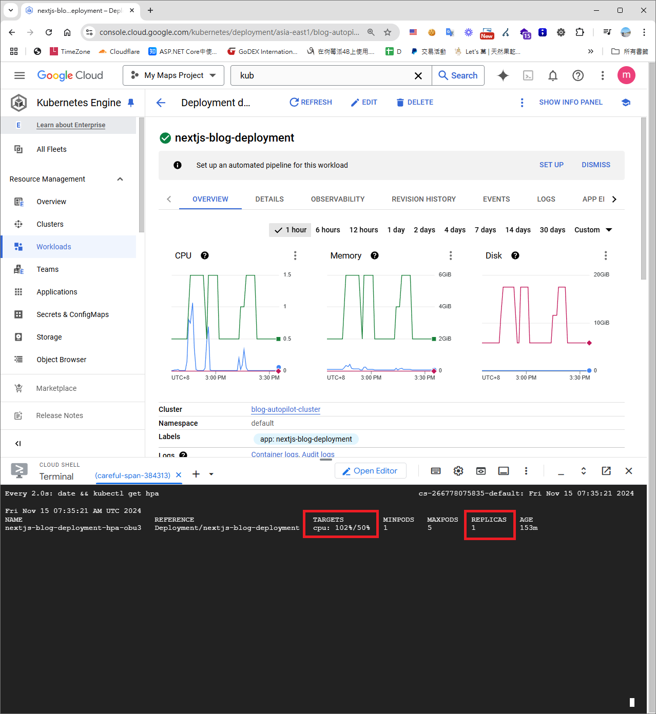
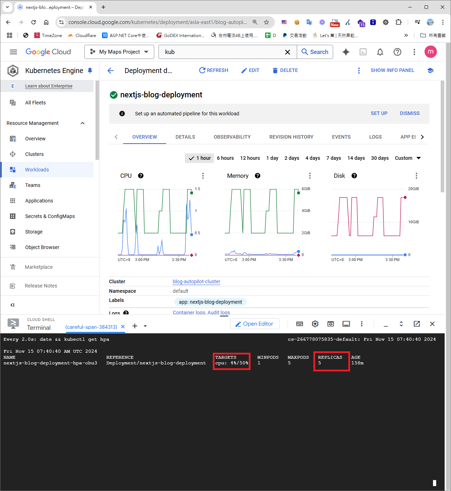
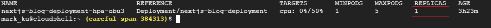

## 什麼是水平擴展 ?
[接續上一篇文章了解如何部署Next js 應用程式到Google Kubernetes Engine](https://blog.markkulab.net/deploy-nextjs-app-to-google-kubernetes-service/)，我們這篇來談談 Google Kubernetes Engine 水平擴容及縮容。　　

如在日常生活中，即使一個人能力再強，最多也只能持續高效工作約 16 小時，如果工作負載過重，這個人可能會無法承受，此時，則需要聘請更多的人來分擔工作，這就是一種橫向擴展的概念。  
  
套用在技術領域中，無論一台伺服器的性能多麼強大，它的處理能力也有極限，當負載超過伺服器的能力時，單靠升級硬體（垂直擴展）可能不足以解決問題，此時就適合導入水平擴容的機制（Scaling Out）。  

## 什麼是 Kubernetes Pods？
在 Kubernetes 中，Pods 是部署的最小單位，負責承載容器化應用程序及其運行環境。

## 哪些網頁應用適合進行水平擴展？
並非所有服務都適合水平擴展，適合的服務通常為**無狀態服務**，例如 Web API 或微服務架構，這些應用可以輕鬆分散負載。

反之，如果服務涉及**本地狀態**（如資料庫或未經設計的 Session 網頁應用），可能會因一致性問題導致無法進行水平擴展。在這種情況下，可以考慮使用**垂直擴展** (Vertical Pod Autoscaler, VPA)，提升單一 Pod 的資源能力以承擔更高負載。

## GKE 的優勢
Google Kubernetes Engine (GKE) 相較於自建 Kubernetes，提供了更便捷的管理功能。例如，GKE 不需要額外安裝 `metrics-server`，即可直接監控容器的 CPU 和記憶體使用情況，大幅降低了初期設定的難度。

## 在設定水平擴容及縮容時，建立 Cluster 遇到的問題
[上篇文章提到，GKE 提供兩種叢集模式：](https://blog.markkulab.net/deploy-nextjs-app-to-google-kubernetes-service/)
- **Standard Cluster**：靈活度高，適合需要細節控制的使用者，但需自行管理資源與設定。
- **Autopilot Cluster**：簡化管理，自動調整資源，適合專注於應用部署的使用者。

但實測發現，**Standard Cluster** 預設未啟用 Metrics，因此在執行 `kubectl get hpa` 時，無法取得 CPU 和記憶體的使用率，起初測試時，無法使用自動擴展功能。


## 首先，我們須需了解 Kubernetes 水平擴展所需要用到的指令
### 查詢容器應用的資源使用情況
以下指令可檢視節點或 Pod 的 CPU 和記憶體使用率：
```bash
kubectl top nodes
kubectl top pods
```

### 查詢水平擴展 (HPA) 狀態
```bash
kubectl get hpa
kubectl get hpa --watch
```

## 手動擴展容器
若需手動擴展容器，可使用以下指令：
```bash
kubectl scale deployment nextjs-blog-deployment --replicas=5
kubectl get pods
```

## 接著，我們必須設定 Deployment 的水平擴展功能
一共有三種設定水平擴展做法，yaml 、指令、網頁UI。

### 1.使用 YAML 檔定義
建立 YAML 檔並執行以下指令：
```bash
kubectl apply -f nextjs-blog-hpa.yaml
```

範例 YAML 檔案內容：
```yaml
apiVersion: autoscaling/v2
kind: HorizontalPodAutoscaler
metadata:
  name: nextjs-blog-hpa
  namespace: default
spec:
  scaleTargetRef:
    apiVersion: apps/v1
    kind: Deployment
    name: nextjs-blog
  minReplicas: 1
  maxReplicas: 5
  metrics:
  - type: Resource
    resource:
      name: cpu
      target:
        type: Utilization
        averageUtilization: 50
```

說明：
- `scaleTargetRef`：指定 HPA 監控的 Deployment。
- `minReplicas`：最少保留 1 個 Pod。
- `maxReplicas`：最大擴展至 5 個 Pod。
- `metrics`：當 CPU 使用率超過 50% 時觸發擴展。

### 2. 使用指令設定水平擴展
```bash
kubectl autoscale deployment nextjs-blog-deployment --cpu-percent=50 --min=1 --max=5
```
### 3. 使用 GKE 網頁介面設定


## 接著，我們來測試先前設定好水平擴展的設定
這次使用 Grafana 的壓測工具 K6

### K6 Docker 版本
```bash
cat script.js | docker run --rm -i grafana/k6 run -
```
*P.S. Windows 環境中，`--rm` 會在壓測完成後刪除容器。*

## 撰寫壓測腳本
以下是範例腳本：
```javascript
import http from 'k6/http';
import { check, sleep } from 'k6';

export const options = {
  stages: [
    { duration: '30s', target: 3000 },  // 負載測試從 0 個虛擬使用者增加到 20 個，並持續30 秒 
    { duration: '1m30s', target: 3000 }, 3000 // 維持 3000 個虛擬使用者持續 1 分 30 秒
    { duration: '20s', target: 0 },
  ]
};
// options 第一階段模擬快速增加負載，第二階段保持穩定負載，第三階段緩慢減少負載。
export default function () {
  const res = http.get('http://your-domain/');
  check(res, { 'status was 200': (r) => r.status == 200 });
  sleep(1);
```
在 Google Cloud Shell 執行 Watch 每兩秒印出即時的cpu 消耗
```bash
 watch -n 2 'date && kubectl get hpa'
```

## 最後，測試結果
當容器 CPU 使用率瞬間達到 102% 時，可能因擴展速度過快，容器尚未完全啟動。
 

當 CPU 使用率到 150% 時，系統自動擴展至 3 個 Pods 分擔負載。
 
當 CPU 使用率達到 超過200% 時，系統自動擴展至當初設置的 5 個 Pods 分擔負載。

當 CPU 使用率下降後，Pods 會回到設定的最小 Pod 數量。


## 心得
使用 GKE 真是太酷了！它的彈性和便利性讓我完全不需要在地端配置繁瑣的基礎設施，回想從過去的基礎設施管理（Infra）一路走到現在成為軟體工程師，這些累積的經驗竟然讓我在學習雲技術和 Kubernetes 時變得更加輕鬆。

## 參考資料
- [從異世界歸來的第二六天 - Kubernetes AutoScaling(二) - Horizontal Pod Autoscaler](https://ithelp.ithome.com.tw/articles/10298858)
- [怎麼在 GKE 上做 Autoscaling](https://youtu.be/jP4cg7itW6E?si=h4TDRqLSWULgzIw9)
- [实战 Kubernetes 的动态扩缩容](https://www.aneasystone.com/archives/2022/11/kubernetes-auto-scaling.html)
- [K6 官方文件](https://grafana.com/docs/k6/latest/get-started/running-k6/) 
